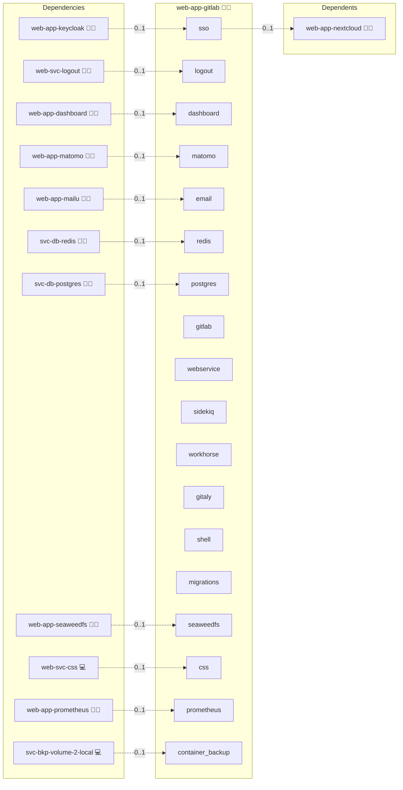

# GitLab

## Description

Accelerate your development with GitLab, an all-in-one platform for source code management, CI/CD, and more. Experience a robust and collaborative environment that empowers your development process.

## Overview

This role deploys GitLab from the official Cloud Native GitLab (CNG) CE images at `registry.gitlab.com/gitlab-org/build/cng/` as separate services: `webservice` (puma), `sidekiq`, `workhorse` (sole HTTP entry point), `gitaly`, `shell` (gitlab-sshd) and a one-shot `migrations` job. All images share a single version pin (`services.webservice.version`). PostgreSQL, Redis and S3-compatible object storage are wired through the platform lookups (central or sidecar), OIDC and SMTP through the platform SSO and email services. The front proxy terminates TLS and forwards HTTP to workhorse.

## Cosmos

The diagram places GitLab in the Infinito.Nexus cosmos: the components it deploys (capabilities), the central services it consumes (dependencies), and its outward reach (federation and bridged external networks).



Solid `1:1` edges are fixed relationships; dashed `0..1` edges are conditional (enabled only in matching deployments). Node markers show the role's deploy modes (💻 host, 🐳 compose, 🐝 swarm); ❌ marks a service that is explicitly turned off, and ⚙️ an Ansible role dependency declared in `meta/main.yml`.

## Features

- **CNG multi-service deployment:** webservice, sidekiq, workhorse, gitaly, gitlab-shell and a migrations one-shot from unmodified upstream images.
- **External/central PostgreSQL and Redis:** rails `database.yml`, `resque.yml`, `cable.yml` and the workhorse config are pre-rendered by Ansible and mounted read-only.
- **Consolidated object storage:** artifacts, LFS, uploads, packages, external diffs, dependency proxy, terraform state, CI secure files and pages buckets on any S3-compatible endpoint; named volumes (`gitlab_shared`, `gitlab_uploads`, `gitlab_builds`) carry the data when object storage is disabled.
- **OIDC single sign-on and SMTP:** rendered into `gitlab.yml` and an `smtp_settings.rb` initializer.
- **Git over SSH:** gitlab-sshd on the public SSH port with role-generated host keys under `<instance>/config/hostkeys/`. Back up that directory: it is not part of any named volume, and a host rebuild or instance purge regenerates the keys, so every git client then sees a host-key-changed warning until it re-trusts the new key.

## Quick Setup

### Development

Clone, set up the workstation, and deploy GitLab onto the local stack:

```bash
git clone https://github.com/infinito-nexus/core.git
cd core
make onboard
make compose-deploy mode=reinstall apps=web-app-gitlab full_cycle=false
```

### Production

Run the published image to provision the inventory and deploy GitLab to a managed server (the mounted volume persists the inventory):

```bash
APP=web-app-gitlab
HOST=<your-server>
TLS_MODE=self_signed
SSH_PUBLIC_KEY="<your-ssh-public-key>"

docker run --rm -it \
  -v "$PWD/inventories:/etc/infinito.nexus/inventories" \
  -e APP="$APP" -e HOST="$HOST" -e TLS_MODE="$TLS_MODE" -e SSH_PUBLIC_KEY="$SSH_PUBLIC_KEY" \
  ghcr.io/infinito-nexus/core/debian bash -c '
    INVENTORY=/etc/infinito.nexus/inventories/production
    infinito administration inventory provision "$INVENTORY" \
      --inventory-file "$INVENTORY/devices.yml" \
      --host "$HOST" \
      --include "$APP" \
      --vars "{\"TLS_MODE\": \"$TLS_MODE\", \"users\": {\"administrator\": {\"authorized_keys\": [\"$SSH_PUBLIC_KEY\"]}}}" &&
    infinito administration deploy dedicated "$INVENTORY/devices.yml" \
      --password-file "$INVENTORY/.password" \
      --diff -vv'
```

## Fresh installs only

The role provisions new GitLab instances. Volumes, secrets and backups of a pre-CNG Omnibus deployment (`gitlab_config`, `gitlab_data`, `/etc/gitlab/gitlab-secrets.json`) are not migrated or restorable into the CNG layout; deploy against a fresh database and empty volumes.

## Gitaly data locality

The `gitlab_repositories` volume is declared `nfs: false`, so in swarm mode it stays a plain node-local volume instead of being rewritten to the shared NFS backend. Gitaly is pinned to a single replica. When a swarm reschedule moves the gitaly task to another node, the repositories stay on the previous node's local volume; move the volume data manually before rescheduling gitaly.

## Upgrades

On each version bump of `services.webservice.version`:

1. Follow the upstream upgrade path stops between the old and new version; the `migrations` one-shot fails hard on skipped stops.
2. Diff the CNG repo `dev/` config templates (`webservice-config`, `sidekiq-config`, `workhorse-config`, `shell-config`, `gitaly-config`) between the two tags and mirror schema changes into `templates/config/`.

## Omissions

- `kas` (Kubernetes agent server, workspaces), `pages`, `registry` and `mailroom` are not deployed; `gitlab.yml` disables them.
- Images are the CE edition (`gitlab-webservice-ce`, `gitlab-sidekiq-ce`, `gitlab-workhorse-ce`, `gitlab-rails-ce`); switch the image keys in `meta/services.yml` to the `-ee` variants for an EE deployment.

## Further Resources

- [GitLab Official Website](https://about.gitlab.com/)
- [Cloud Native GitLab (CNG) images](https://gitlab.com/gitlab-org/build/CNG)
- [GitLab Helm charts documentation](https://docs.gitlab.com/charts/)

## Credits

Implemented by **[Kevin Veen-Birkenbach](https://www.veen.world)**.
Part of the [Infinito.Nexus Project](https://s.infinito.nexus/code) and maintained by [Kevin Veen-Birkenbach](https://www.veen.world).
Licensed under the [Infinito.Nexus Community License (Non-Commercial)](https://s.infinito.nexus/license).
