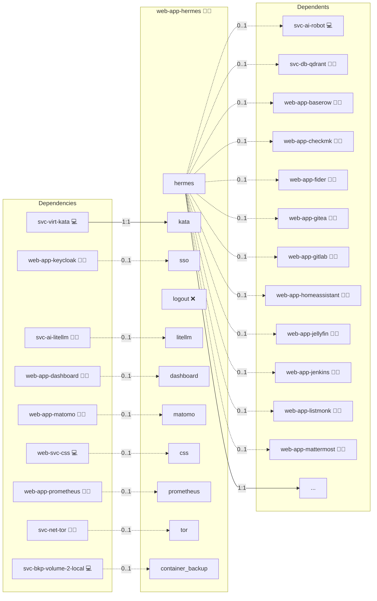

# Hermes Agent

## Description

[Hermes Agent](https://hermes-agent.nousresearch.com/) is an agent runtime from Nous Research that runs tool-using agent sessions against OpenAI-compatible model backends. In gateway mode it serves an OpenAI-compatible HTTP API, where clients address the agent with the same request shape they use for a plain model.

## Overview

This role deploys Hermes Agent in gateway mode as a Docker service, published behind the reverse proxy on its own subdomain, with its compose service pinned to the isolating runtime that the Kata & gVisor role selects for the host. The API server is protected by a generated bearer key, and when the LiteLLM Gateway is part of the deployment the agent's model endpoint is pointed at that gateway with a per-consumer virtual key. Agent state lives in a named volume that the Backup Docker Volumes service captures when it is enabled.

## Cosmos

The diagram places Hermes Agent in the Infinito.Nexus cosmos: the components it deploys (capabilities), the central services it consumes (dependencies), and its outward reach (federation and bridged external networks).



Solid `1:1` edges are fixed relationships; dashed `0..1` edges are conditional (enabled only in matching deployments); red `0..0` edges are turned off in this role. Node markers show the role's deploy modes (💻 host, 🐳 compose, 🐝 swarm); ❌ marks a service that is explicitly turned off, and ⚙️ an Ansible role dependency declared in `meta/main.yml`.

## Features

- **OpenAI-compatible gateway:** The container starts the agent with the `gateway` command and answers OpenAI-style `/v1` requests on its own subdomain.
- **Bearer-key API server:** The API server is gated by a generated `API_SERVER_KEY`, and calls to `/v1/models` without that key are rejected.
- **Isolating runtime:** The compose service is pinned to Kata Containers when hardware virtualization and the Kata shim are present, and to gVisor otherwise.
- **Gateway-routed models:** With the LiteLLM Gateway deployed, the agent's model base URL points at that gateway and authenticates with a per-consumer virtual key.
- **MCP client contract:** With Home Assistant deployed, the role declares the MCP client side of the platform contract as an internal streamable-HTTP client with a read-only tool policy. Every discovered server is rendered into `config.yaml` under `mcp_servers` in the agent's `HERMES_HOME`, with the bearer referenced as `${env:<ROLE>_MCP_TOKEN}` so the config file carries no secret. The deploy then runs `hermes mcp test` per server and fails when one does not answer.
- **Persistent agent data:** Agent state is stored in a named volume mounted at `/opt/data`, which the Backup Docker Volumes service captures without stopping the container.
- **Health endpoint:** A `/health` endpoint reports the runtime status and backs the container healthcheck.

## Quick Setup

### Development

Clone, set up the workstation, and deploy Hermes Agent onto the local stack:

```bash
git clone https://github.com/infinito-nexus/core.git
cd core
make onboard
make compose-deploy mode=reinstall apps=web-app-hermes full_cycle=false
```

### Production

Run the published image to provision the inventory and deploy Hermes Agent to a managed server (the mounted volume persists the inventory):

```bash
APP=web-app-hermes
HOST=<your-server>
TLS_MODE=self_signed
SSH_PUBLIC_KEY="<your-ssh-public-key>"

docker run --rm -it \
  -v "$PWD/inventories:/etc/infinito.nexus/inventories" \
  -e APP="$APP" -e HOST="$HOST" -e TLS_MODE="$TLS_MODE" -e SSH_PUBLIC_KEY="$SSH_PUBLIC_KEY" \
  ghcr.io/infinito-nexus/core/debian bash -c '
    INVENTORY=/etc/infinito.nexus/inventories/production
    infinito administration inventory provision "$INVENTORY" \
      --inventory-file "$INVENTORY/devices.yml" \
      --host "$HOST" \
      --include "$APP" \
      --vars "{\"TLS_MODE\": \"$TLS_MODE\", \"users\": {\"administrator\": {\"authorized_keys\": [\"$SSH_PUBLIC_KEY\"]}}}" &&
    infinito administration deploy dedicated "$INVENTORY/devices.yml" \
      --password-file "$INVENTORY/.password" \
      --diff -vv'
```

## MCP Client

Hermes consumes MCP; it does not serve one in this deployment. Every MCP server
role that is deployed alongside and marked shared is discovered through
`MCP_DISCOVERED_SERVERS` and rendered into the agent config at
`/opt/data/config.yaml`.

### Configuration

| Property | Value |
| --- | --- |
| Direction | `client` |
| Transport | Streamable HTTP |
| Config file | `/opt/data/config.yaml`, owned by uid 10000 |
| Auth | `Authorization` header per server, from the discovery data |

The config file is rendered with the container user as owner. Rendering it as
root makes the agent fall back to its built-in defaults **silently**, reporting
only that the server is unknown.

Servers whose auth scheme no client renderer can present are filtered out before
rendering, so the config never carries an unusable credential.

### Verification

Hermes exposes no administrator-visible list of configured MCP servers, so the
configured set is proven at deploy time instead: the deploy runs `hermes mcp
test <server>` for every configured server and fails when one does not answer. A
successful run reports the negotiated connection and the discovered tool count.
The Playwright spec covers the complementary case, that the agent API holding
the MCP credentials refuses an unauthenticated caller.

### Default state

Off. `mcp.enabled` is false unless an MCP server role is part of the
deployment.

### How to disable

Remove the MCP server roles, or pin `mcp.enabled: false` for this role.
The config then renders with an empty `mcp_servers` map and the verification step
is skipped.

## Credits

Implemented by **[Kevin Veen-Birkenbach](https://www.veen.world)**.
Part of the [Infinito.Nexus Project](https://s.infinito.nexus/code) and maintained by [Kevin Veen-Birkenbach](https://www.veen.world).
Licensed under the [Infinito.Nexus Community License (Non-Commercial)](https://s.infinito.nexus/license).
