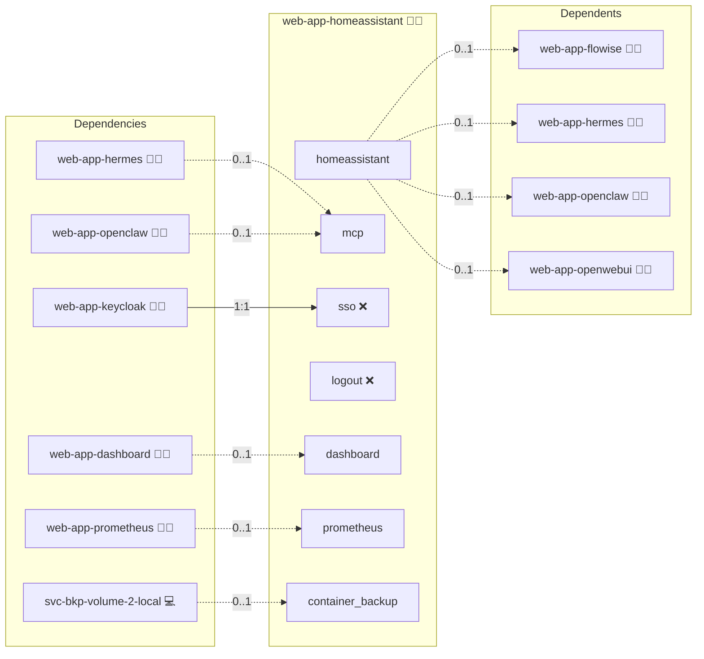

# Home Assistant

## Description

[Home Assistant](https://www.home-assistant.io/) is an open-source home automation platform that connects smart-home devices from many vendors behind a single local interface. It keeps device state, dashboards, and automation rules on the machine that runs it, and exposes them through a web interface, a REST API, and a built-in MCP server.

## Overview

This role deploys Home Assistant as a container on its own canonical domain behind the reverse proxy, with the configuration directory kept in a persistent volume. It renders a `configuration.yaml` that trusts the proxy through `use_x_forwarded_for` and the project-wide trusted-proxy CIDRs, and it attaches the hub to a shared overlay network. With Hermes Agent deployed alongside it, the role declares the hub as the MCP server of the deployment: an internal `/api/mcp` endpoint plus the long-lived access token that MCP clients present.

## Cosmos

The diagram places Home Assistant in the Infinito.Nexus cosmos: the components it deploys (capabilities), the central services it consumes (dependencies), and its outward reach (federation and bridged external networks).



Solid `1:1` edges are fixed relationships; dashed `0..1` edges are conditional (enabled only in matching deployments). Node markers show the role's deploy modes (💻 host, 🐳 compose, 🐝 swarm); ❌ marks a service that is explicitly turned off, and ⚙️ an Ansible role dependency declared in `meta/main.yml`.

## Features

- **Containerized hub:** Runs the official Home Assistant image on both the Docker Compose and Swarm stacks behind the reverse proxy.
- **Reverse-proxy trust:** Renders a `configuration.yaml` with `default_config`, `use_x_forwarded_for`, and the project-wide trusted-proxy CIDRs listed in `trusted_proxies`. In swarm the hub joins the proxy's own overlay, so the forwarded request arrives from that network rather than from the hub's, and trusting only the hub's subnet makes Home Assistant answer every proxied request with HTTP 400.
- **Persistent configuration:** Mounts `/config` as a named volume and hands it to the container backup service when volume backups are part of the deployment.
- **MCP server contract:** Declares the built-in MCP server at `/api/mcp` over streamable HTTP as an internal, bearer-token-authenticated endpoint, and generates the token that MCP clients present. Adding the MCP Server integration itself stays a Home Assistant onboarding step.
- **Token verified against the hub:** Every deploy asks the hub whether the stored token still authenticates and re-mints it when the hub rejects it, then fails the deploy if the fresh token is rejected too. A hub whose `.storage/auth` was recreated leaves a stored token pointing at a deleted refresh token, and clients would receive a 401 on every call.
- **Entity-scoped tool policy:** Home Assistant offers no per-tool filter. Enabling the Assist API always publishes its actuating intents (`HassTurnOn`, `HassTurnOff`, the todo-list writers), so the enforced control is entity exposure: the role exposes no entity to Assist, which leaves those tools with nothing to act on. Making the hub actuate anything is an explicit operator step per entity.
- **Guest MCP probe:** A Playwright spec asserts that an unauthenticated request to the MCP endpoint is never answered with a 2xx.
- **Monitoring and dashboard entries:** Registers the hub with the metrics and dashboard services when those are part of the deployment.

## Quick Setup

### Development

Clone, set up the workstation, and deploy Home Assistant onto the local stack:

```bash
git clone https://github.com/infinito-nexus/core.git
cd core
make onboard
make compose-deploy mode=reinstall apps=web-app-homeassistant full_cycle=false
```

### Production

Run the published image to provision the inventory and deploy Home Assistant to a managed server (the mounted volume persists the inventory):

```bash
APP=web-app-homeassistant
HOST=<your-server>
TLS_MODE=self_signed
SSH_PUBLIC_KEY="<your-ssh-public-key>"

docker run --rm -it \
  -v "$PWD/inventories:/etc/infinito.nexus/inventories" \
  -e APP="$APP" -e HOST="$HOST" -e TLS_MODE="$TLS_MODE" -e SSH_PUBLIC_KEY="$SSH_PUBLIC_KEY" \
  ghcr.io/infinito-nexus/core/debian bash -c '
    INVENTORY=/etc/infinito.nexus/inventories/production
    infinito administration inventory provision "$INVENTORY" \
      --inventory-file "$INVENTORY/devices.yml" \
      --host "$HOST" \
      --include "$APP" \
      --vars "{\"TLS_MODE\": \"$TLS_MODE\", \"users\": {\"administrator\": {\"authorized_keys\": [\"$SSH_PUBLIC_KEY\"]}}}" &&
    infinito administration deploy dedicated "$INVENTORY/devices.yml" \
      --password-file "$INVENTORY/.password" \
      --diff -vv'
```

## MCP Server

Home Assistant ships the MCP server as a native integration. The role enables it
through `services.mcp.enabled`, which stays true only while an MCP client role is
part of the deployment.

### Endpoint

| Property | Value |
| --- | --- |
| Transport | Streamable HTTP |
| URL | `http://homeassistant:8123/api/mcp` |
| Exposure | `internal`, container network only |

### Auth

Clients present a long-lived access token as `Authorization: Bearer <token>`. The
token is minted once per deployment and kept in `sys-token-store` under the
`administrator` user, not in the role's `credentials:` block. An unauthenticated
request is answered with 404: Home Assistant does not reveal the endpoint.

### Authorization subject

`auth_subject: administrator`: Home Assistant scopes the token to the account that minted
it. This deployment mints it for the administrator, so a call arrives as the
administrator whoever asked the client. Entity exposure still bounds the reach.
Getting to the tool server is gated on the role's `mcp` RBAC group.

### Tool categories

`tools/list` returns 10 tools: entity control (`HassTurnOn`, `HassTurnOff`),
timers, broadcast, to-do list read and write, date and time, and `GetLiveContext`
for the current state.

### Default state

Off. `services.mcp.enabled` is false unless `web-app-hermes` or
`web-app-openclaw` is deployed alongside.

### Tool scope

The enforced control is entity exposure, not a read-only flag. Only entities
exposed to Assist are reachable, so an entity that is not exposed cannot be read
or actuated through MCP even though the write tools are listed.

### How to disable

Remove the MCP client roles from the deployment, or pin
`services.mcp.enabled: false` for this role in the inventory. The integration is
then not configured and the endpoint stops answering.

## Credits

Implemented by **[Kevin Veen-Birkenbach](https://www.veen.world)**.
Part of the [Infinito.Nexus Project](https://s.infinito.nexus/code) and maintained by [Kevin Veen-Birkenbach](https://www.veen.world).
Licensed under the [Infinito.Nexus Community License (Non-Commercial)](https://s.infinito.nexus/license).
