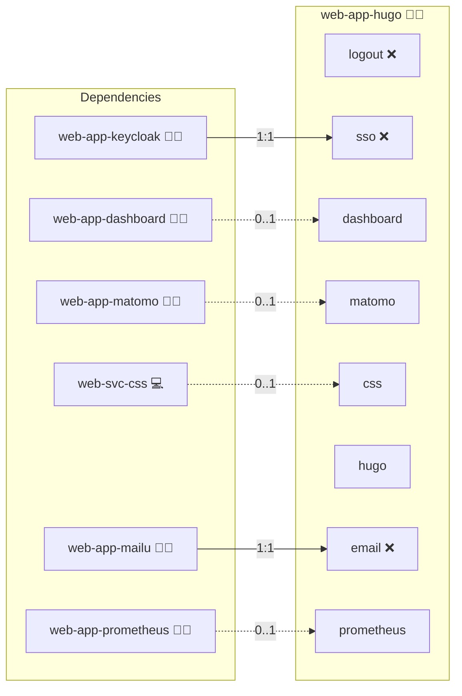

# Hugo

## Description

[Hugo](https://gohugo.io/) is a fast, single-binary static site generator written in Go. This role builds a Hugo site from any upstream Git repository (default: [gohugoio/hugoDocs](https://github.com/gohugoio/hugoDocs)) at image-build time and serves the rendered HTML/CSS/JS via nginx. There is no database, no application server, and no dynamic backend at runtime.

## Overview

The role uses a multi-stage Dockerfile:

1. **Builder stage:** pinned `hugomods/hugo:exts-<version>` (extended Hugo) clones the configured content repository and runs `hugo --minify -e <env> -b <baseURL>` to render the site to `/public`.
2. **Serve stage:** pinned `nginx:<version>-alpine` ships the rendered `/public` from the builder stage as `/usr/share/nginx/html`.

`compose build` re-bakes the static output whenever the cloned content changes, so deploys are content-driven without any runtime build step.

## Cosmos

The diagram places Hugo in the Infinito.Nexus cosmos: the components it deploys (capabilities), the central services it consumes (dependencies), and its outward reach (federation and bridged external networks).



Solid `1:1` edges are fixed relationships; dashed `0..1` edges are conditional (enabled only in matching deployments). Node markers show the role's deploy modes (💻 host, 🐳 compose, 🐝 swarm); ❌ marks a service that is explicitly turned off, and ⚙️ an Ansible role dependency declared in `meta/main.yml`.

## Features

- **Automated provisioning:** Configured by Ansible without manual steps.

## Quick Setup

### Development

Clone, set up the workstation, and deploy Hugo onto the local stack:

```bash
git clone https://github.com/infinito-nexus/core.git
cd core
make onboard
make compose-deploy mode=reinstall apps=web-app-hugo full_cycle=false
```

### Production

Run the published image to provision the inventory and deploy Hugo to a managed server (the mounted volume persists the inventory):

```bash
APP=web-app-hugo
HOST=<your-server>
TLS_MODE=self_signed
SSH_PUBLIC_KEY="<your-ssh-public-key>"

docker run --rm -it \
  -v "$PWD/inventories:/etc/infinito.nexus/inventories" \
  -e APP="$APP" -e HOST="$HOST" -e TLS_MODE="$TLS_MODE" -e SSH_PUBLIC_KEY="$SSH_PUBLIC_KEY" \
  ghcr.io/infinito-nexus/core/debian bash -c '
    INVENTORY=/etc/infinito.nexus/inventories/production
    infinito administration inventory provision "$INVENTORY" \
      --inventory-file "$INVENTORY/devices.yml" \
      --host "$HOST" \
      --include "$APP" \
      --vars "{\"TLS_MODE\": \"$TLS_MODE\", \"users\": {\"administrator\": {\"authorized_keys\": [\"$SSH_PUBLIC_KEY\"]}}}" &&
    infinito administration deploy dedicated "$INVENTORY/devices.yml" \
      --password-file "$INVENTORY/.password" \
      --diff -vv'
```

## Configuration

The default configuration in `meta/services.yml` builds the Hugo documentation:

```yaml
hugo:
  source_repository: https://github.com/gohugoio/hugoDocs.git
  source_version:    v0.148.0
```

To host your own Hugo site, override `services.hugo.source_repository` and `services.hugo.source_version` in your inventory. Example:

```yaml
applications:
  web-app-hugo:
    services:
      hugo:
        source_repository: https://git.example.com/your-org/your-hugo-site.git
        source_version:    v1.0.0
```

The theme MUST be bundled with the source repository (either checked in under `themes/` or referenced as a Hugo Module via `go.mod`). V1 does not support a separate theme override.

## Scope

V1 supports **exactly one canonical domain** per role deploy. The play asserts this at start-up. Multi-canonical-domain support (multiple Hugo sites in one role) is a follow-up.

## Further Resources

- [Hugo official site](https://gohugo.io/)
- [Hugo documentation source: gohugoio/hugoDocs](https://github.com/gohugoio/hugoDocs)
- [hugomods/hugo Docker images](https://hub.docker.com/r/hugomods/hugo)

## Credits

Implemented by **[Kevin Veen-Birkenbach](https://www.veen.world)**.
Part of the [Infinito.Nexus Project](https://s.infinito.nexus/code) and maintained by [Kevin Veen-Birkenbach](https://www.veen.world).
Licensed under the [Infinito.Nexus Community License (Non-Commercial)](https://s.infinito.nexus/license).
