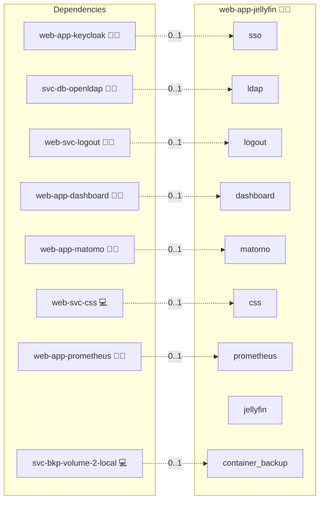

# Jellyfin

## Description

[Jellyfin](https://jellyfin.org) is a free, open-source media server. This role deploys the official `jellyfin/jellyfin` container behind the Infinito.Nexus reverse proxy, with Keycloak OIDC (web) and central LDAP authentication provisioned via the Jellyfin auth plugins.

## Overview

Jellyfin stores its metadata in internal SQLite under `/config` - it needs **no external database**. The role persists three named volumes: `/config`, `/cache`, and `/media`. Media libraries are added in-app against `/media`.

## Cosmos

The diagram places Jellyfin in the Infinito.Nexus cosmos: the components it deploys (capabilities), the central services it consumes (dependencies), and its outward reach (federation and bridged external networks).



Solid `1:1` edges are fixed relationships; dashed `0..1` edges are conditional (enabled only in matching deployments). Node markers show the role's deploy modes (💻 host, 🐳 compose, 🐝 swarm); ❌ marks a service that is explicitly turned off, and ⚙️ an Ansible role dependency declared in `meta/main.yml`.

## Features

- **Open-source media streaming** - movies, shows, music, live TV from the official Jellyfin server.
- **Keycloak OIDC (web)** - one-click web sign-in via the [`jellyfin-plugin-sso`](https://github.com/9p4/jellyfin-plugin-sso) plugin against the platform Keycloak.
- **Central LDAP (all clients)** - the [`jellyfin-plugin-ldapauth`](https://github.com/jellyfin/jellyfin-plugin-ldapauth) plugin authenticates web AND native apps against the platform OpenLDAP.
- **Break-glass admin** - a local administrator seeded via the first-run wizard (`/Startup`), independent of SSO/LDAP.
- **No external database** - self-contained SQLite under `/config`.

## Quick Setup

### Development

Clone, set up the workstation, and deploy Jellyfin onto the local stack:

```bash
git clone https://github.com/infinito-nexus/core.git
cd core
make onboard
make compose-deploy mode=reinstall apps=web-app-jellyfin full_cycle=false
```

### Production

Run the published image to provision the inventory and deploy Jellyfin to a managed server (the mounted volume persists the inventory):

```bash
APP=web-app-jellyfin
HOST=<your-server>
TLS_MODE=self_signed
SSH_PUBLIC_KEY="<your-ssh-public-key>"

docker run --rm -it \
  -v "$PWD/inventories:/etc/infinito.nexus/inventories" \
  -e APP="$APP" -e HOST="$HOST" -e TLS_MODE="$TLS_MODE" -e SSH_PUBLIC_KEY="$SSH_PUBLIC_KEY" \
  ghcr.io/infinito-nexus/core/debian bash -c '
    INVENTORY=/etc/infinito.nexus/inventories/production
    infinito administration inventory provision "$INVENTORY" \
      --inventory-file "$INVENTORY/devices.yml" \
      --host "$HOST" \
      --include "$APP" \
      --vars "{\"TLS_MODE\": \"$TLS_MODE\", \"users\": {\"administrator\": {\"authorized_keys\": [\"$SSH_PUBLIC_KEY\"]}}}" &&
    infinito administration deploy dedicated "$INVENTORY/devices.yml" \
      --password-file "$INVENTORY/.password" \
      --diff -vv'
```

## Authentication & Admin Model

Jellyfin has **no native OIDC/LDAP**; auth is plugin-based with an important client-coverage caveat:

- **LDAP plugin** works on **every client** (web + native Android/iOS/TV/desktop apps).
- **OIDC SSO plugin** is **web-UI only** - native apps cannot use it (they sign in via LDAP/local).

`files/configure-auth.sh` (run on the deploy host) completes the first-run wizard (seeds the break-glass admin), installs both plugins via Jellyfin's own `/Packages` installer, writes the plugin configs, and restarts.

## Further Resources

- [Jellyfin website](https://jellyfin.org)
- [Container installation](https://jellyfin.org/docs/general/installation/container/)
- [LDAP plugin](https://github.com/jellyfin/jellyfin-plugin-ldapauth)
- [SSO/OIDC plugin](https://github.com/9p4/jellyfin-plugin-sso)

## Credits

Implemented by **[Kevin Veen-Birkenbach](https://www.veen.world)**.
Part of the [Infinito.Nexus Project](https://s.infinito.nexus/code) and maintained by [Kevin Veen-Birkenbach](https://www.veen.world).
Licensed under the [Infinito.Nexus Community License (Non-Commercial)](https://s.infinito.nexus/license).
Licensed under the [Infinito.Nexus Community License (Non-Commercial)](https://s.infinito.nexus/license).
