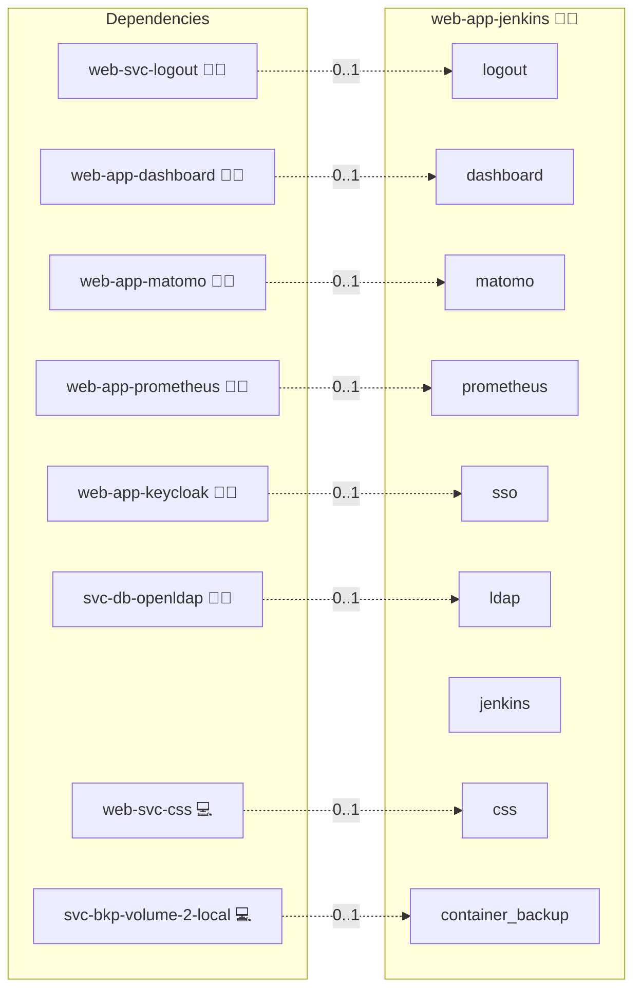

# Jenkins

## Description

[Jenkins](https://www.jenkins.io/) is an open-source automation server that orchestrates the build, test, and deployment of software through pipelines, freestyle jobs, and a large plugin ecosystem.

## Overview

This role deploys Jenkins on Docker Compose. It builds a custom Jenkins image that pre-installs the `oic-auth`, `ldap`, `role-strategy`, and `configuration-as-code` plugins, then mounts a JCasC YAML file that wires the security realm against Keycloak (variant 0, OIDC) or `svc-db-openldap` (variant 1, LDAP). The setup wizard is skipped via `JAVA_OPTS=-Djenkins.install.runSetupWizard=false` so the JCasC config takes over from first boot.

## Cosmos

The diagram places Jenkins in the Infinito.Nexus cosmos: the components it deploys (capabilities), the central services it consumes (dependencies), and its outward reach (federation and bridged external networks).



Solid `1:1` edges are fixed relationships; dashed `0..1` edges are conditional (enabled only in matching deployments). Node markers show the role's deploy modes (💻 host, 🐳 compose, 🐝 swarm); ❌ marks a service that is explicitly turned off, and ⚙️ an Ansible role dependency declared in `meta/main.yml`.

## Features

- **Containerized deployment:** Run Jenkins through Docker Compose with the role-specific custom image.
- **Native OIDC SSO:** Authenticate users against Keycloak via the `oic-auth` plugin, configured by JCasC at boot.
- **LDAP variant:** Switch to Jenkins's core `ldap` plugin via the role's matrix-deploy variant 1 against `svc-db-openldap`.
- **Role-strategy authorisation:** Map Keycloak groups and LDAP groups onto Jenkins authorities through the `role-strategy` plugin.
- **JCasC-managed configuration:** Persist the security realm and authorisation strategy as code via Configuration as Code.
- **Pre-installed plugin set:** Bake build-pipeline, credentials, and SCM plugins into the image so first start-up does not block on plugin downloads.

## Quick Setup

### Development

Clone, set up the workstation, and deploy Jenkins onto the local stack:

```bash
git clone https://github.com/infinito-nexus/core.git
cd core
make onboard
make compose-deploy mode=reinstall apps=web-app-jenkins full_cycle=false
```

### Production

Run the published image to provision the inventory and deploy Jenkins to a managed server (the mounted volume persists the inventory):

```bash
APP=web-app-jenkins
HOST=<your-server>
TLS_MODE=self_signed
SSH_PUBLIC_KEY="<your-ssh-public-key>"

docker run --rm -it \
  -v "$PWD/inventories:/etc/infinito.nexus/inventories" \
  -e APP="$APP" -e HOST="$HOST" -e TLS_MODE="$TLS_MODE" -e SSH_PUBLIC_KEY="$SSH_PUBLIC_KEY" \
  ghcr.io/infinito-nexus/core/debian bash -c '
    INVENTORY=/etc/infinito.nexus/inventories/production
    infinito administration inventory provision "$INVENTORY" \
      --inventory-file "$INVENTORY/devices.yml" \
      --host "$HOST" \
      --include "$APP" \
      --vars "{\"TLS_MODE\": \"$TLS_MODE\", \"users\": {\"administrator\": {\"authorized_keys\": [\"$SSH_PUBLIC_KEY\"]}}}" &&
    infinito administration deploy dedicated "$INVENTORY/devices.yml" \
      --password-file "$INVENTORY/.password" \
      --diff -vv'
```

## Further Resources

- [Jenkins Official Website](https://www.jenkins.io/)
- [Jenkins oic-auth plugin](https://plugins.jenkins.io/oic-auth/)
- [Jenkins Configuration as Code plugin](https://plugins.jenkins.io/configuration-as-code/)

## Credits

Implemented by **[Kevin Veen-Birkenbach](https://www.veen.world)**.
Part of the [Infinito.Nexus Project](https://s.infinito.nexus/code) and maintained by [Kevin Veen-Birkenbach](https://www.veen.world).
Licensed under the [Infinito.Nexus Community License (Non-Commercial)](https://s.infinito.nexus/license).
