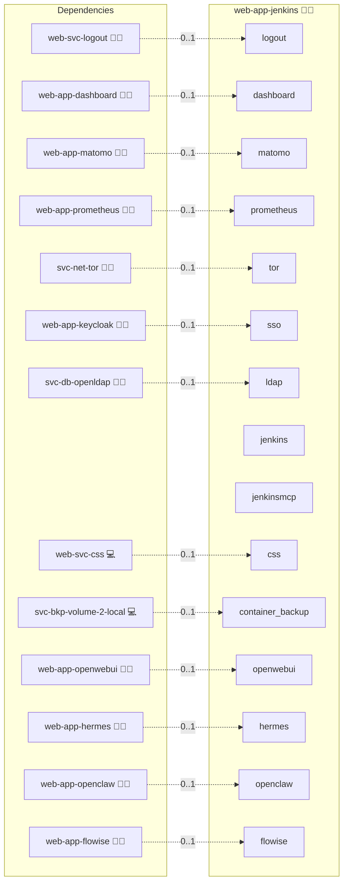

# Jenkins

## Description

[Jenkins](https://www.jenkins.io/) is an open-source automation server that orchestrates the build, test, and deployment of software through pipelines, freestyle jobs, and a large plugin ecosystem.

## Overview

This role deploys Jenkins on Docker Compose. It builds a custom Jenkins image that pre-installs the `oic-auth`, `ldap`, `role-strategy`, and `configuration-as-code` plugins, then mounts a JCasC YAML file that wires the security realm against Keycloak (variant 0, OIDC) or `svc-db-openldap` (variant 1, LDAP). The setup wizard is skipped via `JAVA_OPTS=-Djenkins.install.runSetupWizard=false` so the JCasC config takes over from first boot.

## Cosmos

The diagram places Jenkins in the Infinito.Nexus cosmos: the components it deploys (capabilities), the central services it consumes (dependencies), and its outward reach (federation and bridged external networks).


```mermaid
flowchart LR
    subgraph deps [Dependencies]
        dep_svc_bkp_volume_2_local["svc-bkp-volume-2-local 💻"]
        dep_svc_db_openldap["svc-db-openldap 🐳🐝"]
        dep_svc_net_tor["svc-net-tor 🐳🐝"]
        dep_web_app_dashboard["web-app-dashboard 🐳🐝"]
        dep_web_app_flowise["web-app-flowise 🐳🐝"]
        dep_web_app_hermes["web-app-hermes 🐳🐝"]
        dep_web_app_keycloak["web-app-keycloak 🐳🐝"]
        dep_web_app_matomo["web-app-matomo 🐳🐝"]
        dep_web_app_openclaw["web-app-openclaw 🐳🐝"]
        dep_web_app_openwebui["web-app-openwebui 🐳🐝"]
        dep_web_app_prometheus["web-app-prometheus 🐳🐝"]
        dep_web_svc_css["web-svc-css 💻"]
        dep_web_svc_logout["web-svc-logout 🐳🐝"]
    end
    subgraph role [web-app-jenkins 🐳🐝]
        svc_logout["logout"]
        svc_dashboard["dashboard"]
        svc_matomo["matomo"]
        svc_prometheus["prometheus"]
        svc_tor["tor"]
        svc_sso["sso"]
        svc_ldap["ldap"]
        svc_jenkins["jenkins"]
        svc_jenkinsmcp["jenkinsmcp"]
        svc_css["css"]
        svc_container_backup["container_backup"]
        svc_openwebui["openwebui"]
        svc_hermes["hermes"]
        svc_openclaw["openclaw"]
        svc_flowise["flowise"]
    end
    dep_svc_bkp_volume_2_local -. "0..1" .-> svc_container_backup
    dep_svc_db_openldap -. "0..1" .-> svc_ldap
    dep_svc_net_tor -. "0..1" .-> svc_tor
    dep_web_app_dashboard -. "0..1" .-> svc_dashboard
    dep_web_app_flowise -. "0..1" .-> svc_flowise
    dep_web_app_hermes -. "0..1" .-> svc_hermes
    dep_web_app_keycloak -. "0..1" .-> svc_sso
    dep_web_app_matomo -. "0..1" .-> svc_matomo
    dep_web_app_openclaw -. "0..1" .-> svc_openclaw
    dep_web_app_openwebui -. "0..1" .-> svc_openwebui
    dep_web_app_prometheus -. "0..1" .-> svc_prometheus
    dep_web_svc_css -. "0..1" .-> svc_css
    dep_web_svc_logout -. "0..1" .-> svc_logout
```

Solid `1:1` edges are fixed relationships; dashed `0..1` edges are conditional (enabled only in matching deployments); red `0..0` edges are turned off in this role. Node markers show the role's deploy modes (💻 host, 🐳 compose, 🐝 swarm); ❌ marks a service that is explicitly turned off, and ⚙️ an Ansible role dependency declared in `meta/main.yml`.

## Features

- **Containerized deployment:** Run Jenkins through Docker Compose with the role-specific custom image.
- **Native OIDC SSO:** Authenticate users against Keycloak via the `oic-auth` plugin, configured by JCasC at boot.
- **LDAP variant:** Switch to Jenkins's core `ldap` plugin via the role's matrix-deploy variant 1 against `svc-db-openldap`.
- **Role-strategy authorisation:** Map Keycloak groups and LDAP groups onto Jenkins authorities through the `role-strategy` plugin.
- **JCasC-managed configuration:** Persist the security realm and authorisation strategy as code via Configuration as Code.
- **Pre-installed plugin set:** Bake build-pipeline, credentials, and SCM plugins into the image so first start-up does not block on plugin downloads.
- **MCP server surface:** Serve the `mcp-server` plugin's streamable-HTTP endpoint on the container network, guarded by an administrator API token and limited to the read-only tool default.

## MCP Server

The role exposes Jenkins as an MCP server through the [MCP Server plugin](https://plugins.jenkins.io/mcp-server/), baked into the image alongside the other plugins in `files/plugins.txt`. The surface is declared as the `mcp` service in `meta/services.yml`.

| Property | Value |
| --- | --- |
| Transport | `streamable_http` |
| Plugin | `mcp-server` pinned to `0.190.ve5a_6581ffc96` in [`files/plugins.txt`](./files/plugins.txt) |
| Endpoint | `http://jenkins:8080/mcp-server/mcp` |
| Health | `/mcp-health` |
| Auth | `basic_auth` (`Authorization: Basic base64(<user>:<apiToken>)`) |
| Subject | administrator |
| Tools | read-only by default, mutating tools off |

Enable the surface by deploying `web-app-hermes` or `web-app-openclaw` alongside Jenkins, or by forcing `mcp.enabled` on. Open WebUI skips the server because it cannot present basic auth.

At boot, `files/mcp-api-token.groovy` runs from `init.groovy.d` and mints an API token named `infinito-mcp` for the administrator account, writing the plain value to `/var/jenkins_home/secrets/infinito-mcp.token`. `tasks/utils/mcp.yml` then reads that value out of the container, persists it through `sys-token-store`, and hard-fails the deploy when the controller rejects it. `MCP_DISCOVERED_SERVERS` picks the token up from the store and the client roles build the header via the `mcp_authorization` filter.

Reach the endpoint by hand with:

```bash
curl -u "<administrator>:<apiToken>" \
  -H 'Content-Type: application/json' \
  -H 'Accept: application/json, text/event-stream' \
  --data-binary '{"jsonrpc":"2.0","id":1,"method":"initialize","params":{"protocolVersion":"2025-03-26","capabilities":{},"clientInfo":{"name":"cli","version":"1.0.0"}}}' \
  http://jenkins:8080/mcp-server/mcp
```

### Default state

Off. `mcp.enabled` is true only while `web-app-hermes` or
`web-app-openclaw` is part of the deployment.

### Authorization subject

`auth_subject: administrator`: the API token is issued against the
administrator account, so every call carries that account's rights no matter who
asked the client. Reaching the tool server is gated on the role's `mcp` RBAC
group, which is a separate grant from administering Jenkins.

### Tool scope

The plugin answers `initialize` without credentials, because that call is
capability negotiation and carries no data. Everything after it is guarded: an
unauthenticated `tools/list` is refused and returns no tool inventory.

### How to disable

Remove the MCP client roles, or pin `mcp.enabled: false` for this role.
The MCP Server plugin is then not installed and the boot hook mints no API token.

## Quick Setup

### Development

Clone, set up the workstation, and deploy Jenkins onto the local stack:

```bash
git clone https://github.com/infinito-nexus/core.git
cd core
make onboard
make compose-deploy mode=reinstall apps=web-app-jenkins full_cycle=false
```

### Production

Run the published image to provision the inventory and deploy Jenkins to a managed server (the mounted volume persists the inventory):

```bash
APP=web-app-jenkins
HOST=<your-server>
TLS_MODE=self_signed
SSH_PUBLIC_KEY="<your-ssh-public-key>"

docker run --rm -it \
  -v "$PWD/inventories:/etc/infinito.nexus/inventories" \
  -e APP="$APP" -e HOST="$HOST" -e TLS_MODE="$TLS_MODE" -e SSH_PUBLIC_KEY="$SSH_PUBLIC_KEY" \
  ghcr.io/infinito-nexus/core/debian bash -c '
    INVENTORY=/etc/infinito.nexus/inventories/production
    infinito administration inventory provision "$INVENTORY" \
      --inventory-file "$INVENTORY/devices.yml" \
      --host "$HOST" \
      --include "$APP" \
      --vars "{\"TLS_MODE\": \"$TLS_MODE\", \"users\": {\"administrator\": {\"authorized_keys\": [\"$SSH_PUBLIC_KEY\"]}}}" &&
    infinito administration deploy dedicated "$INVENTORY/devices.yml" \
      --password-file "$INVENTORY/.password" \
      --diff -vv'
```

## Further Resources

- [Jenkins Official Website](https://www.jenkins.io/)
- [Jenkins oic-auth plugin](https://plugins.jenkins.io/oic-auth/)
- [Jenkins Configuration as Code plugin](https://plugins.jenkins.io/configuration-as-code/)
- [Jenkins MCP Server plugin](https://plugins.jenkins.io/mcp-server/)

## Persona contract opt-outs

The shared `biber` and `administrator` persona journeys are opted out via `PERSONA_BIBER_BLOCKED` / `PERSONA_ADMINISTRATOR_BLOCKED` in `templates/playwright.env.j2`.
Outside the OIDC variant, `templates/casc.yaml.j2` selects the `ldap` or `local` security realm and Jenkins' only login surface is its own Java-realm form, whose fields are named `j_username` / `j_password` (pinned by the LDAP scenario in `files/playwright/playwright.spec.js`) — names the shared native-login probe does not match, so the persona never authenticates.
The flag is currently unconditional; narrowing it to `` once the OIDC persona journey has been verified end-to-end is the path back.

## Credits

Implemented by **[Kevin Veen-Birkenbach](https://www.veen.world)**.
Part of the [Infinito.Nexus Project](https://s.infinito.nexus/code) and maintained by [Kevin Veen-Birkenbach](https://www.veen.world).
Licensed under the [Infinito.Nexus Community License (Non-Commercial)](https://s.infinito.nexus/license).
