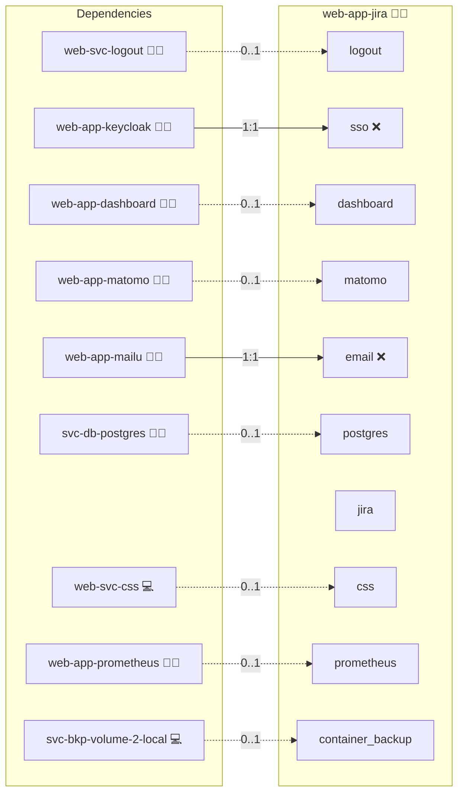

# Jira

## Description

[Jira](https://www.atlassian.com/) is Atlassian’s issue and project-tracking platform. This role deploys Jira via Docker Compose, connects it to PostgreSQL, and adds proxy awareness, optional OIDC SSO, health checks, and production-oriented defaults for Infinito.Nexus.

## Overview

The role builds a lean custom image on top of the official Jira Software image, provisions persistent volumes, and exposes the app behind your reverse proxy. Variables control image/version/volumes/domains/SSO. JVM heap sizing is auto-derived from host RAM with safe caps to prevent `Xms > Xmx`.

## Cosmos

The diagram places Jira in the Infinito.Nexus cosmos: the components it deploys (capabilities), the central services it consumes (dependencies), and its outward reach (federation and bridged external networks).



Solid `1:1` edges are fixed relationships; dashed `0..1` edges are conditional (enabled only in matching deployments). Node markers show the role's deploy modes (💻 host, 🐳 compose, 🐝 swarm); ❌ marks a service that is explicitly turned off.

## Features

* **Fully Dockerized:** Compose stack with a dedicated data volume (`jira_data`) and a minimal overlay image to enable future plugins/config.
* **Reverse-Proxy/HTTPS Ready:** Preconfigured Atlassian Tomcat proxy envs so Jira respects external scheme/host/port.
* **OIDC SSO (Optional):** Pre-templated vars for issuer, client, endpoints, scopes; compatible with Atlassian DC SSO/OIDC marketplace apps.
* **Central Database:** PostgreSQL integration (local or central) with credentials sourced from role configuration.
* **JVM Auto-Tuning:** Safe calculation of `JVM_MINIMUM_MEMORY` / `JVM_MAXIMUM_MEMORY` with caps to avoid VM init errors.
* **Health Checks:** Container healthcheck for quicker failure detection and stable automation.
* **CSP & Canonical Domains:** Integrates with platform CSP and domain management.
* **Backup Ready:** Persistent data under `{{ JIRA_STORAGE_PATH }}`.

## Quick Setup

### Development

Clone, set up the workstation, and deploy Jira onto the local stack:

```bash
git clone https://github.com/infinito-nexus/core.git
cd core
make onboard
make compose-deploy mode=reinstall apps=web-app-jira full_cycle=false
```

### Production

Run the published image to provision the inventory and deploy Jira to a managed server (the mounted volume persists the inventory between the two runs):

```bash
docker run --rm -it \
  -v "$PWD/inventories:/etc/infinito.nexus/inventories" \
  ghcr.io/infinito-nexus/core/debian \
  infinito administration inventory provision /etc/infinito.nexus/inventories/prod \
  --inventory-file /etc/infinito.nexus/inventories/prod/devices.yml \
  --host <your-server> \
  --vars-file inventories/<env>/default.yml \
  --include 'web-app-jira'

docker run --rm -it \
  -v "$PWD/inventories:/etc/infinito.nexus/inventories" \
  ghcr.io/infinito-nexus/core/debian \
  infinito administration deploy dedicated /etc/infinito.nexus/inventories/prod/devices.yml \
  --password-file /etc/infinito.nexus/inventories/prod/.password \
  --id web-app-jira \
  --diff \
  -vv
```

## Further Resources

* Docker Hub (official image): [atlassian/jira-software](https://hub.docker.com/r/atlassian/jira-software)

## Credits

Implemented by **[Kevin Veen-Birkenbach](https://www.veen.world)**.
Part of the [Infinito.Nexus Project](https://s.infinito.nexus/code) and maintained by [Kevin Veen-Birkenbach](https://www.veen.world).
Licensed under the [Infinito.Nexus Community License (Non-Commercial)](https://s.infinito.nexus/license).
