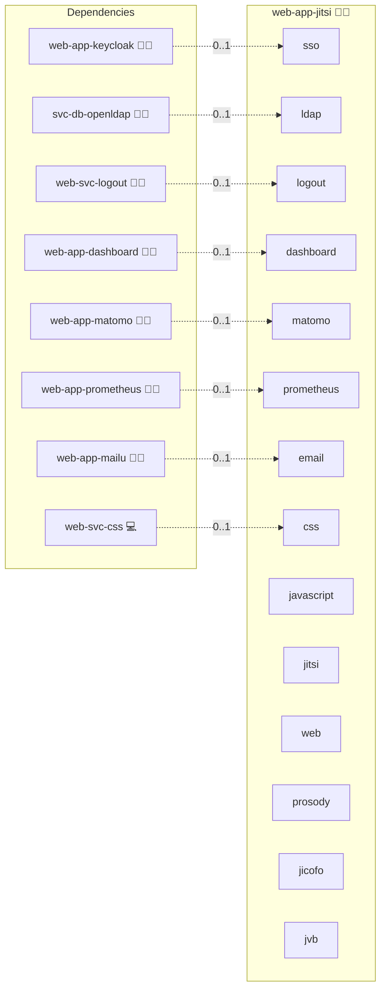

# Jitsi Meet

## Description

[Jitsi Meet](https://jitsi.org/) is an open-source, end-to-end-encryptable video conferencing platform. Rooms run over WebRTC with a central Selective Forwarding Unit (jvb), an XMPP server (prosody) for signalling, and a conference focus daemon (jicofo).

## Overview

This role deploys the official `jitsi/{web,prosody,jicofo,jvb}` images as a single-domain Jitsi Meet stack. Authentication is bridged to the central Keycloak via JWT (prosody validates RS256 tokens whose issuer is the realm's OIDC endpoint), and to OpenLDAP via prosody `mod_auth_ldap2` in the LDAP-only matrix variant. The web container sits behind the central openresty reverse proxy at `meet.{{ DOMAIN_PRIMARY }}`; the media plane (jvb) publishes UDP `10000/udp` on the host.

## Cosmos

The diagram places Jitsi Meet in the Infinito.Nexus cosmos: the components it deploys (capabilities), the central services it consumes (dependencies), and its outward reach (federation and bridged external networks).



Solid `1:1` edges are fixed relationships; dashed `0..1` edges are conditional (enabled only in matching deployments). Node markers show the role's deploy modes (💻 host, 🐳 compose, 🐝 swarm); ❌ marks a service that is explicitly turned off, and ⚙️ an Ansible role dependency declared in `meta/main.yml`.

## Features

- **JWT-bridged SSO:** Prosody validates Keycloak-issued RS256 tokens via JWKS so the OIDC client controls room moderation rights.
- **LDAP direct-bind variant:** `meta/variants.yml` V3 wires prosody's `mod_auth_ldap2` against `svc-db-openldap` for a non-OIDC LDAP-only deploy.
- **Three persona surfaces:** `guest` lands on the public landing without a room, `biber` joins a JWT-issued room, `administrator` is moderator with token-gated kick/lock.
- **Self-contained Prosody:** Component secrets for jicofo, jvb, jigasi and jibri are pre-generated via `meta/schema.yml` so XMPP auth is stable across redeploys.

## Quick Setup

### Development

Clone, set up the workstation, and deploy Jitsi Meet onto the local stack:

```bash
git clone https://github.com/infinito-nexus/core.git
cd core
make onboard
make compose-deploy mode=reinstall apps=web-app-jitsi full_cycle=false
```

### Production

Run the published image to provision the inventory and deploy Jitsi Meet to a managed server (the mounted volume persists the inventory):

```bash
APP=web-app-jitsi
HOST=<your-server>
TLS_MODE=self_signed
SSH_PUBLIC_KEY="<your-ssh-public-key>"

docker run --rm -it \
  -v "$PWD/inventories:/etc/infinito.nexus/inventories" \
  -e APP="$APP" -e HOST="$HOST" -e TLS_MODE="$TLS_MODE" -e SSH_PUBLIC_KEY="$SSH_PUBLIC_KEY" \
  ghcr.io/infinito-nexus/core/debian bash -c '
    INVENTORY=/etc/infinito.nexus/inventories/production
    infinito administration inventory provision "$INVENTORY" \
      --inventory-file "$INVENTORY/devices.yml" \
      --host "$HOST" \
      --include "$APP" \
      --vars "{\"TLS_MODE\": \"$TLS_MODE\", \"users\": {\"administrator\": {\"authorized_keys\": [\"$SSH_PUBLIC_KEY\"]}}}" &&
    infinito administration deploy dedicated "$INVENTORY/devices.yml" \
      --password-file "$INVENTORY/.password" \
      --diff -vv'
```

## Developer Notes

Variant matrix lives in [variants.yml](./meta/variants.yml). Service flags, ports, and image pins in [services.yml](./meta/services.yml). Credentials declared in [schema.yml](./meta/schema.yml).

### Persona contract opt-outs

The `biber` and `administrator` Playwright personas are gated on `services.sso.enabled`. When SSO is off, [`templates/playwright.env.j2`](./templates/playwright.env.j2) renders `PERSONA_BIBER_BLOCKED=true` and `PERSONA_ADMINISTRATOR_BLOCKED=true`. Two reasons:

- **V2 (no auth)**: every service is off; there is no auth chain to drive end-to-end.
- **V3 (LDAP only)**: Jitsi has no in-app HTTP OIDC adapter, so direct prosody `mod_auth_ldap2` binds happen inside the XMPP signalling layer when the user joins a room. The persona helpers only model the OIDC redirect chain through Keycloak, so the LDAP-only variant cannot be exercised via the shared persona helpers.

The `guest` persona is always live (no auth chain assumption) and the canonical-landing baseline test runs unconditionally.

## Further Resources

- [Jitsi Meet Project](https://jitsi.org/)
- [docker-jitsi-meet (upstream)](https://github.com/jitsi/docker-jitsi-meet)
- [Jitsi prosody plugins (jitsi-contrib)](https://github.com/jitsi-contrib/prosody-plugins)

## Credits

Implemented by **[Kevin Veen-Birkenbach](https://www.veen.world)**.
Part of the [Infinito.Nexus Project](https://s.infinito.nexus/code) and maintained by [Kevin Veen-Birkenbach](https://www.veen.world).
Licensed under the [Infinito.Nexus Community License (Non-Commercial)](https://s.infinito.nexus/license).
