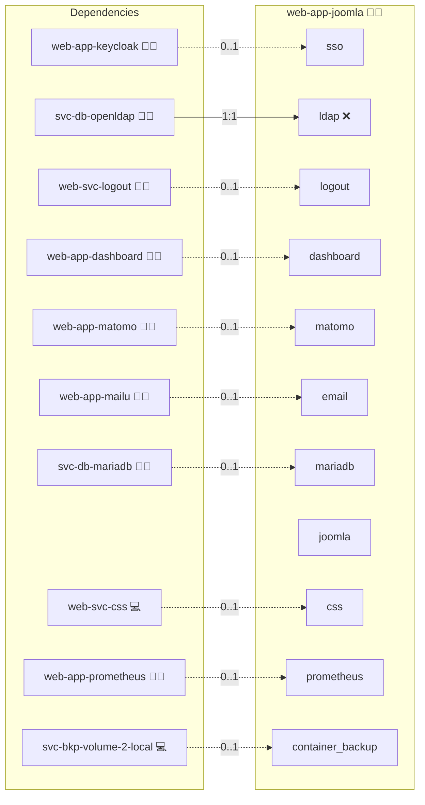

# Joomla

## Description

[Joomla](https://www.joomla.org/) is a free and open-source content management system that lets users build and run websites, intranets, and online applications without writing code. It exposes a component, module, and plugin architecture that authors and developers extend with custom content types, layouts, and integrations.

## Overview

This role deploys Joomla on Docker Compose. It builds a custom Joomla image that bakes in Composer for runtime extension builds, runs the Joomla CLI installer with the role's database, and installs the in-role `plg_system_keycloak` plugin so the site speaks OIDC against Keycloak with RBAC group mapping. A matrix-deploy variant flips the role to LDAP via Joomla's core LDAP authentication plugin instead.

For the OIDC plugin source and its environment contract see [README.md](./files/joomla-oidc-plugin/README.md).

## Cosmos

The diagram places Joomla in the Infinito.Nexus cosmos: the components it deploys (capabilities), the central services it consumes (dependencies), and its outward reach (federation and bridged external networks).



Solid `1:1` edges are fixed relationships; dashed `0..1` edges are conditional (enabled only in matching deployments). Node markers show the role's deploy modes (💻 host, 🐳 compose, 🐝 swarm); ❌ marks a service that is explicitly turned off, and ⚙️ an Ansible role dependency declared in `meta/main.yml`.

## Addons

Role-level extensions are declared in [`meta/addons/`](./meta/addons/)
(unified addon contract, requirement 026):

| Addon | Mechanism | Default state | Bridges |
|-------|-----------|---------------|---------|
| `plg_system_keycloak` | `plugin` | enabled whenever the `sso` service is present (`web-app-keycloak` co-deployed) | `sso` → `web-app-keycloak` |

`plg_system_keycloak` is built imperatively inside the Joomla container and speaks OIDC against Keycloak.
Its enablement derives directly from the `sso` service flag, and its OIDC runtime contract (issuer, client id/secret, redirect/end-session URLs, fallback toggle, and RBAC group paths) lives under the addon's `config:` block, which [`templates/env.j2`](./templates/env.j2) renders into the `JOOMLA_OIDC_*` plugin environment.

## Features

- **Containerized deployment:** Run Joomla through Docker Compose with the role-specific custom image.
- **Native OIDC SSO:** Authenticate users against Keycloak via the in-role `plg_system_keycloak` plugin, with `?fallback=local` as an env-toggleable emergency hatch.
- **RBAC group mapping:** Map Keycloak group paths onto Joomla's built-in `Super Users`, `Editor`, and `Registered` user groups inside the plugin.
- **LDAP variant:** Switch to Joomla's core LDAP plugin via the role's matrix-deploy variant 1, for sites that prefer direct LDAP federation.
- **External database:** Persist Joomla content in the project's central RDBMS through the standard role-meta wiring.
- **NGINX reverse proxy:** Front the Joomla container with the project's `sys-stk-front-proxy` for TLS termination and per-domain routing.

## Quick Setup

### Development

Clone, set up the workstation, and deploy Joomla onto the local stack:

```bash
git clone https://github.com/infinito-nexus/core.git
cd core
make onboard
make compose-deploy mode=reinstall apps=web-app-joomla full_cycle=false
```

### Production

Run the published image to provision the inventory and deploy Joomla to a managed server (the mounted volume persists the inventory):

```bash
APP=web-app-joomla
HOST=<your-server>
TLS_MODE=self_signed
SSH_PUBLIC_KEY="<your-ssh-public-key>"

docker run --rm -it \
  -v "$PWD/inventories:/etc/infinito.nexus/inventories" \
  -e APP="$APP" -e HOST="$HOST" -e TLS_MODE="$TLS_MODE" -e SSH_PUBLIC_KEY="$SSH_PUBLIC_KEY" \
  ghcr.io/infinito-nexus/core/debian bash -c '
    INVENTORY=/etc/infinito.nexus/inventories/production
    infinito administration inventory provision "$INVENTORY" \
      --inventory-file "$INVENTORY/devices.yml" \
      --host "$HOST" \
      --include "$APP" \
      --vars "{\"TLS_MODE\": \"$TLS_MODE\", \"users\": {\"administrator\": {\"authorized_keys\": [\"$SSH_PUBLIC_KEY\"]}}}" &&
    infinito administration deploy dedicated "$INVENTORY/devices.yml" \
      --password-file "$INVENTORY/.password" \
      --diff -vv'
```

## Developer Notes

See [README.md](./files/joomla-oidc-plugin/README.md) for the OIDC plugin's manifest, services provider, runtime environment, and route map.

## End-to-end tests

The Playwright spec at [`playwright.spec.js`](./files/playwright/playwright.spec.js) currently exercises the **administrator** path only: Keycloak SSO into the admin backend plus the local form-login emergency hatch (`?fallback=local`). The non-admin RBAC path via the canonical `biber` user is not yet covered.

Until the biber path is added:

- the role's [`playwright.env.j2`](./templates/playwright.env.j2) MUST NOT carry stale `BIBER_USERNAME` / `BIBER_PASSWORD` keys (the lint at [`test_env_keys_used.py`](../../tests/lint/ansible/roles/web-app/playwright/test_env_keys_used.py) enforces this);
- the admin scenarios stay gated on `oidc` (and on `ldap` for the LDAP-variant scenarios), so a deploy with `disable=oidc` reports the SSO scenario as `skipped`, never `failed`.

## Further Resources

- [Joomla Official Website](https://www.joomla.org/)
- [Joomla Documentation](https://docs.joomla.org/)

## Credits

Implemented by **[Kevin Veen-Birkenbach](https://www.veen.world)**.
Part of the [Infinito.Nexus Project](https://s.infinito.nexus/code) and maintained by [Kevin Veen-Birkenbach](https://www.veen.world).
Licensed under the [Infinito.Nexus Community License (Non-Commercial)](https://s.infinito.nexus/license).
