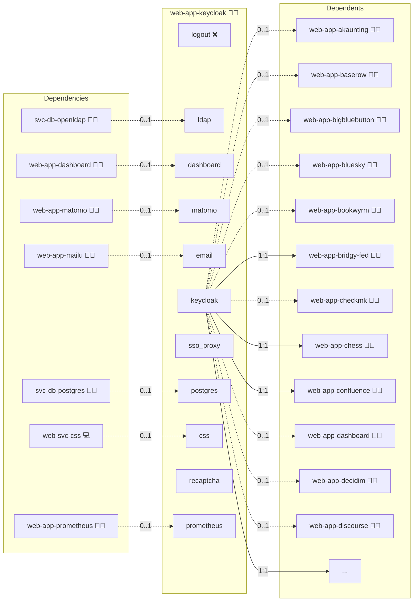

# Keycloak

## Description

Step into a secure future with [Keycloak](https://www.keycloak.org/)! This open‐source identity and access management solution offers powerful single sign-on (SSO), multi-factor authentication, and user federation capabilities. With support for industry standards such as SAML and OpenID Connect, Keycloak helps you protect and streamline access to your applications.

## Overview

This role deploys Keycloak in a Docker environment, integrating it with a PostgreSQL database and enabling operation behind a reverse proxy such as NGINX. It manages container orchestration and configuration via Docker Compose and environment variable templates, ensuring a secure and scalable identity management solution.

## Cosmos

The diagram places Keycloak in the Infinito.Nexus cosmos: the components it deploys (capabilities), the central services it consumes (dependencies), and its outward reach (federation and bridged external networks).



Solid `1:1` edges are fixed relationships; dashed `0..1` edges are conditional (enabled only in matching deployments). Node markers show the role's deploy modes (💻 host, 🐳 compose, 🐝 swarm); ❌ marks a service that is explicitly turned off, and ⚙️ an Ansible role dependency declared in `meta/main.yml`.

## Features

- **Comprehensive Identity Management:** Manage users, roles, and permissions across your applications with robust SSO and user federation.
- **Advanced Security Options:** Benefit from multi-factor authentication, configurable password policies, and secure session management.
- **Standards Support:** Seamlessly integrate with SAML, OpenID Connect, and OAuth2 to support various authentication flows.
- **Scalable and Customizable:** Easily tailor settings and scale your Keycloak instance to meet growing demands.

## Quick Setup

### Development

Clone, set up the workstation, and deploy Keycloak onto the local stack:

```bash
git clone https://github.com/infinito-nexus/core.git
cd core
make onboard
make compose-deploy mode=reinstall apps=web-app-keycloak full_cycle=false
```

### Production

Run the published image to provision the inventory and deploy Keycloak to a managed server (the mounted volume persists the inventory):

```bash
APP=web-app-keycloak
HOST=<your-server>
TLS_MODE=self_signed
SSH_PUBLIC_KEY="<your-ssh-public-key>"

docker run --rm -it \
  -v "$PWD/inventories:/etc/infinito.nexus/inventories" \
  -e APP="$APP" -e HOST="$HOST" -e TLS_MODE="$TLS_MODE" -e SSH_PUBLIC_KEY="$SSH_PUBLIC_KEY" \
  ghcr.io/infinito-nexus/core/debian bash -c '
    INVENTORY=/etc/infinito.nexus/inventories/production
    infinito administration inventory provision "$INVENTORY" \
      --inventory-file "$INVENTORY/devices.yml" \
      --host "$HOST" \
      --include "$APP" \
      --vars "{\"TLS_MODE\": \"$TLS_MODE\", \"users\": {\"administrator\": {\"authorized_keys\": [\"$SSH_PUBLIC_KEY\"]}}}" &&
    infinito administration deploy dedicated "$INVENTORY/devices.yml" \
      --password-file "$INVENTORY/.password" \
      --diff -vv'
```

## Developer Notes

For the OIDC variable tree, claim rules, and the policy that app-specific protocol mappers belong in per-client scope files (not in the shared `clients/default.json.j2`), see [oidc.md](../../docs/contributing/design/iam/oidc.md).

## Further Resources

- [Keycloak Official Website](https://www.keycloak.org/)
- [Official Keycloak Documentation](https://www.keycloak.org/documentation.html)
- [Keycloak GitHub Repository](https://github.com/keycloak/keycloak)
- [Setting up Keycloak behind a Reverse Proxy](https://www.keycloak.org/server/reverseproxy)
- [Wikipedia](https://en.wikipedia.org/wiki/Keycloak)
- [Youtube Tutorial](https://www.youtube.com/watch?v=fvxQ8bW0vO8)

## Credits

Implemented by **[Kevin Veen-Birkenbach](https://www.veen.world)**.
Part of the [Infinito.Nexus Project](https://s.infinito.nexus/code) and maintained by [Kevin Veen-Birkenbach](https://www.veen.world).
Licensed under the [Infinito.Nexus Community License (Non-Commercial)](https://s.infinito.nexus/license).
