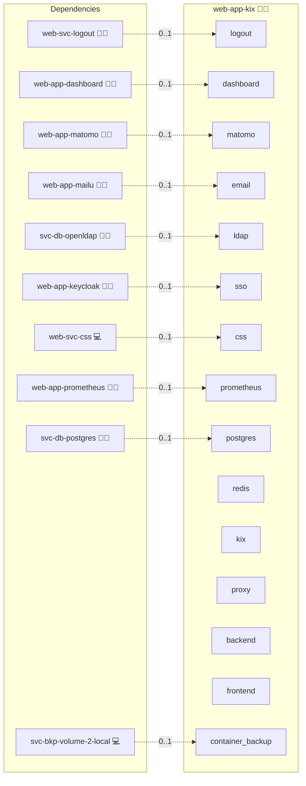

# KIX

## Description

[KIX Start](https://www.kixdesk.com/) is an open-source IT service management and helpdesk platform forked from OTRS. It provides ticket management, configuration management, knowledge base, and reporting for IT service teams.

## Overview

This role deploys KIX as an Infinito.Nexus web app behind the project's standard `sys-stk-front-proxy` and `web-app-keycloak`'s SSO-proxy sidecar chain. The upstream `kix-on-premise` proxy, backend, and frontend containers ship from `docker-registry.kixdesk.com/public/`. The backend initialises its schema (`scripts/database/kix-schema.xml`) against the central `svc-db-postgres` cluster, or against the embedded postgres sidecar when no central provider is in the inventory, with `pg_trgm` pre-activated via `services.postgres.extensions`; the cache is the role-local passwordless redis sidecar (the frontend ignores `REDIS_CACHE_PASSWORD`). Initial admin credentials are seeded via `INITIAL_ADMIN_PW` on first start (see `meta/schema.yml`).

## Cosmos

The diagram places KIX in the Infinito.Nexus cosmos: the components it deploys (capabilities), the central services it consumes (dependencies), and its outward reach (federation and bridged external networks).



Solid `1:1` edges are fixed relationships; dashed `0..1` edges are conditional (enabled only in matching deployments). Node markers show the role's deploy modes (💻 host, 🐳 compose, 🐝 swarm); ❌ marks a service that is explicitly turned off, and ⚙️ an Ansible role dependency declared in `meta/main.yml`.

## Features

- **TLS and HSTS:** KIX is reachable at `kix.<DOMAIN_PRIMARY>` via `sys-stk-front-proxy` with HSTS enabled.
- **OAuth2 proxy gate:** Every request is gated by `web-app-keycloak`'s SSO-proxy sidecar (`services.sso.enabled: true`). The Keycloak realm-level OTP and WebAuthn flow enforces 2FA before the OAuth2 proxy admits a session; KIX itself carries no 2FA logic.
- **Per-app RBAC:** Members of `/roles/web-app-kix/administrator` or `/roles/web-app-kix/user` are admitted to KIX; other users are blocked at the OAuth2 proxy. The `user` role is declared via `meta/rbac.yml` so non-admin agents can be granted helpdesk access without bumping them to global administrator.
- **LDAP user directory:** KIX' `Auth::LDAP` and `Auth::Sync::LDAP` modules are wired against `svc-db-openldap`, with one backend per role group. On first login KIX pulls the user's profile (display name, email, group membership) from LDAP, so no manual KIX-side user pre-creation is required.
- **Custom `kix-proxy` routing:** The role bind-mounts a complete `default.conf` into the upstream `kix-proxy` container that exposes the agent portal on port 80, routes through the frontend Node server, and forwards the OAuth2-proxy `X-Forwarded-User` header as a `Remote-User` upstream header.
- **Outbound mail:** KIX notification mail flows through the project's `sys-svc-mail-smtp` relay.
- **Dashboard card:** `web-app-dashboard` surfaces a KIX tile pointing at the canonical URL.
- **Universal logout:** The project logout endpoint terminates the KIX session alongside every other Infinito.Nexus app.

## Quick Setup

### Development

Clone, set up the workstation, and deploy KIX onto the local stack:

```bash
git clone https://github.com/infinito-nexus/core.git
cd core
make onboard
make compose-deploy mode=reinstall apps=web-app-kix full_cycle=false
```

### Production

Run the published image to provision the inventory and deploy KIX to a managed server (the mounted volume persists the inventory):

```bash
APP=web-app-kix
HOST=<your-server>
TLS_MODE=self_signed
SSH_PUBLIC_KEY="<your-ssh-public-key>"

docker run --rm -it \
  -v "$PWD/inventories:/etc/infinito.nexus/inventories" \
  -e APP="$APP" -e HOST="$HOST" -e TLS_MODE="$TLS_MODE" -e SSH_PUBLIC_KEY="$SSH_PUBLIC_KEY" \
  ghcr.io/infinito-nexus/core/debian bash -c '
    INVENTORY=/etc/infinito.nexus/inventories/production
    infinito administration inventory provision "$INVENTORY" \
      --inventory-file "$INVENTORY/devices.yml" \
      --host "$HOST" \
      --include "$APP" \
      --vars "{\"TLS_MODE\": \"$TLS_MODE\", \"users\": {\"administrator\": {\"authorized_keys\": [\"$SSH_PUBLIC_KEY\"]}}}" &&
    infinito administration deploy dedicated "$INVENTORY/devices.yml" \
      --password-file "$INVENTORY/.password" \
      --diff -vv'
```

## Further Resources

- [KIX Start website](https://www.kixdesk.com/)
- [KIX documentation](https://docs.kixdesk.com/)

## Credits

Implemented by **[Kevin Veen-Birkenbach](https://www.veen.world)**.
Part of the [Infinito.Nexus Project](https://s.infinito.nexus/code) and maintained by [Kevin Veen-Birkenbach](https://www.veen.world).
Licensed under the [Infinito.Nexus Community License (Non-Commercial)](https://s.infinito.nexus/license).
