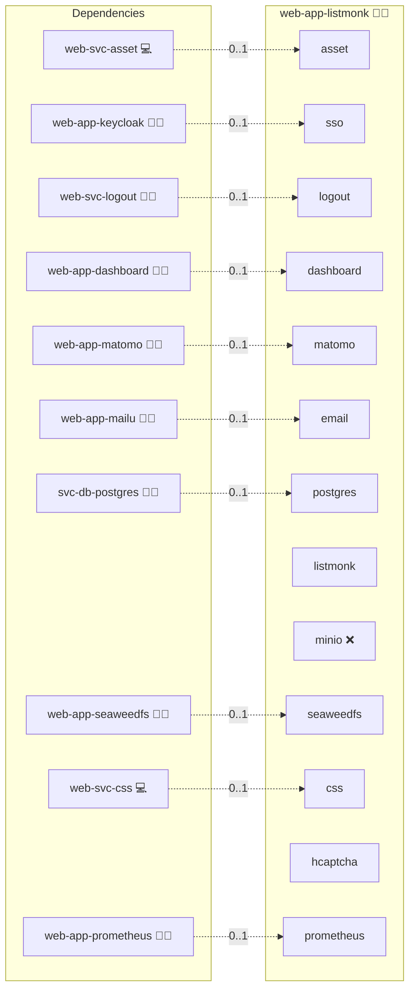

# Listmonk

## Description

Elevate your email marketing with Listmonk, a high-performance, self-hosted newsletter and mailing list manager featuring a modern, intuitive dashboard. Listmonk empowers you with advanced analytics, efficient subscriber segmentation, and streamlined campaign management, all configurable via a flexible TOML configuration file.

## Overview

This role deploys Listmonk using Docker, ensuring a robust and scalable setup for your newsletter management needs. Listmonk’s architecture supports a dedicated PostgreSQL database and integration with an NGINX reverse proxy for secure access. To configure and manage your instance, use the provided configuration files:

- [Installation.md](./Installation.md)
- [Upgrade.md](./Upgrade.md)

## Cosmos

The diagram places Listmonk in the Infinito.Nexus cosmos: the components it deploys (capabilities), the central services it consumes (dependencies), and its outward reach (federation and bridged external networks).



Solid `1:1` edges are fixed relationships; dashed `0..1` edges are conditional (enabled only in matching deployments). Node markers show the role's deploy modes (💻 host, 🐳 compose, 🐝 swarm); ❌ marks a service that is explicitly turned off, and ⚙️ an Ansible role dependency declared in `meta/main.yml`.

## Features

- **High Performance:** Optimized for handling large-scale mailing lists and newsletters with rapid processing.
- **Modern Dashboard:** Enjoy a sleek, user-friendly interface for managing campaigns and analyzing performance.
- **Advanced Analytics:** Gain insights through detailed reporting on campaign metrics and subscriber behavior.
- **Flexible Configuration:** Easily customize settings such as database connections, admin credentials, and server configurations via a TOML file.
- **Robust Infrastructure:** Seamlessly integrates with PostgreSQL for reliable data management and supports deployment behind a reverse proxy.

## Quick Setup

### Development

Clone, set up the workstation, and deploy Listmonk onto the local stack:

```bash
git clone https://github.com/infinito-nexus/core.git
cd core
make onboard
make compose-deploy mode=reinstall apps=web-app-listmonk full_cycle=false
```

### Production

Run the published image to provision the inventory and deploy Listmonk to a managed server (the mounted volume persists the inventory):

```bash
APP=web-app-listmonk
HOST=<your-server>
TLS_MODE=self_signed
SSH_PUBLIC_KEY="<your-ssh-public-key>"

docker run --rm -it \
  -v "$PWD/inventories:/etc/infinito.nexus/inventories" \
  -e APP="$APP" -e HOST="$HOST" -e TLS_MODE="$TLS_MODE" -e SSH_PUBLIC_KEY="$SSH_PUBLIC_KEY" \
  ghcr.io/infinito-nexus/core/debian bash -c '
    INVENTORY=/etc/infinito.nexus/inventories/production
    infinito administration inventory provision "$INVENTORY" \
      --inventory-file "$INVENTORY/devices.yml" \
      --host "$HOST" \
      --include "$APP" \
      --vars "{\"TLS_MODE\": \"$TLS_MODE\", \"users\": {\"administrator\": {\"authorized_keys\": [\"$SSH_PUBLIC_KEY\"]}}}" &&
    infinito administration deploy dedicated "$INVENTORY/devices.yml" \
      --password-file "$INVENTORY/.password" \
      --diff -vv'
```

## Further Resources

- [Listmonk Official Website](https://listmonk.app/)
- [Listmonk Installation Documentation](https://listmonk.app/docs/installation/)
- [Listmonk GitHub Repository](https://github.com/knadh/listmonk/)

## Credits

Implemented by **[Kevin Veen-Birkenbach](https://www.veen.world)**.
Part of the [Infinito.Nexus Project](https://s.infinito.nexus/code) and maintained by [Kevin Veen-Birkenbach](https://www.veen.world).
Licensed under the [Infinito.Nexus Community License (Non-Commercial)](https://s.infinito.nexus/license).
