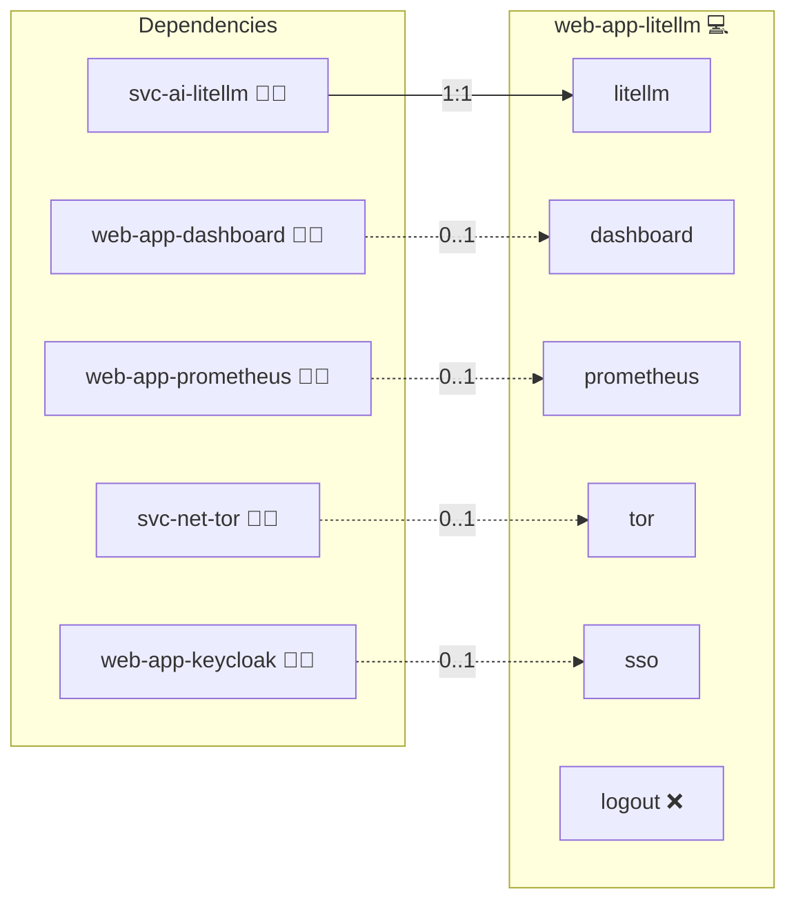

# LiteLLM Admin UI

## Description

[LiteLLM](https://docs.litellm.ai/) is an LLM gateway that puts a single OpenAI-compatible API in front of many model providers. Its admin UI is the gateway's built-in web interface for virtual API keys, teams, budgets and rate limits, model routing, and request and spend logs.

## Overview

This role deploys the LiteLLM admin UI as the browser-facing entry point of the headless LiteLLM Gateway. It runs in host mode and starts no container of its own: it claims a canonical domain, terminates TLS, applies the platform Content-Security-Policy, and reverse-proxies that domain to the local HTTP port the gateway publishes. Visitors sign in with the gateway's own UI credentials.

## Cosmos

The diagram places LiteLLM Admin UI in the Infinito.Nexus cosmos: the components it deploys (capabilities), the central services it consumes (dependencies), and its outward reach (federation and bridged external networks).



Solid `1:1` edges are fixed relationships; dashed `0..1` edges are conditional (enabled only in matching deployments); red `0..0` edges are turned off in this role. Node markers show the role's deploy modes (💻 host, 🐳 compose, 🐝 swarm); ❌ marks a service that is explicitly turned off, and ⚙️ an Ansible role dependency declared in `meta/main.yml`.

## Features

- **Dedicated domain:** The admin UI is reachable on its own canonical hostname under the primary domain.
- **Host-mode front proxy:** The role renders an OpenResty virtual host that terminates TLS and forwards to the gateway's local HTTP port, without deploying a container.
- **Keycloak sign-in:** With Keycloak in the deployment, the role sets `services.sso.flavor: oidc` and the LiteLLM Gateway reads the platform's OIDC endpoints from `GENERIC_CLIENT_ID`, `GENERIC_CLIENT_SECRET`, `GENERIC_AUTHORIZATION_ENDPOINT`, `GENERIC_TOKEN_ENDPOINT` and `GENERIC_USERINFO_ENDPOINT`. Sign in at `/sso/key/generate`; `PROXY_ADMIN_ID` carries the administrator's username. LiteLLM serves SSO for up to five accounts in `litellm_usertable` and refuses beyond that without `LITELLM_LICENSE`.
- **Gateway credentials:** Without Keycloak, access is gated by the LiteLLM UI username and password that the LiteLLM Gateway provisions. That pair keeps working alongside SSO as a break-glass login.
- **Scoped Content-Security-Policy:** The UI's inline bootstrap scripts pass through a `script-src-elem` flag, and no external font or connect sources are whitelisted.
- **Dashboard tile:** The application contributes a dashboard card when the platform dashboard is part of the deployment.
- **Guest smoke test:** A Playwright spec asserts that the UI answers behind the proxy and gates unauthenticated visitors: it expects the handover to Keycloak when SSO is on and the UI's own password form when it is off.
- **SSO round-trip test:** `test-oidc-login.js` drives `/sso/key/generate` through the Keycloak login form and asserts the UI no longer falls back to its own password gate.

## Quick Setup

### Development

Clone, set up the workstation, and deploy LiteLLM Admin UI onto the local stack:

```bash
git clone https://github.com/infinito-nexus/core.git
cd core
make onboard
make compose-deploy mode=reinstall apps=web-app-litellm full_cycle=false
```

### Production

Install LiteLLM Admin UI directly onto the target machine: clone the repository, install the OS prerequisites and the repository toolchain, then deploy against localhost over a local connection (no SSH, no container):

```bash
git clone https://github.com/infinito-nexus/core.git
cd core
bash scripts/install/package.sh
make install
source scripts/meta/env/load.sh

APP=web-app-litellm
DOMAIN=<your-domain>
TLS_MODE=self_signed
SSH_PUBLIC_KEY="<your-ssh-public-key>"
INVENTORY=inventories/production
infinito administration inventory provision "$INVENTORY" \
  --inventory-file "$INVENTORY/devices.yml" \
  --host localhost \
  --include "$APP" \
  --vars "{\"TLS_MODE\": \"$TLS_MODE\", \"DOMAIN_PRIMARY\": \"$DOMAIN\", \"users\": {\"administrator\": {\"authorized_keys\": [\"$SSH_PUBLIC_KEY\"]}}}"
infinito administration deploy dedicated "$INVENTORY/devices.yml" \
  --password-file "$INVENTORY/.password" \
  --diff -vv
```

## Credits

Implemented by **[Kevin Veen-Birkenbach](https://www.veen.world)**.
Part of the [Infinito.Nexus Project](https://s.infinito.nexus/code) and maintained by [Kevin Veen-Birkenbach](https://www.veen.world).
Licensed under the [Infinito.Nexus Community License (Non-Commercial)](https://s.infinito.nexus/license).
