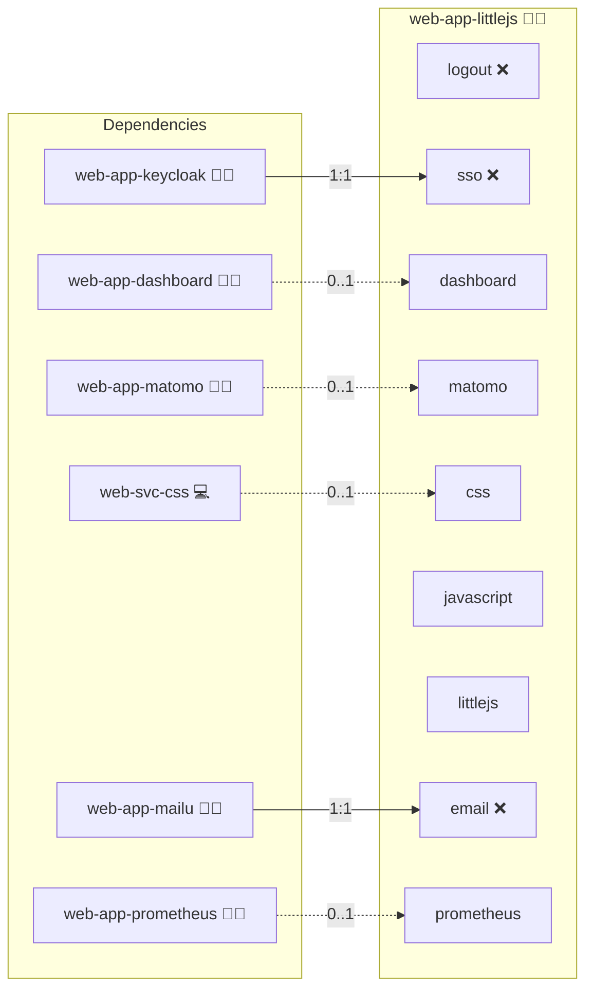

# LittleJS

## Description

**LittleJS** is a self-hosted web application that bundles the LittleJS engine, its official examples, and a minimal Infinito.Nexus launcher UI.
It provides a simple, tile-based overview of demos and games, allowing you to quickly explore LittleJS examples directly in your browser.

## Overview

LittleJS Playground is designed as a lightweight HTML5 game sandbox for education, prototyping, and fun.
It exposes the original LittleJS `examples/` browser and adds a Bootstrap-based landing page that lists all examples as clickable tiles and offers quick links to popular games such as platformers and arcade-style demos.
The app runs as a single Docker container and requires no additional database or backend services.

## Cosmos

The diagram places LittleJS in the Infinito.Nexus cosmos: the components it deploys (capabilities), the central services it consumes (dependencies), and its outward reach (federation and bridged external networks).



Solid `1:1` edges are fixed relationships; dashed `0..1` edges are conditional (enabled only in matching deployments). Node markers show the role's deploy modes (💻 host, 🐳 compose, 🐝 swarm); ❌ marks a service that is explicitly turned off, and ⚙️ an Ansible role dependency declared in `meta/main.yml`.

## Features

- **Self-hosted LittleJS environment**: run LittleJS demos and games under your own domain.
- **Example browser integration**: direct access to the original LittleJS example browser.
- **Tile-based launcher UI**: dynamically renders a catalog from the `exampleList` definition.
- **Quick links for games**: navbar entries for selected games (e.g. platformer, pong, space shooter).
- **Bootstrap-styled interface**: clean, minimalistic, and responsive layout.
- **Docker-ready**: fully integrated into the Infinito.Nexus Docker stack.

## Quick Setup

### Development

Clone, set up the workstation, and deploy LittleJS onto the local stack:

```bash
git clone https://github.com/infinito-nexus/core.git
cd core
make onboard
make compose-deploy mode=reinstall apps=web-app-littlejs full_cycle=false
```

### Production

Run the published image to provision the inventory and deploy LittleJS to a managed server (the mounted volume persists the inventory):

```bash
APP=web-app-littlejs
HOST=<your-server>
TLS_MODE=self_signed
SSH_PUBLIC_KEY="<your-ssh-public-key>"

docker run --rm -it \
  -v "$PWD/inventories:/etc/infinito.nexus/inventories" \
  -e APP="$APP" -e HOST="$HOST" -e TLS_MODE="$TLS_MODE" -e SSH_PUBLIC_KEY="$SSH_PUBLIC_KEY" \
  ghcr.io/infinito-nexus/core/debian bash -c '
    INVENTORY=/etc/infinito.nexus/inventories/production
    infinito administration inventory provision "$INVENTORY" \
      --inventory-file "$INVENTORY/devices.yml" \
      --host "$HOST" \
      --include "$APP" \
      --vars "{\"TLS_MODE\": \"$TLS_MODE\", \"users\": {\"administrator\": {\"authorized_keys\": [\"$SSH_PUBLIC_KEY\"]}}}" &&
    infinito administration deploy dedicated "$INVENTORY/devices.yml" \
      --password-file "$INVENTORY/.password" \
      --diff -vv'
```

## Further Resources

- Upstream engine & examples: [KilledByAPixel/LittleJS](https://github.com/KilledByAPixel/LittleJS)
- LittleJS README & docs: [GitHub – LittleJS](https://github.com/KilledByAPixel/LittleJS#readme)

## Credits

Implemented by **[Kevin Veen-Birkenbach](https://www.veen.world)**.
Part of the [Infinito.Nexus Project](https://s.infinito.nexus/code) and maintained by [Kevin Veen-Birkenbach](https://www.veen.world).
Licensed under the [Infinito.Nexus Community License (Non-Commercial)](https://s.infinito.nexus/license).
