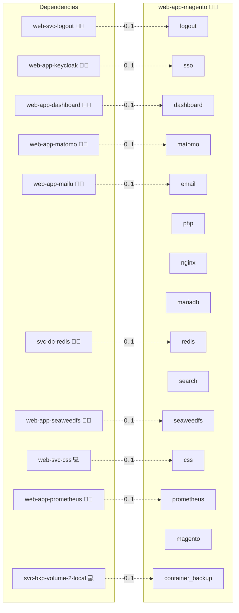

# Magento

## Description

**Magento (Adobe Commerce Open Source)** is a powerful, extensible e-commerce platform built with PHP. It supports multi-store setups, advanced catalog management, promotions, checkout flows, and a rich extension ecosystem.

## Overview

This role deploys **Magento 2** via Docker Compose. It is aligned with the Infinito.Nexus stack patterns:

- Reverse-proxy integration (front proxy handled by platform roles)
- Optional **central database** (MariaDB) or app-local DB
- **OpenSearch** for catalog search (required by Magento 2.4+)
- Optional **Redis** cache/session (can be toggled)
- Health checks, volumes, and environment templating
- SMTP wired via platform's `SYSTEM_EMAIL` settings

## Cosmos

The diagram places Magento in the Infinito.Nexus cosmos: the components it deploys (capabilities), the central services it consumes (dependencies), and its outward reach (federation and bridged external networks).



Solid `1:1` edges are fixed relationships; dashed `0..1` edges are conditional (enabled only in matching deployments). Node markers show the role's deploy modes (💻 host, 🐳 compose, 🐝 swarm); ❌ marks a service that is explicitly turned off, and ⚙️ an Ansible role dependency declared in `meta/main.yml`.

## Features

- **Modern search:** OpenSearch out of the box (single-node).
- **Flexible DB:** Use platform's central MariaDB or app-local DB.
- **Optional Redis:** Toggle cache/session backend.
- **Proxy-aware:** Exposes HTTP on localhost, picked up by front proxy role.
- **Automation-friendly:** Admin user seeded from inventory variables.

## Quick Setup

### Development

Clone, set up the workstation, and deploy Magento onto the local stack:

```bash
git clone https://github.com/infinito-nexus/core.git
cd core
make onboard
make compose-deploy mode=reinstall apps=web-app-magento full_cycle=false
```

### Production

Run the published image to provision the inventory and deploy Magento to a managed server (the mounted volume persists the inventory):

```bash
APP=web-app-magento
HOST=<your-server>
TLS_MODE=self_signed
SSH_PUBLIC_KEY="<your-ssh-public-key>"

docker run --rm -it \
  -v "$PWD/inventories:/etc/infinito.nexus/inventories" \
  -e APP="$APP" -e HOST="$HOST" -e TLS_MODE="$TLS_MODE" -e SSH_PUBLIC_KEY="$SSH_PUBLIC_KEY" \
  ghcr.io/infinito-nexus/core/debian bash -c '
    INVENTORY=/etc/infinito.nexus/inventories/production
    infinito administration inventory provision "$INVENTORY" \
      --inventory-file "$INVENTORY/devices.yml" \
      --host "$HOST" \
      --include "$APP" \
      --vars "{\"TLS_MODE\": \"$TLS_MODE\", \"users\": {\"administrator\": {\"authorized_keys\": [\"$SSH_PUBLIC_KEY\"]}}}" &&
    infinito administration deploy dedicated "$INVENTORY/devices.yml" \
      --password-file "$INVENTORY/.password" \
      --diff -vv'
```

## Further Resources

- [Magento Open Source](https://magento.com/)
- [Adobe Commerce DevDocs](https://developer.adobe.com/commerce/)
- [OpenSearch](https://opensearch.org/)

## Credits

Implemented by **[Kevin Veen-Birkenbach](https://www.veen.world)**.
Part of the [Infinito.Nexus Project](https://s.infinito.nexus/code) and maintained by [Kevin Veen-Birkenbach](https://www.veen.world).
Licensed under the [Infinito.Nexus Community License (Non-Commercial)](https://s.infinito.nexus/license).
