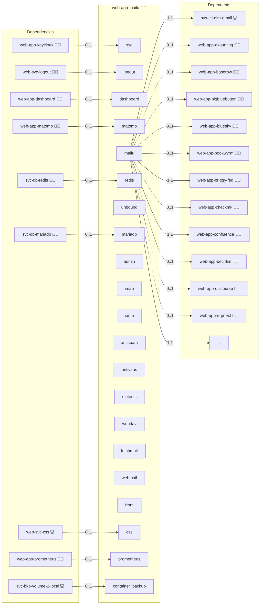

# Mailu

## Description

Revolutionize your email communications with Mailu, a secure and flexible mail server solution that integrates comprehensive features like robust SMTP/IMAP support, advanced spam filtering, DKIM signing, and seamless webmail access. With its modern design and performance-oriented architecture, Mailu empowers you to manage digital correspondence with efficiency and reliability.

## Overview

Mailu is a complete mail server suite delivered as a Docker-based solution. It supports all essential email protocols, offers intuitive administration through a web interface, and integrates advanced security measures such as TLS encryption and virus scanning. Its modular architecture allows for scalable deployments and easy customization to suit diverse operational requirements.

More information about this role is available in these GitHub repositories:

- [Mailu](https://github.com/infinito-nexus/core/tree/main/roles/web-app-mailu)
- [Mailu-OIDC](https://github.com/heviat/Mailu-OIDC)

## Cosmos

The diagram places Mailu in the Infinito.Nexus cosmos: the components it deploys (capabilities), the central services it consumes (dependencies), and its outward reach (federation and bridged external networks).



Solid `1:1` edges are fixed relationships; dashed `0..1` edges are conditional (enabled only in matching deployments). Node markers show the role's deploy modes (💻 host, 🐳 compose, 🐝 swarm); ❌ marks a service that is explicitly turned off, and ⚙️ an Ansible role dependency declared in `meta/main.yml`.

## Features

- **Comprehensive Email Protocols:** Supports SMTP, IMAP, and POP3 for reliable email delivery and retrieval.
- **Advanced Security:** Incorporates TLS encryption, DKIM, and SPF to secure your communications and prevent spoofing.
- **Integrated Spam Filtering and Antivirus:** Offers robust tools for spam detection and virus scanning, ensuring your inboxes remain clean and secure.
- **Customizable Webmail and Administration:** Provides a modern web interface for managing emails and administrative tasks with ease.
- **Flexible Deployment:** Easily scale and customize using Docker Compose, with configurable settings for networking, storage, and external services.
- **OIDC Support:** Optionally integrate with OpenID Connect for centralized authentication across your services.

## Quick Setup

### Development

Clone, set up the workstation, and deploy Mailu onto the local stack:

```bash
git clone https://github.com/infinito-nexus/core.git
cd core
make onboard
make compose-deploy mode=reinstall apps=web-app-mailu full_cycle=false
```

### Production

Run the published image to provision the inventory and deploy Mailu to a managed server (the mounted volume persists the inventory):

```bash
APP=web-app-mailu
HOST=<your-server>
TLS_MODE=self_signed
SSH_PUBLIC_KEY="<your-ssh-public-key>"

docker run --rm -it \
  -v "$PWD/inventories:/etc/infinito.nexus/inventories" \
  -e APP="$APP" -e HOST="$HOST" -e TLS_MODE="$TLS_MODE" -e SSH_PUBLIC_KEY="$SSH_PUBLIC_KEY" \
  ghcr.io/infinito-nexus/core/debian bash -c '
    INVENTORY=/etc/infinito.nexus/inventories/production
    infinito administration inventory provision "$INVENTORY" \
      --inventory-file "$INVENTORY/devices.yml" \
      --host "$HOST" \
      --include "$APP" \
      --vars "{\"TLS_MODE\": \"$TLS_MODE\", \"users\": {\"administrator\": {\"authorized_keys\": [\"$SSH_PUBLIC_KEY\"]}}}" &&
    infinito administration deploy dedicated "$INVENTORY/devices.yml" \
      --password-file "$INVENTORY/.password" \
      --diff -vv'
```

## Further Resources

- [Mailu Official Website](https://mailu.io/)
- [Mailu compose setup guide](https://mailu.io/1.7/compose/setup.html)
- [SysPass issue #1299](https://github.com/nuxsmin/sysPass/issues/1299)
- [Mailu issue #1719](https://github.com/Mailu/Mailu/issues/1719)
- [Mailu issue #1171](https://github.com/Mailu/Mailu/issues/1171)
- [Mailu issue #2135](https://github.com/Mailu/Mailu/issues/2135)
- [Mailu issue #2827](https://github.com/Mailu/Mailu/issues/2827)
- [Mailu GitHub repository](https://github.com/Mailu/Mailu)
- [Gist by marienfressinaud](https://gist.github.com/marienfressinaud/f284a59b18aad395eb0de2d22836ae6b)

## Credits

Implemented by **[Kevin Veen-Birkenbach](https://www.veen.world)**.
Part of the [Infinito.Nexus Project](https://s.infinito.nexus/code) and maintained by [Kevin Veen-Birkenbach](https://www.veen.world).
Licensed under the [Infinito.Nexus Community License (Non-Commercial)](https://s.infinito.nexus/license).
