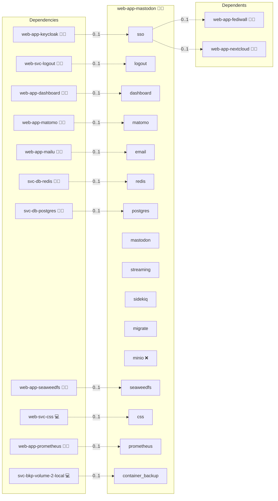

# Mastodon

## Description

Dive into a decentralized social experience with Mastodon, a vibrant platform that redefines online communication with its federated, community-driven approach. With a rich set of features focused on privacy, scalability, and customization, Mastodon empowers users to create, share, and interact in an open social network.

## Overview

This role deploys Mastodon using Docker, streamlining the installation and configuration of a full-featured social networking platform. Mastodon is built to support federation across multiple instances, offering robust content moderation, real-time updates, and flexible API integrations. Its advanced architecture includes separate services for the web frontend, streaming API, and background job processing, ensuring high performance and scalability for large communities.

## Cosmos

The diagram places Mastodon in the Infinito.Nexus cosmos: the components it deploys (capabilities), the central services it consumes (dependencies), and its outward reach (federation and bridged external networks).



Solid `1:1` edges are fixed relationships; dashed `0..1` edges are conditional (enabled only in matching deployments). Node markers show the role's deploy modes (💻 host, 🐳 compose, 🐝 swarm); ❌ marks a service that is explicitly turned off, and ⚙️ an Ansible role dependency declared in `meta/main.yml`.

## Features

- **Decentralized Network:** Connect with users across multiple instances in a federated social media ecosystem.
- **Real-Time Streaming:** Enjoy dynamic updates and real-time content delivery through dedicated streaming services.
- **Robust Content Moderation:** Utilize powerful moderation tools to manage community interactions and maintain safe spaces.
- **Scalable Architecture:** Benefit from a multi-service, Docker-based setup that supports high user loads and seamless background processing.
- **Flexible Authentication:** Integrated support for OpenID Connect (OIDC) simplifies user login and enhances security.
- **Customizable User Experience:** Configure themes, timeline settings, and notification options to tailor the social experience to your community.

## Quick Setup

### Development

Clone, set up the workstation, and deploy Mastodon onto the local stack:

```bash
git clone https://github.com/infinito-nexus/core.git
cd core
make onboard
make compose-deploy mode=reinstall apps=web-app-mastodon full_cycle=false
```

### Production

Run the published image to provision the inventory and deploy Mastodon to a managed server (the mounted volume persists the inventory):

```bash
APP=web-app-mastodon
HOST=<your-server>
TLS_MODE=self_signed
SSH_PUBLIC_KEY="<your-ssh-public-key>"

docker run --rm -it \
  -v "$PWD/inventories:/etc/infinito.nexus/inventories" \
  -e APP="$APP" -e HOST="$HOST" -e TLS_MODE="$TLS_MODE" -e SSH_PUBLIC_KEY="$SSH_PUBLIC_KEY" \
  ghcr.io/infinito-nexus/core/debian bash -c '
    INVENTORY=/etc/infinito.nexus/inventories/production
    infinito administration inventory provision "$INVENTORY" \
      --inventory-file "$INVENTORY/devices.yml" \
      --host "$HOST" \
      --include "$APP" \
      --vars "{\"TLS_MODE\": \"$TLS_MODE\", \"users\": {\"administrator\": {\"authorized_keys\": [\"$SSH_PUBLIC_KEY\"]}}}" &&
    infinito administration deploy dedicated "$INVENTORY/devices.yml" \
      --password-file "$INVENTORY/.password" \
      --diff -vv'
```

## Further Resources

- [Mastodon Official Website](https://joinmastodon.org/)
- [Mastodon Documentation](https://docs.joinmastodon.org/)
- [Mastodon Configuration Guide](https://gist.github.com/TrillCyborg/84939cd4013ace9960031b803a0590c4)
- [Scaling a Mastodon Server](https://www.digitalocean.com/community/tutorials/how-to-scale-your-mastodon-server)
- [Mastodon GitHub Issues](https://github.com/mastodon/mastodon/issues/7958)

## Credits

Implemented by **[Kevin Veen-Birkenbach](https://www.veen.world)**.
Part of the [Infinito.Nexus Project](https://s.infinito.nexus/code) and maintained by [Kevin Veen-Birkenbach](https://www.veen.world).
Licensed under the [Infinito.Nexus Community License (Non-Commercial)](https://s.infinito.nexus/license).
