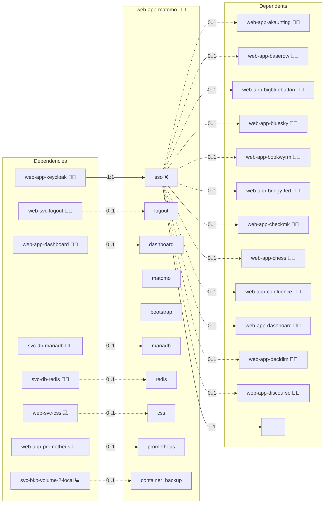

# Matomo

## Description

Experience the power of Matomo, an innovative open-source analytics platform that delivers real-time insights, robust visitor tracking, and privacy-first features to elevate your website performance. Dive into actionable data with unmatched precision and clarity.

## Overview

This role deploys Matomo using Docker, automating the setup of your analytics platform along with its underlying database. With support for health checks, persistent storage for configuration and data, and integration with an NGINX reverse proxy, Matomo is configured to provide reliable and scalable analytics for your digital presence.

## Cosmos

The diagram places Matomo in the Infinito.Nexus cosmos: the components it deploys (capabilities), the central services it consumes (dependencies), and its outward reach (federation and bridged external networks).



Solid `1:1` edges are fixed relationships; dashed `0..1` edges are conditional (enabled only in matching deployments). Node markers show the role's deploy modes (💻 host, 🐳 compose, 🐝 swarm); ❌ marks a service that is explicitly turned off, and ⚙️ an Ansible role dependency declared in `meta/main.yml`.

## Features

- **Real-Time Analytics:** Monitor visitor activity and generate detailed insights instantly.
- **Robust Tracking:** Track user interactions across your website with comprehensive analytics tools.
- **Privacy-First:** Enjoy a self-hosted solution that prioritizes data ownership and privacy.
- **Customizable Setup:** Configure database connections, admin credentials, and server settings via environment variables and a TOML configuration file.
- **Scalable Deployment:** Use Docker to ensure your analytics platform can grow with your traffic demands.

## Quick Setup

### Development

Clone, set up the workstation, and deploy Matomo onto the local stack:

```bash
git clone https://github.com/infinito-nexus/core.git
cd core
make onboard
make compose-deploy mode=reinstall apps=web-app-matomo full_cycle=false
```

### Production

Run the published image to provision the inventory and deploy Matomo to a managed server (the mounted volume persists the inventory):

```bash
APP=web-app-matomo
HOST=<your-server>
TLS_MODE=self_signed
SSH_PUBLIC_KEY="<your-ssh-public-key>"

docker run --rm -it \
  -v "$PWD/inventories:/etc/infinito.nexus/inventories" \
  -e APP="$APP" -e HOST="$HOST" -e TLS_MODE="$TLS_MODE" -e SSH_PUBLIC_KEY="$SSH_PUBLIC_KEY" \
  ghcr.io/infinito-nexus/core/debian bash -c '
    INVENTORY=/etc/infinito.nexus/inventories/production
    infinito administration inventory provision "$INVENTORY" \
      --inventory-file "$INVENTORY/devices.yml" \
      --host "$HOST" \
      --include "$APP" \
      --vars "{\"TLS_MODE\": \"$TLS_MODE\", \"users\": {\"administrator\": {\"authorized_keys\": [\"$SSH_PUBLIC_KEY\"]}}}" &&
    infinito administration deploy dedicated "$INVENTORY/devices.yml" \
      --password-file "$INVENTORY/.password" \
      --diff -vv'
```

## Further Resources

- [Matomo Official Website](https://matomo.org/)

## Credits

Implemented by **[Kevin Veen-Birkenbach](https://www.veen.world)**.
Part of the [Infinito.Nexus Project](https://s.infinito.nexus/code) and maintained by [Kevin Veen-Birkenbach](https://www.veen.world).
Licensed under the [Infinito.Nexus Community License (Non-Commercial)](https://s.infinito.nexus/license).
