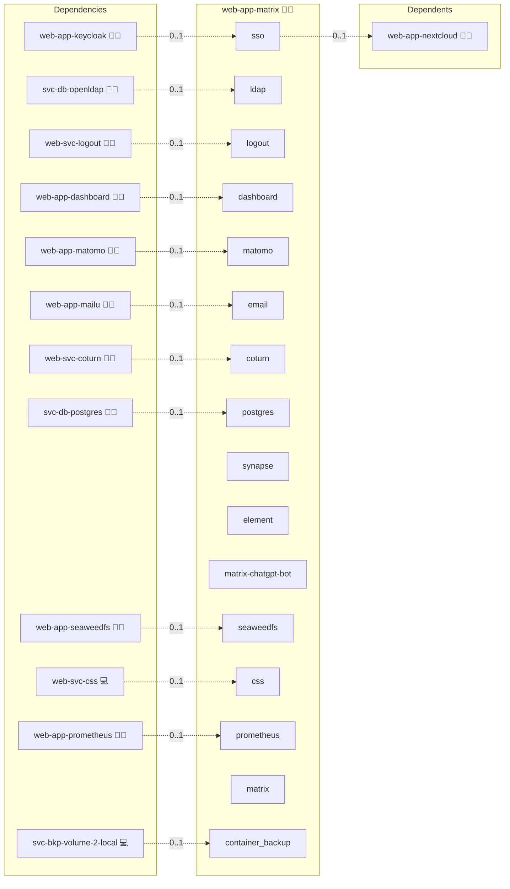
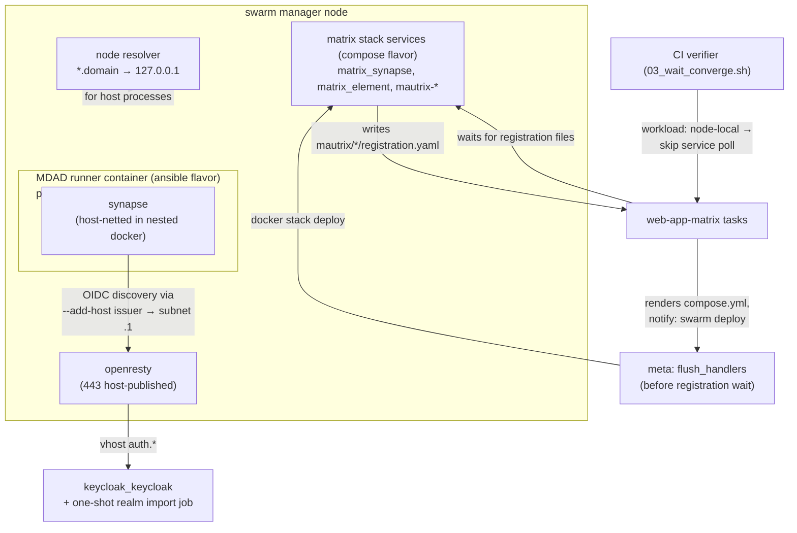

# Matrix

## Description

Step into the future of communication with Matrix, a dynamic and decentralized platform that delivers secure, real-time messaging and collaboration. With robust federation, end-to-end encryption, and versatile bridging support, Matrix enables seamless connections across diverse networks while safeguarding your data.

## Overview

This role deploys a Matrix homeserver and the Element web client. Two deployment flavors are supported, selected via `services.matrix.flavor`:

- `ansible` (default) wraps [matrix-docker-ansible-deploy](https://github.com/spantaleev/matrix-docker-ansible-deploy) (MDAD). MDAD runs ~70 upstream sub-roles to deliver Synapse, Element, every supported bridge, Element Call, and Jitsi. Infinito.Nexus pins MDAD by commit, renders an MDAD inventory from `services.matrix.*` knobs, and disables MDAD's bundled Traefik / Postgres / Redis so the central Infinito services back the stack.
- `compose` is the in-repo Docker Compose stack. It remains installable but receives no new features.

The compose flavor is **deprecated**. New deployments should use the ansible flavor.

## Cosmos

The diagram places Matrix in the Infinito.Nexus cosmos: the components it deploys (capabilities), the central services it consumes (dependencies), and its outward reach (federation and bridged external networks).



Solid `1:1` edges are fixed relationships; dashed `0..1` edges are conditional (enabled only in matching deployments). Node markers show the role's deploy modes (💻 host, 🐳 compose, 🐝 swarm); ❌ marks a service that is explicitly turned off, and ⚙️ an Ansible role dependency declared in `meta/main.yml`.

## Features

- **Decentralized and Federated:** Connect with a global network of Matrix homeservers, ensuring there is no single point of failure.
- **End-to-End Encryption:** Protect your communications with robust encryption mechanisms to keep your messages private.
- **Interoperability:** Bridge communications with external platforms (Signal, Telegram, Slack, IRC, Discord, Gitter, Twitter, and more) through MDAD-managed appservices.
- **Scalable Architecture:** Designed to handle increasing user loads and message volumes with high performance.
- **Flexible Client Support:** Access Matrix services via modern web clients like Element, plus integrated Element Call and Jitsi video conferencing.

## Quick Setup

### Development

Clone, set up the workstation, and deploy Matrix onto the local stack:

```bash
git clone https://github.com/infinito-nexus/core.git
cd core
make onboard
make compose-deploy mode=reinstall apps=web-app-matrix full_cycle=false
```

### Production

Run the published image to provision the inventory and deploy Matrix to a managed server (the mounted volume persists the inventory):

```bash
APP=web-app-matrix
HOST=<your-server>
TLS_MODE=self_signed
SSH_PUBLIC_KEY="<your-ssh-public-key>"

docker run --rm -it \
  -v "$PWD/inventories:/etc/infinito.nexus/inventories" \
  -e APP="$APP" -e HOST="$HOST" -e TLS_MODE="$TLS_MODE" -e SSH_PUBLIC_KEY="$SSH_PUBLIC_KEY" \
  ghcr.io/infinito-nexus/core/debian bash -c '
    INVENTORY=/etc/infinito.nexus/inventories/production
    infinito administration inventory provision "$INVENTORY" \
      --inventory-file "$INVENTORY/devices.yml" \
      --host "$HOST" \
      --include "$APP" \
      --vars "{\"TLS_MODE\": \"$TLS_MODE\", \"users\": {\"administrator\": {\"authorized_keys\": [\"$SSH_PUBLIC_KEY\"]}}}" &&
    infinito administration deploy dedicated "$INVENTORY/devices.yml" \
      --password-file "$INVENTORY/.password" \
      --diff -vv'
```

## Flavors

### `ansible` (default)

Pinned MDAD upstream lives at `services.matrix.upstream.{repo,ref}`. To bump:

1. Update `services.matrix.upstream.ref` in `meta/services.yml` to a newer MDAD commit.
2. Run `make compose-deploy mode=reinstall apps=web-app-matrix full_cycle=true variant=0`.
3. Iterate `mode=update` for follow-up adjustments.

MDAD knobs are rendered from `templates/flavor/ansible/vars.yml.j2`. Central-service consumers (postgres, redis, mailu, keycloak, openldap) are wired automatically when their `services.<name>.enabled` toggles are true.

**Runner-container encapsulation.** MDAD's `ansible-playbook setup.yml` invocation runs inside a dedicated sub-container (image: `services.matrix.runner.image`, built from `files/flavor/ansible/runner/Dockerfile`). This isolates MDAD's Ansible runtime from the Infinito-Nexus deploy container's Ansible, so MDAD can pin its own `ansible-core` / `community.docker` / `community.general` versions without colliding with Infinito's. The runner mounts:

- `/var/run/docker.sock`, so MDAD-launched containers land in the same Docker daemon as the rest of the stack
- `/etc/systemd/system`, `/run/systemd`, so MDAD's `systemctl` calls target the deploy container's systemd
- `/matrix`, MDAD's data and config root
- the MDAD checkout at `{{ MATRIX_MDAD_DIR }}`, a read-write working copy

`/usr/local/bin` is NOT bind-mounted, even though MDAD writes a few helper scripts there. The runner's `ansible-core` lives at `/opt/ansible/bin/` (out of the way) to keep the option open, but mounting the deploy container's `/usr/local/bin` over the runner causes a Python ABI mismatch segfault (host Python is built differently from `python:3.13-slim`). MDAD's host-side helper scripts are not invoked by the deploy flow.

A `mount --make-rshared /` runs once in the deploy container before the runner starts, because MDAD's systemd units bind-mount `/matrix/synapse/storage` with `bind-propagation=slave`, which requires shared/slave propagation on the source.

### `compose` (deprecated)

Set `services.matrix.flavor: compose` to opt in. Tasks live under `tasks/flavor/compose/`, templates under `templates/flavor/compose/`. Existing volumes and credentials are reused, so in-place deploys need no migration.

## Schema

The swarm deploy chain across both flavors:



## Bridge matrix

Set per-bridge flags under `services.matrix.plugins.<bridge>: true|false` in `meta/services.yml`. Conservative defaults: `mautrix_{signal,telegram,twitter,slack}`, `appservice_irc`, `heisenbridge`, `discord`, `gitter`, `hookshot` ON; `whatsapp`/`facebook`/`instagram`/`googlechat`/`sms` OFF.

The ansible flavor maps each true flag to the matching `matrix_<bridge>_enabled` MDAD var; the compose flavor builds the `MATRIX_BRIDGES` loop from the enabled `mechanism: bridge` addons (see Addons below).

## Addons

The mautrix network bridges are declared in
[`meta/addons/`](./meta/addons/) as `mechanism: bridge` addons
(requirement 026, Decision 13). Each is `required: false` and **disabled by default**; its
per-network DB password is referenced from
[`meta/schema.yml`](./meta/schema.yml) `credentials:`, never inlined.

| Addon | Mechanism | Default state | Bridges |
|-------|-----------|---------------|---------|
| `mautrix-whatsapp` | `bridge` | disabled | external network |
| `mautrix-telegram` | `bridge` | disabled | external network |
| `mautrix-signal` | `bridge` | disabled | external network |
| `mautrix-slack` | `bridge` | disabled | external network |
| `mautrix-meta` | `bridge` | disabled | external network |

The compose flavor derives `MATRIX_BRIDGES` from the enabled bridge addons'
`config:` blocks; the enabled/disabled split is exercised by the compose
variant in [`meta/variants.yml`](./meta/variants.yml). Coverage is via
`test-bridge-roster.js`.

## Conferencing

`services.matrix.conferencing.element_call` and `services.matrix.conferencing.jitsi` toggle MDAD's Element Call / Jitsi stacks (ansible flavor only). Both default to true.

## Playwright specs

In addition to the persona and CSP specs:

- `test-element-call.js` opens the Element home view and verifies a call-widget control surfaces when `services.matrix.conferencing.element_call=true` (skipped otherwise).
- `test-bridge-roster.js` probes the Synapse `/_matrix/client/v3/profile/{bot}` endpoint for every enabled bridge and fails on 5xx (skipped when no bridge is enabled).

## Further Resources

- [Matrix Official Website](https://matrix.org/)
- [Matrix Documentation](https://matrix.org/docs/)

## Credits

Implemented by **[Kevin Veen-Birkenbach](https://www.veen.world)**.
Part of the [Infinito.Nexus Project](https://s.infinito.nexus/code) and maintained by [Kevin Veen-Birkenbach](https://www.veen.world).
Licensed under the [Infinito.Nexus Community License (Non-Commercial)](https://s.infinito.nexus/license).
