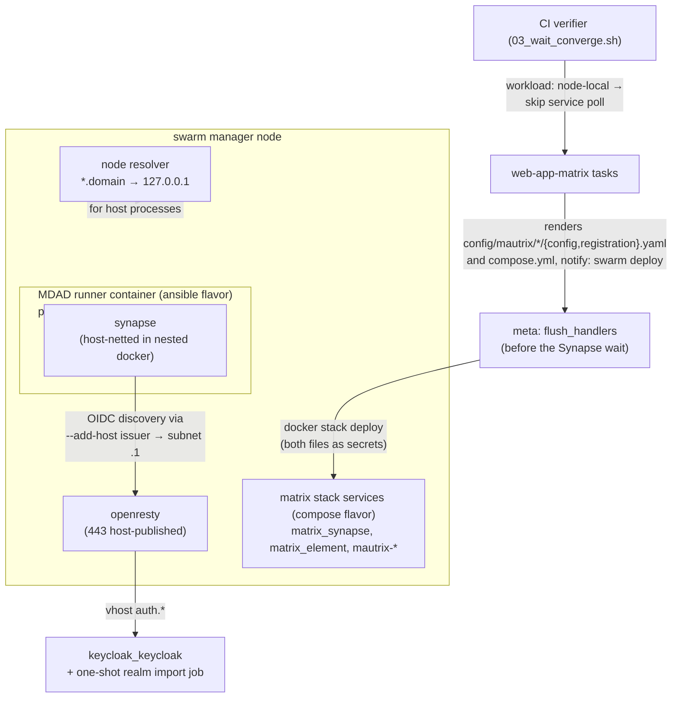

# Matrix

## Description

Step into the future of communication with Matrix, a dynamic and decentralized platform that delivers secure, real-time messaging and collaboration. With robust federation, end-to-end encryption, and versatile bridging support, Matrix enables seamless connections across diverse networks while safeguarding your data.

## Overview

This role deploys a Matrix homeserver and the Element web client. Two deployment flavors are supported, selected via `services.matrix.flavor`:

- `ansible` (default) wraps [matrix-docker-ansible-deploy](https://github.com/spantaleev/matrix-docker-ansible-deploy) (MDAD). MDAD runs ~70 upstream sub-roles to deliver Synapse, Element, every supported bridge, Element Call, and Jitsi. Infinito.Nexus pins MDAD by commit, renders an MDAD inventory from `services.matrix.*` knobs, and disables MDAD's bundled Traefik / Postgres / Redis so the central Infinito services back the stack.
- `compose` is the in-repo Docker Compose stack. It remains installable but receives no new features.

The compose flavor is **deprecated**. New deployments should use the ansible flavor.

## Features

- **Decentralized and Federated:** Connect with a global network of Matrix homeservers, ensuring there is no single point of failure.
- **End-to-End Encryption:** Protect your communications with robust encryption mechanisms to keep your messages private.
- **Interoperability:** Bridge communications with external platforms (Signal, Telegram, Slack, IRC, Discord, Gitter, Twitter, and more) through MDAD-managed appservices.
- **Scalable Architecture:** Designed to handle increasing user loads and message volumes with high performance.
- **Flexible Client Support:** Access Matrix services via modern web clients like Element, plus integrated Element Call and Jitsi video conferencing.

## Flavors

### `ansible` (default)

Pinned MDAD upstream lives at `services.matrix.upstream.{repo,ref}`. To bump:

1. Update `services.matrix.upstream.ref` in `meta/services.yml` to a newer MDAD commit.
2. Run `make compose-deploy mode=reinstall apps=web-app-matrix full_cycle=true variant=0`.
3. Iterate `mode=update` for follow-up adjustments.

MDAD knobs are rendered from `templates/flavor/ansible/vars.yml.j2`. Central-service consumers (postgres, redis, mailu, keycloak, openldap) are wired automatically when their `services.<name>.enabled` toggles are true.

**Runner-container encapsulation.** MDAD's `ansible-playbook setup.yml` invocation runs inside a dedicated sub-container (image: `services.matrix.runner.image`, built from `files/flavor/ansible/runner/Dockerfile`). This isolates MDAD's Ansible runtime from the Infinito-Nexus deploy container's Ansible, so MDAD can pin its own `ansible-core` / `community.docker` / `community.general` versions without colliding with Infinito's. The runner mounts:

- `/var/run/docker.sock`, so MDAD-launched containers land in the same Docker daemon as the rest of the stack
- `/etc/systemd/system`, `/run/systemd`, so MDAD's `systemctl` calls target the deploy container's systemd
- `/matrix`, MDAD's data and config root
- the MDAD checkout at `{{ MATRIX_MDAD_DIR }}`, a read-write working copy

`/usr/local/bin` is NOT bind-mounted, even though MDAD writes a few helper scripts there. The runner's `ansible-core` lives at `/opt/ansible/bin/` (out of the way) to keep the option open, but mounting the deploy container's `/usr/local/bin` over the runner causes a Python ABI mismatch segfault (host Python is built differently from `python:3.13-slim`). MDAD's host-side helper scripts are not invoked by the deploy flow.

A `mount --make-rshared /` runs once in the deploy container before the runner starts, because MDAD's systemd units bind-mount `/matrix/synapse/storage` with `bind-propagation=slave`, which requires shared/slave propagation on the source.

### `compose` (deprecated)

Set `services.matrix.flavor: compose` to opt in. Tasks live under `tasks/flavor/compose/`, templates under `templates/flavor/compose/`. Existing volumes and credentials are reused, so in-place deploys need no migration.

## Schema

The swarm deploy chain across both flavors:

```mermaid
flowchart TD
    subgraph node["swarm manager node"]
        prx["openresty<br/>(443 host-published)"]
        dnsm["node resolver<br/>*.domain → 127.0.0.1"]
        subgraph runner["MDAD runner container (ansible flavor)<br/>privileged, nested docker"]
            syn["synapse<br/>(host-netted in nested docker)"]
        end
        stack["matrix stack services (compose flavor)<br/>matrix_synapse, matrix_element, mautrix-*"]
    end
    kc["keycloak_keycloak<br/>+ one-shot realm import job"]

    role["web-app-matrix tasks"] -- "renders config/mautrix/*/{config,registration}.yaml<br/>and compose.yml, notify: swarm deploy" --> flush["meta: flush_handlers<br/>(before the Synapse wait)"]
    flush -- "docker stack deploy<br/>(both files as secrets)" --> stack

    syn -- "OIDC discovery via<br/>--add-host issuer → subnet .1" --> prx
    prx -- "vhost auth.*" --> kc
    dnsm -. "127.0.0.1 only valid<br/>for host processes" .-> node

    verify["CI verifier (03_wait_converge.sh)"] -- "workload: node-local →<br/>skip service poll" --> role
```

## Bridge matrix

Set per-bridge flags under `services.matrix.plugins.<bridge>: true|false` in `meta/services.yml`. Conservative defaults: `mautrix_{signal,telegram,twitter,slack}`, `appservice_irc`, `heisenbridge`, `discord`, `gitter`, `hookshot` ON; `whatsapp`/`facebook`/`instagram`/`googlechat`/`sms` OFF.

The ansible flavor maps each true flag to the matching `matrix_<bridge>_enabled` MDAD var; the compose flavor builds the `MATRIX_BRIDGES` loop from the enabled `mechanism: bridge` addons (see Addons below).

## Addons

The mautrix network bridges are declared in
`meta/addons/` as `mechanism: bridge` addons
(requirement 026, Decision 13). Each is `required: false` and **disabled by default**; its
per-network DB password and its appservice `as_token`/`hs_token` pair are referenced from
[`meta/secrets.yml`](./meta/secrets.yml) `credentials:`, never inlined. The role renders each
bridge's `config.yaml` and the matching Synapse `registration.yaml` from the same tokens.

| Addon | Mechanism | Default state | Bridges |
|-------|-----------|---------------|---------|
| `mautrix-whatsapp` | `bridge` | disabled | external network |
| `mautrix-telegram` | `bridge` | disabled | external network |
| `mautrix-signal` | `bridge` | disabled | external network |
| `mautrix-slack` | `bridge` | disabled | external network |
| `mautrix-meta` | `bridge` | disabled | external network |
| `hookshot-gitlab` | `bridge` | follows `services.gitlab.enabled` | `gitlab` |
| `hookshot-jira` | `bridge` | never: `services.jira.enabled` is pinned off because `web-app-jira` is end of life (see [lifecycle.md](../../docs/contributing/design/role/services/lifecycle.md)) | `jira` |
| `hookshot-webhooks` | `bridge` | follows `services.n8n.enabled` | `n8n` |
| `hookshot-feeds` | `bridge` | disabled | RSS, no partner role |
| `jitsi` | `module` | follows `services.jitsi.enabled` | `jitsi` |
| `baibot` | `addon` | follows `services.matrix.plugins.chatgpt` | `litellm` |
| `synapse-usage-exporter` | `addon` | follows `services.prometheus.enabled` | `prometheus` |

The compose flavor derives `MATRIX_BRIDGES` from the enabled bridge addons'
`config:` blocks that declare a `bridge_name`; the enabled/disabled split is
exercised by the compose variant in [`meta/variants.yml`](./meta/variants.yml).
Coverage is via `test-bridge-roster.js`.

The three cross-role addons follow their partner's service flag instead of a
static default, except where the partner is end of life: `services.jira.enabled`
is a literal `false` that no inventory can turn on, so `hookshot-jira` stays
declared and dormant. `hookshot-gitlab` and `hookshot-jira` select which
[matrix-hookshot](https://github.com/matrix-org/matrix-hookshot) connections the
ansible flavor configures, on top of the `services.matrix.plugins.hookshot`
knob that decides whether MDAD deploys the bridge at all. `jitsi` writes
[Element's](https://github.com/element-hq/element-web/blob/develop/docs/jitsi.md)
`jitsi.preferredDomain` so conference widgets open on the co-deployed
`web-app-jitsi` instance: the compose flavor writes it into
`element.config.json`, the ansible flavor overrides MDAD's
`matrix_client_element_jitsi_preferred_domain` and the matching `.well-known`
client property. Which of the two stacks serves is decided by
`services.jitsi.shared`: shared means `web-app-jitsi` provides it and MDAD's own
jitsi role stays off, unshared means MDAD raises web, prosody, jicofo and jvb
inside the runner container and owns the client config itself. The unshared
branch serves on `matrix_server_fqn_jitsi`, which needs a routed domain before
it is reachable from outside the runner. Per-addon specs live under
`files/playwright/addons/`.

`services.matrix.plugins.hookshot` follows the deployment of the partners its
connection addons bind, so the bridge comes up wherever `web-app-gitlab` or
`web-app-n8n` is deployed. The four `hookshot-*` addons then select which
connections MDAD configures through `matrix_bridge_hookshot_<kind>_enabled`;
`generic` and `feeds` are upstream defaults the addons drive explicitly.
`hookshot-feeds` has no partner service of its own, so enabling it alone does
nothing: without `web-app-gitlab` or `web-app-n8n` the bridge it configures is
never deployed. Pin it in a round that already carries one of them.

A bridge addon names the upstream switches it drives under
`config.upstream_flags`, next to its `bridge_name`. The ansible flavor renders
that list; one addon may drive several switches, as `mautrix-meta` does for
MDAD's separate Messenger and Instagram roles.

`services.matrix.plugins.chatgpt` is the single switch for the AI surface in
both flavors: the compose flavor renders `matrix-chatgpt-bot`, the ansible
flavor enables `baibot`. Both reach the model through `svc-ai-litellm` with the
role's `litellm_api_key`, and MDAD creates the `baibot` account itself from
`matrix_user_creator_users_auto`, so no account provisioning step is needed.

`synapse-usage-exporter` turns Synapse's metrics listener on and publishes it on
the `matrix-mdad` container's own interface. The outer Prometheus joins this
role's docker network and scrapes the DiD container by name, which is why
`services.prometheus.native_metrics` resolves its `service_key` and `port` per
flavor: `synapse:9000` for the in-repo compose stack, `matrix:9100` for the
MDAD stack where the homeserver runs one docker layer deeper.

## Conferencing

`services.matrix.conferencing.element_call` and `services.matrix.conferencing.jitsi` toggle MDAD's Element Call / Jitsi stacks (ansible flavor only). Both default to true.

## Playwright specs

In addition to the persona and CSP specs:

- `test-element-call.js` opens the Element home view and verifies a call-widget control surfaces when `services.matrix.conferencing.element_call=true` (skipped otherwise).
- `test-bridge-roster.js` probes the Synapse `/_matrix/client/v3/profile/{bot}` endpoint for every enabled bridge and fails on 5xx (skipped when no bridge is enabled).

## Further Resources

- [Matrix Official Website](https://matrix.org/)
- [Matrix Documentation](https://matrix.org/docs/)
- [Corporate design review: screenshots in light, dark, desktop and mobile](https://claude.ai/artifact/ARJ2WC3qqcZAFe8oj2ux9V)

## Credits

Implemented by **[Kevin Veen-Birkenbach](https://www.veen.world)**.
Part of the [Infinito.Nexus Project](https://s.infinito.nexus/code) and maintained by [Kevin Veen-Birkenbach](https://www.veen.world).
Licensed under the [Infinito.Nexus Community License (Non-Commercial)](https://s.infinito.nexus/license).
