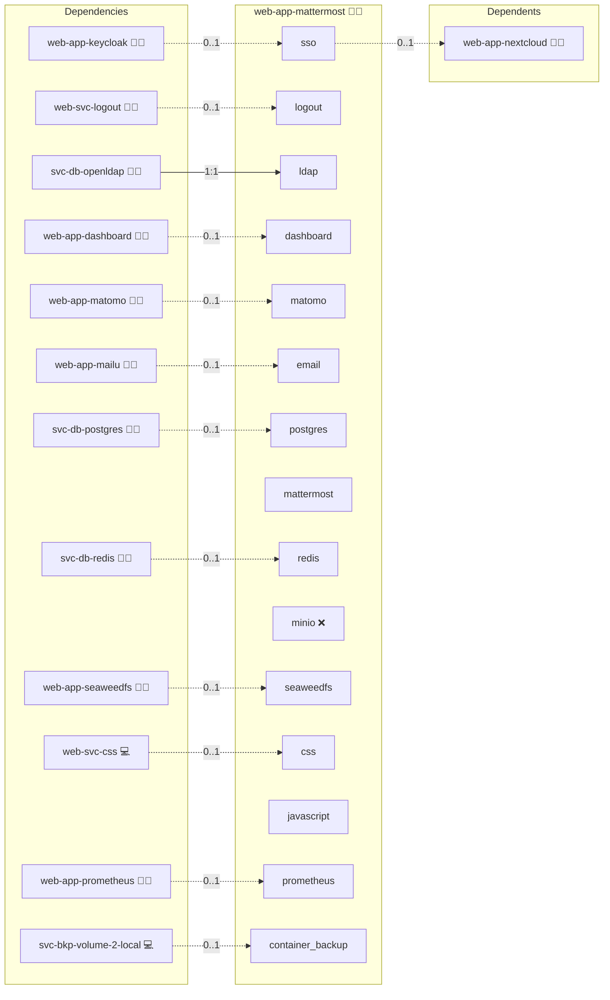

# Mattermost

## Description

Deploys [Mattermost Team Edition](https://mattermost.com/) (an open-source, self-hosted team messaging platform) as part of the Infinito.Nexus stack.

## Overview

This role unite your team with Mattermost, an open-source, self-hosted messaging platform that delivers secure, real-time collaboration through channels, threads, and integrations, keeping your conversations private and under your control.

## Cosmos

The diagram places Mattermost in the Infinito.Nexus cosmos: the components it deploys (capabilities), the central services it consumes (dependencies), and its outward reach (federation and bridged external networks).



Solid `1:1` edges are fixed relationships; dashed `0..1` edges are conditional (enabled only in matching deployments). Node markers show the role's deploy modes (💻 host, 🐳 compose, 🐝 swarm); ❌ marks a service that is explicitly turned off, and ⚙️ an Ansible role dependency declared in `meta/main.yml`.

## Features

- Single-container deployment via Docker Compose
- PostgreSQL database (MySQL/MariaDB not supported since Mattermost v8+)
- SSO via Keycloak using the GitLab OAuth2 provider (see note below)
- Email notifications via Mailu (optional)
- Persistent storage for config, data, logs, and plugins
- Accessible at `https://mattermost.<your-domain>`

## Quick Setup

### Development

Clone, set up the workstation, and deploy Mattermost onto the local stack:

```bash
git clone https://github.com/infinito-nexus/core.git
cd core
make onboard
make compose-deploy mode=reinstall apps=web-app-mattermost full_cycle=false
```

### Production

Run the published image to provision the inventory and deploy Mattermost to a managed server (the mounted volume persists the inventory):

```bash
APP=web-app-mattermost
HOST=<your-server>
TLS_MODE=self_signed
SSH_PUBLIC_KEY="<your-ssh-public-key>"

docker run --rm -it \
  -v "$PWD/inventories:/etc/infinito.nexus/inventories" \
  -e APP="$APP" -e HOST="$HOST" -e TLS_MODE="$TLS_MODE" -e SSH_PUBLIC_KEY="$SSH_PUBLIC_KEY" \
  ghcr.io/infinito-nexus/core/debian bash -c '
    INVENTORY=/etc/infinito.nexus/inventories/production
    infinito administration inventory provision "$INVENTORY" \
      --inventory-file "$INVENTORY/devices.yml" \
      --host "$HOST" \
      --include "$APP" \
      --vars "{\"TLS_MODE\": \"$TLS_MODE\", \"users\": {\"administrator\": {\"authorized_keys\": [\"$SSH_PUBLIC_KEY\"]}}}" &&
    infinito administration deploy dedicated "$INVENTORY/devices.yml" \
      --password-file "$INVENTORY/.password" \
      --diff -vv'
```

## SSO / Authentication

Mattermost **Team Edition** does not support native OIDC (`MM_OPENIDSETTINGS_*`) or LDAP, since both are Enterprise-only features.

The workaround used here is the **GitLab OAuth2 provider** (`MM_GITLABSETTINGS_*`), which is generic enough to work with any OIDC-compatible identity provider including Keycloak. This provides true SSO: user accounts are automatically created in Mattermost on first login.

The login button in the UI will read "SSO with Infinito.Nexus" (renamed via injected JavaScript). The underlying auth flow is standard OAuth2/OIDC against Keycloak.

To enable SSO, set `services.sso.enabled: true` (the default) in your inventory and ensure `OIDC.CLIENT.SECRET` is configured.

## Configuration

Key settings in `meta/services.yml` and `meta/server.yml`:

| Key | Default | Description |
|-----|---------|-------------|
| `services.sso.enabled` | `true` | Enable Keycloak SSO via GitLab OAuth2 |
| `services.postgres.shared` | `true` | Use the shared PostgreSQL service instead of a role-local one |
| `services.mattermost.version` | `latest` | Docker image tag |
| `domains.canonical` | `mattermost.{{ DOMAIN_PRIMARY }}` | Public domain |

## Addons

This role declares no addons (it ships no `meta/addons/` directory). Mattermost **Team Edition** manages plugin install and enablement at runtime; there is no declarative per-plugin install path in this role. Plugins are operator-managed and persisted through the named plugin volumes (`plugins`, `client-plugins`) declared in `meta/volumes.yml`. No addon bridges any in-repo service.

## References

- [Mattermost Docker Install](https://docs.mattermost.com/install/install-docker.html)
- [Mattermost Configuration Settings](https://docs.mattermost.com/configure/configuration-settings.html)
- [GitLab SSO in Mattermost](https://docs.mattermost.com/deployment/sso-gitlab.html)

## Credits

Implemented by **[Alejandro Roman Ibanez](https://github.com/AlejandroRomanIbanez)**.
Part of the [Infinito.Nexus Project](https://s.infinito.nexus/code) and maintained by [Kevin Veen-Birkenbach](https://www.veen.world).
Licensed under the [Infinito.Nexus Community License (Non-Commercial)](https://s.infinito.nexus/license).
