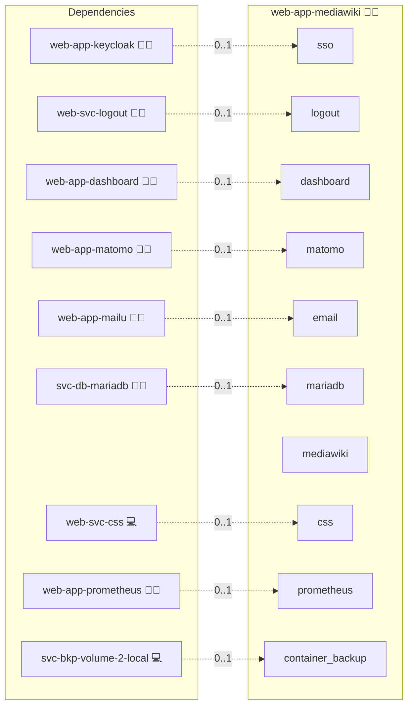

# MediaWiki

## Description

Empower your knowledge base with MediaWiki, a versatile and collaborative platform designed to build comprehensive, user-driven documentation. MediaWiki offers a rich extension ecosystem, robust content management capabilities, and customizable configurations to transform your information into a vibrant, living resource.

## Overview

This role deploys MediaWiki using Docker, automating the setup of your wiki instance along with its underlying MariaDB database. It handles generating the essential configuration file (LocalSettings.php) from a seeded template and integrates with an NGINX reverse proxy for secure, efficient web access.

## Cosmos

The diagram places MediaWiki in the Infinito.Nexus cosmos: the components it deploys (capabilities), the central services it consumes (dependencies), and its outward reach (federation and bridged external networks).



Solid `1:1` edges are fixed relationships; dashed `0..1` edges are conditional (enabled only in matching deployments). Node markers show the role's deploy modes (💻 host, 🐳 compose, 🐝 swarm); ❌ marks a service that is explicitly turned off, and ⚙️ an Ansible role dependency declared in `meta/main.yml`.

## Features

- **Collaborative Editing:** Enable multiple users to create and update content simultaneously through an intuitive interface.
- **Extensible Architecture:** Leverage a wide range of extensions and customization options to tailor the wiki experience to your needs.
- **Robust Content Management:** Organize, categorize, and retrieve information efficiently with powerful content management tools.
- **Scalable Deployment:** Utilize Docker for a portable and scalable setup that adapts as your community grows.
- **Secure and Reliable:** Benefit from secure access via an NGINX reverse proxy combined with a MariaDB backend for reliable data storage.

## Quick Setup

### Development

Clone, set up the workstation, and deploy MediaWiki onto the local stack:

```bash
git clone https://github.com/infinito-nexus/core.git
cd core
make onboard
make compose-deploy mode=reinstall apps=web-app-mediawiki full_cycle=false
```

### Production

Run the published image to provision the inventory and deploy MediaWiki to a managed server (the mounted volume persists the inventory):

```bash
APP=web-app-mediawiki
HOST=<your-server>
TLS_MODE=self_signed
SSH_PUBLIC_KEY="<your-ssh-public-key>"

docker run --rm -it \
  -v "$PWD/inventories:/etc/infinito.nexus/inventories" \
  -e APP="$APP" -e HOST="$HOST" -e TLS_MODE="$TLS_MODE" -e SSH_PUBLIC_KEY="$SSH_PUBLIC_KEY" \
  ghcr.io/infinito-nexus/core/debian bash -c '
    INVENTORY=/etc/infinito.nexus/inventories/production
    infinito administration inventory provision "$INVENTORY" \
      --inventory-file "$INVENTORY/devices.yml" \
      --host "$HOST" \
      --include "$APP" \
      --vars "{\"TLS_MODE\": \"$TLS_MODE\", \"users\": {\"administrator\": {\"authorized_keys\": [\"$SSH_PUBLIC_KEY\"]}}}" &&
    infinito administration deploy dedicated "$INVENTORY/devices.yml" \
      --password-file "$INVENTORY/.password" \
      --diff -vv'
```

## Addons

This role ships its OIDC login stack as unified addons declared in [`meta/addons/`](meta/addons/). Both are MediaWiki extensions installed from upstream and gated on the `sso` service flag (`web-app-keycloak` co-deployed). The OIDC client secret is rendered through `templates/oidc.php.j2` and never inlined into the addon declaration.

| Addon | Mechanism | Default state | Bridges |
|---|---|---|---|
| PluggableAuth | extension | enabled when `services.sso.enabled` | none |
| OpenIDConnect | extension | enabled when `services.sso.enabled` | `sso` |

## Further Resources

- [MediaWiki Official Website](https://www.mediawiki.org/)
- [MediaWiki Documentation](https://www.mediawiki.org/wiki/Manual:Configuration_settings)

## Swarm + NFS pilot

Volume layout under `DEPLOYMENT_MODE: swarm` with `storage.backend: nfs`:

- **`images/`** opts into NFS (`nfs: true` in the `compose_volumes`
  call from `templates/compose.yml.j2`). The volume is shared across
  all swarm nodes so the MediaWiki application service can be
  rescheduled freely.
- **`extensions/`** stays local. Extensions are rebuilt from the
  role-managed git source on every install — no shared state needs
  to survive a node move.
- **MariaDB data** stays local on the manager node via
  [svc-db-mariadb](../svc-db-mariadb/) pinning. NFS for the DB data
  directory is intentionally out of scope for v1 (locking / `fsync`
  semantics). See 023's Future Extensions.

CI gate: [.github/workflows/test-deploy-swarm.yml](../../.github/workflows/test-deploy-swarm.yml)
provisions a 3-node DinD swarm, deploys this role as a stack, drains
the worker running the application service, and asserts that wiki
content survives the reschedule.

## Credits

Implemented by **[Kevin Veen-Birkenbach](https://www.veen.world)**.
Part of the [Infinito.Nexus Project](https://s.infinito.nexus/code) and maintained by [Kevin Veen-Birkenbach](https://www.veen.world).
Licensed under the [Infinito.Nexus Community License (Non-Commercial)](https://s.infinito.nexus/license).
