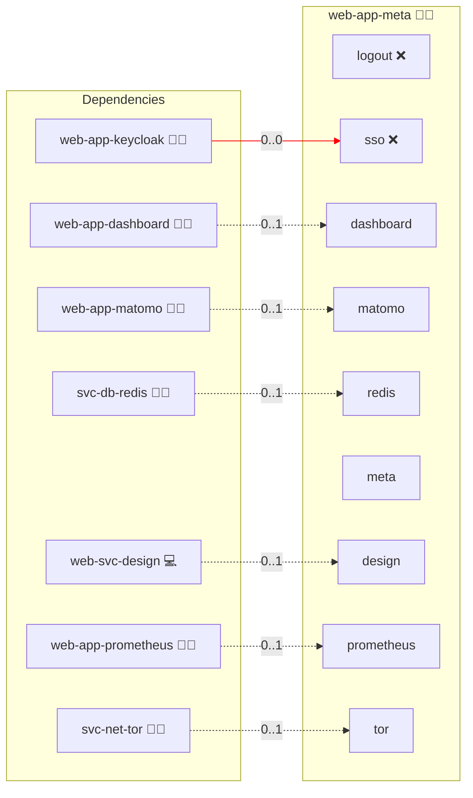

# Meta

## Description

This role deploys the [Meta Infinite Graph](https://github.com/infinito-nexus/meta), a browsable graph of every Infinito.Nexus role and the dependencies between them. It is served as a pre-rendered static site from a project-owned container image.

## Overview

The graph is a read-only surface. It has no accounts, no login and no authenticated state, so `meta/services.yml` pins both `sso` and `logout` to `false` and the role declares `PERSONA_ADMINISTRATOR_BLOCKED` and `PERSONA_BIBER_BLOCKED` in `templates/playwright.env.j2`.

Everything else the role couples to is driven by group membership: a service turns on exactly when its provider role is part of the deployment. The role runs in both compose and swarm mode and is published on `meta.{{ DOMAIN_PRIMARY }}`.

## Cosmos

The diagram places Meta in the Infinito.Nexus cosmos: the components it deploys (capabilities), the central services it consumes (dependencies), and its outward reach (federation and bridged external networks).



Solid `1:1` edges are fixed relationships; dashed `0..1` edges are conditional (enabled only in matching deployments); red `0..0` edges are turned off in this role. Node markers show the role's deploy modes (💻 host, 🐳 compose, 🐝 swarm); ❌ marks a service that is explicitly turned off, and ⚙️ an Ansible role dependency declared in `meta/main.yml`.

## Features

- **Dependency graph:** renders every role and the edges between them, so the modular structure of a deployment is inspectable without reading `meta/` files by hand.
- **Pinned release image:** `ghcr.io/infinito-nexus/meta` from the project's own registry namespace, pinned to a release tag rather than a floating `latest`. The role declares no `architectures`, so the deploy matrix may place it on either.
- **Live role data:** when `web-svc-api` is in the deployment, `templates/env.j2` renders `MIG_API_URL` from its canonical URL so the graph reads role data from the running API instead of a build-time snapshot.
- **Dashboard tile:** when `web-app-dashboard` is present, the graph is offered as a card pointing at this role's canonical domain.
- **Shared styling:** when `web-svc-design` is present, the site consumes the central stylesheet.
- **Usage statistics:** when `web-app-matomo` is present, the tracker is injected by `sys-front-inj-matomo`.
- **Scrape target:** when `web-app-prometheus` is present, the role joins the monitoring closure.
- **Onion surface:** when `svc-net-tor` is present, the graph is additionally served over its onion address. Both variants in `meta/variants.yml` keep tor on.
- **Resource envelope:** 0.2 CPU, 128 MB reservation, 256 MB limit, 256 PIDs, 1224 MB minimum storage; `curl` healthcheck on internal port 80, locally published on 8047.

## Quick Setup

### Development

Clone, set up the workstation, and deploy Meta onto the local stack:

```bash
git clone https://github.com/infinito-nexus/core.git
cd core
make onboard
make compose-deploy mode=reinstall apps=web-app-meta full_cycle=false
```

### Production

Run the published image to provision the inventory and deploy Meta to a managed server (the mounted volume persists the inventory):

```bash
APP=web-app-meta
HOST="<your-server>"
DOMAIN="<your-domain>"
TLS_MODE=self_signed
SSH_PUBLIC_KEY="<your-ssh-public-key>"

docker run --rm -it \
  -v "$PWD/inventories:/etc/infinito.nexus/inventories" \
  -e APP="$APP" -e HOST="$HOST" -e DOMAIN="$DOMAIN" -e TLS_MODE="$TLS_MODE" -e SSH_PUBLIC_KEY="$SSH_PUBLIC_KEY" \
  ghcr.io/infinito-nexus/core/debian:latest bash -c '
    INVENTORY=/etc/infinito.nexus/inventories/production
    infinito administration inventory provision "$INVENTORY" \
      --inventory-file "$INVENTORY/devices.yml" \
      --host "$HOST" \
      --include "$APP" \
      --vars "{\"TLS_MODE\": \"$TLS_MODE\", \"DOMAIN_PRIMARY\": \"$DOMAIN\", \"users\": {\"administrator\": {\"authorized_keys\": [\"$SSH_PUBLIC_KEY\"]}}}" &&
    infinito administration deploy dedicated "$INVENTORY/devices.yml" \
      --password-file "$INVENTORY/.password" \
      --diff -vv'
```

## Further Resources

- [Meta Infinite Graph Homepage](https://github.com/infinito-nexus/meta)

## Credits

Implemented by **[Kevin Veen-Birkenbach](https://social.infinito.nexus/profile/kevinveenbirkenbach/profile)**.
Part of the [Infinito.Nexus Project](https://s.infinito.nexus/code) and maintained by [Kevin Veen-Birkenbach](https://www.veen.world).
Licensed under the [Infinito.Nexus Community License (Non-Commercial)](https://s.infinito.nexus/license).
