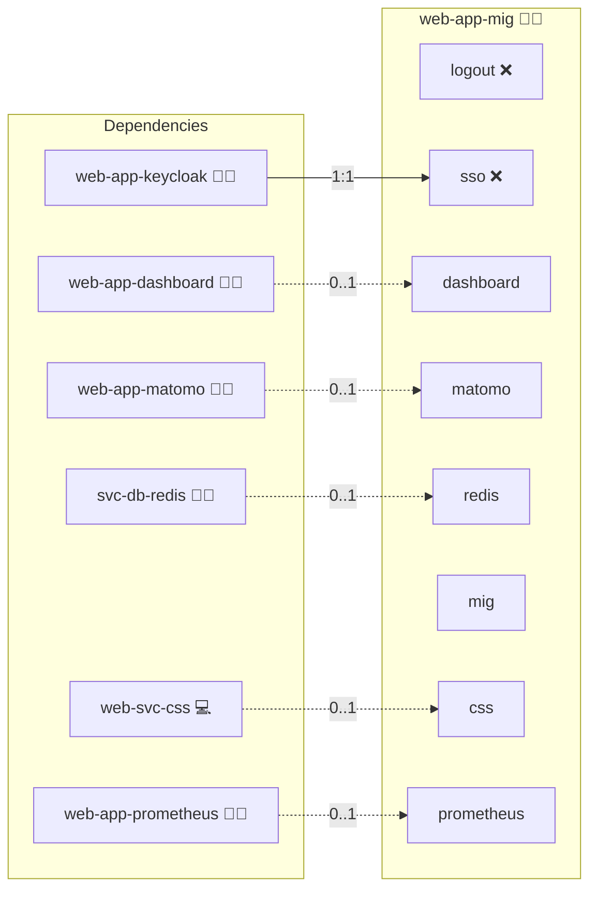

# MIG

This folder contains the Ansible role to deploy the Meta Infinite Graph for Infinito.Nexus.

## Description

This role sets up the [Ansible Meta Infinite Graph](https://github.com/kevinveenbirkenbach/meta-infinite-graph) for Infinito.Nexus. The Meta Infinite Graph visualizes all dependencies and relationships between Infinito.Nexus roles, making the overall infrastructure structure transparent and easy to understand.

## Overview

The Meta Infinite Graph is an essential tool for analyzing, auditing, and maintaining the modular structure of the Infinito.Nexus ecosystem. It provides a clear overview of all roles and how they are interconnected.

## Cosmos

The diagram places MIG in the Infinito.Nexus cosmos: the components it deploys (capabilities), the central services it consumes (dependencies), and its outward reach (federation and bridged external networks).



Solid `1:1` edges are fixed relationships; dashed `0..1` edges are conditional (enabled only in matching deployments). Node markers show the role's deploy modes (💻 host, 🐳 compose, 🐝 swarm); ❌ marks a service that is explicitly turned off.

## Features

- Automatic deployment of the Meta Infinite Graph web application
- Shows all dependencies and connections between Infinito.Nexus roles
- Useful for documentation and architecture transparency

## Quick Setup

### Development

Clone, set up the workstation, and deploy MIG onto the local stack:

```bash
git clone https://github.com/infinito-nexus/core.git
cd core
make onboard
make compose-deploy mode=reinstall apps=web-app-mig full_cycle=false
```

### Production

Run the published image to provision the inventory and deploy MIG to a managed server (the mounted volume persists the inventory between the two runs):

```bash
docker run --rm -it \
  -v "$PWD/inventories:/etc/infinito.nexus/inventories" \
  ghcr.io/infinito-nexus/core/debian \
  infinito administration inventory provision /etc/infinito.nexus/inventories/prod \
  --inventory-file /etc/infinito.nexus/inventories/prod/devices.yml \
  --host <your-server> \
  --vars-file inventories/<env>/default.yml \
  --include 'web-app-mig'

docker run --rm -it \
  -v "$PWD/inventories:/etc/infinito.nexus/inventories" \
  ghcr.io/infinito-nexus/core/debian \
  infinito administration deploy dedicated /etc/infinito.nexus/inventories/prod/devices.yml \
  --password-file /etc/infinito.nexus/inventories/prod/.password \
  --id web-app-mig \
  --diff \
  -vv
```

## Further Resources

- [Meta Infinite Graph Homepage](https://github.com/kevinveenbirkenbach/meta-infinite-graph)

## Credits

Implemented by **[Kevin Veen-Birkenbach](https://www.veen.world)**.
Part of the [Infinito.Nexus Project](https://s.infinito.nexus/code) and maintained by [Kevin Veen-Birkenbach](https://www.veen.world).
Licensed under the [Infinito.Nexus Community License (Non-Commercial)](https://s.infinito.nexus/license).
