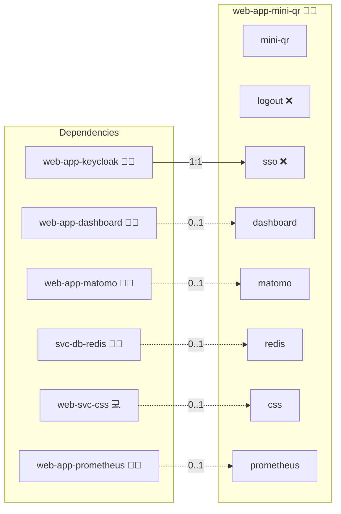

# Mini-QR

## Description

**Mini-QR** is a lightweight, self-hosted web application for generating QR codes instantly and privately.  
It provides a minimal and elegant interface to convert any text, URL, or message into a QR code directly in your browser, without external tracking or dependencies.

## Overview

Mini-QR is designed for simplicity, privacy, and speed.  
It offers an ad-free interface that works entirely within your local environment, making it ideal for individuals, organizations, and educational institutions that value data sovereignty.  
The app runs as a single Docker container and requires no database or backend setup, enabling secure and frictionless QR generation anywhere.

## Cosmos

The diagram places Mini-QR in the Infinito.Nexus cosmos: the components it deploys (capabilities), the central services it consumes (dependencies), and its outward reach (federation and bridged external networks).



Solid `1:1` edges are fixed relationships; dashed `0..1` edges are conditional (enabled only in matching deployments). Node markers show the role's deploy modes (💻 host, 🐳 compose, 🐝 swarm); ❌ marks a service that is explicitly turned off.

## Features

- **Instant QR code creation**: simply type or paste your content.
- **Privacy-friendly**: all generation happens client-side; no data leaves your server.
- **Open Source**: fully auditable and modifiable for custom integrations.
- **Responsive Design**: optimized for both desktop and mobile devices.
- **Docker-ready**: can be deployed in seconds using the official image.

## Quick Setup

### Development

Clone, set up the workstation, and deploy Mini-QR onto the local stack:

```bash
git clone https://github.com/infinito-nexus/core.git
cd core
make onboard
make compose-deploy mode=reinstall apps=web-app-mini-qr full_cycle=false
```

### Production

Run the published image to provision the inventory and deploy Mini-QR to a managed server (the mounted volume persists the inventory between the two runs):

```bash
docker run --rm -it \
  -v "$PWD/inventories:/etc/infinito.nexus/inventories" \
  ghcr.io/infinito-nexus/core/debian \
  infinito administration inventory provision /etc/infinito.nexus/inventories/prod \
  --inventory-file /etc/infinito.nexus/inventories/prod/devices.yml \
  --host <your-server> \
  --vars-file inventories/<env>/default.yml \
  --include 'web-app-mini-qr'

docker run --rm -it \
  -v "$PWD/inventories:/etc/infinito.nexus/inventories" \
  ghcr.io/infinito-nexus/core/debian \
  infinito administration deploy dedicated /etc/infinito.nexus/inventories/prod/devices.yml \
  --password-file /etc/infinito.nexus/inventories/prod/.password \
  --id web-app-mini-qr \
  --diff \
  -vv
```

## Further Resources

- 🧩 Upstream project: [lyqht/mini-qr](https://github.com/lyqht/mini-qr)
- 📦 Upstream Dockerfile: [View on GitHub](https://github.com/lyqht/mini-qr/blob/main/Dockerfile)
- 🌐 Docker Image: `ghcr.io/lyqht/mini-qr:latest`

## Credits

Implemented by **[Kevin Veen-Birkenbach](https://www.veen.world)**.
Part of the [Infinito.Nexus Project](https://s.infinito.nexus/code) and maintained by [Kevin Veen-Birkenbach](https://www.veen.world).
Licensed under the [Infinito.Nexus Community License (Non-Commercial)](https://s.infinito.nexus/license).
