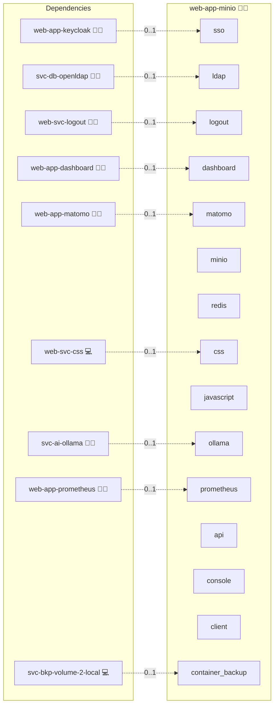

# MinIO

## Description

**MinIO** is an S3-compatible object storage service for files, media, backups, and AI artifacts, self-hosted for performance and control.

## Overview

Applications that speak “S3” (Pixelfed, Mastodon, Nextcloud, Flowise, etc.) store and retrieve objects from MinIO buckets using familiar SDKs and CLIs. Admins manage buckets, users, and access policies through a browser console while keeping everything on-prem.

## Cosmos

The diagram places MinIO in the Infinito.Nexus cosmos: the components it deploys (capabilities), the central services it consumes (dependencies), and its outward reach (federation and bridged external networks).



Solid `1:1` edges are fixed relationships; dashed `0..1` edges are conditional (enabled only in matching deployments). Node markers show the role's deploy modes (💻 host, 🐳 compose, 🐝 swarm); ❌ marks a service that is explicitly turned off, and ⚙️ an Ansible role dependency declared in `meta/main.yml`.

## Features

* S3-compatible API for broad app compatibility
* Buckets, users, access keys, and fine-grained policies
* Optional versioning, lifecycle rules, and object lock
* Presigned URLs for secure, time-limited uploads/downloads
* Ideal for AI stacks: datasets, embeddings, and artifacts

## Quick Setup

### Development

Clone, set up the workstation, and deploy MinIO onto the local stack:

```bash
git clone https://github.com/infinito-nexus/core.git
cd core
make onboard
make compose-deploy mode=reinstall apps=web-app-minio full_cycle=false
```

### Production

Run the published image to provision the inventory and deploy MinIO to a managed server (the mounted volume persists the inventory):

```bash
APP=web-app-minio
HOST=<your-server>
TLS_MODE=self_signed
SSH_PUBLIC_KEY="<your-ssh-public-key>"

docker run --rm -it \
  -v "$PWD/inventories:/etc/infinito.nexus/inventories" \
  -e APP="$APP" -e HOST="$HOST" -e TLS_MODE="$TLS_MODE" -e SSH_PUBLIC_KEY="$SSH_PUBLIC_KEY" \
  ghcr.io/infinito-nexus/core/debian bash -c '
    INVENTORY=/etc/infinito.nexus/inventories/production
    infinito administration inventory provision "$INVENTORY" \
      --inventory-file "$INVENTORY/devices.yml" \
      --host "$HOST" \
      --include "$APP" \
      --vars "{\"TLS_MODE\": \"$TLS_MODE\", \"users\": {\"administrator\": {\"authorized_keys\": [\"$SSH_PUBLIC_KEY\"]}}}" &&
    infinito administration deploy dedicated "$INVENTORY/devices.yml" \
      --password-file "$INVENTORY/.password" \
      --diff -vv'
```

## Further Resources

* MinIO: [www.min.io](https://www.min.io)
* AWS S3 (API background): [aws.amazon.com/s3](https://aws.amazon.com/s3)

## Credits

Implemented by **[Kevin Veen-Birkenbach](https://www.veen.world)**.
Part of the [Infinito.Nexus Project](https://s.infinito.nexus/code) and maintained by [Kevin Veen-Birkenbach](https://www.veen.world).
Licensed under the [Infinito.Nexus Community License (Non-Commercial)](https://s.infinito.nexus/license).
