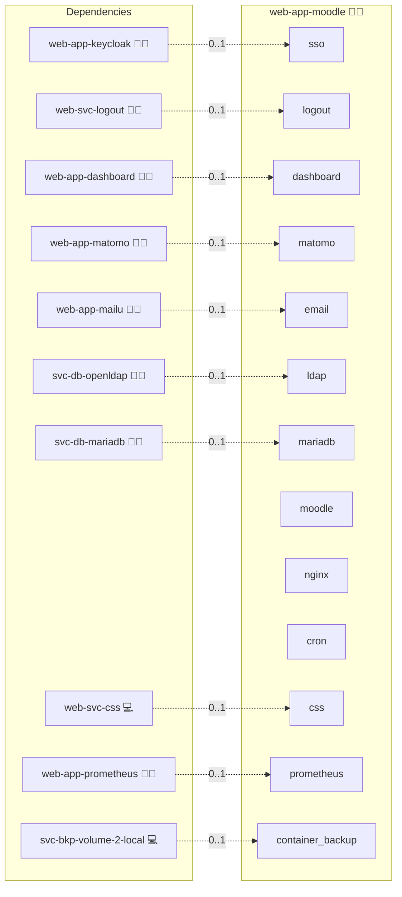

# Moodle

## Description

Ignite the learning experience with [Moodle](https://moodle.org/), a powerful and versatile platform for online education that energizes classrooms and fosters interactive learning. Moodle delivers a comprehensive set of tools for creating, managing, and sharing educational content, supporting collaboration among educators and learners alike.

## Overview

This role deploys Moodle using Docker, automating the setup of both the Moodle application and its underlying MariaDB database. It integrates with an NGINX reverse proxy to ensure secure and efficient web access and uses persistent storage to safeguard your data and configuration.

## Cosmos

The diagram places Moodle in the Infinito.Nexus cosmos: the components it deploys (capabilities), the central services it consumes (dependencies), and its outward reach (federation and bridged external networks).



Solid `1:1` edges are fixed relationships; dashed `0..1` edges are conditional (enabled only in matching deployments). Node markers show the role's deploy modes (💻 host, 🐳 compose, 🐝 swarm); ❌ marks a service that is explicitly turned off, and ⚙️ an Ansible role dependency declared in `meta/main.yml`.

## Features

- **Comprehensive e-Learning Platform:** Offers an extensive array of features including course management, assessment tools, and collaborative resources.
- **Customizable Interface:** Tailor the look and feel of your learning environment with numerous themes and plugins.
- **Scalable Deployment:** Leverage Docker for a portable and scalable installation that adapts as your user base grows.
- **Robust Data Management:** Secure and reliable storage of both the Moodle application and user data through Docker volumes.
- **Secure Web Access:** Configured to work seamlessly behind an NGINX reverse proxy for enhanced security and performance.
- **Single Sign-On (SSO) / OpenID Connect (OIDC):** Seamless integration with external identity providers for centralized authentication.

## Quick Setup

### Development

Clone, set up the workstation, and deploy Moodle onto the local stack:

```bash
git clone https://github.com/infinito-nexus/core.git
cd core
make onboard
make compose-deploy mode=reinstall apps=web-app-moodle full_cycle=false
```

### Production

Run the published image to provision the inventory and deploy Moodle to a managed server (the mounted volume persists the inventory):

```bash
APP=web-app-moodle
HOST=<your-server>
TLS_MODE=self_signed
SSH_PUBLIC_KEY="<your-ssh-public-key>"

docker run --rm -it \
  -v "$PWD/inventories:/etc/infinito.nexus/inventories" \
  -e APP="$APP" -e HOST="$HOST" -e TLS_MODE="$TLS_MODE" -e SSH_PUBLIC_KEY="$SSH_PUBLIC_KEY" \
  ghcr.io/infinito-nexus/core/debian bash -c '
    INVENTORY=/etc/infinito.nexus/inventories/production
    infinito administration inventory provision "$INVENTORY" \
      --inventory-file "$INVENTORY/devices.yml" \
      --host "$HOST" \
      --include "$APP" \
      --vars "{\"TLS_MODE\": \"$TLS_MODE\", \"users\": {\"administrator\": {\"authorized_keys\": [\"$SSH_PUBLIC_KEY\"]}}}" &&
    infinito administration deploy dedicated "$INVENTORY/devices.yml" \
      --password-file "$INVENTORY/.password" \
      --diff -vv'
```

## Image source

This role builds its own Moodle image from upstream Moodle source on top of the official `php:8.3-fpm` base.

## Further Resources

- [Moodle Official Website](https://moodle.org/)
- [Moodle Developer Documentation: Docker images](https://moodledev.io/general/app/development/setup/docker-images)
- [moodlehq/moodle-docker](https://github.com/moodlehq/moodle-docker) (extension list reference)

## Credits

Implemented by **[Kevin Veen-Birkenbach](https://www.veen.world)**.
Part of the [Infinito.Nexus Project](https://s.infinito.nexus/code) and maintained by [Kevin Veen-Birkenbach](https://www.veen.world).
Licensed under the [Infinito.Nexus Community License (Non-Commercial)](https://s.infinito.nexus/license).
