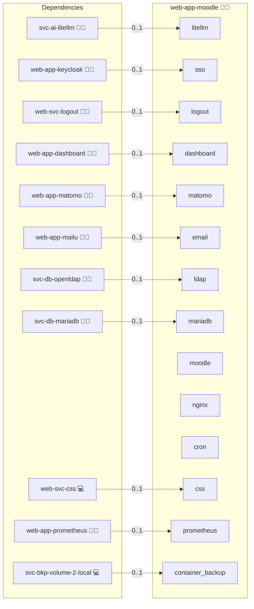

# Moodle

## Description

Ignite the learning experience with [Moodle](https://moodle.org/), a powerful and versatile platform for online education that energizes classrooms and fosters interactive learning. Moodle delivers a comprehensive set of tools for creating, managing, and sharing educational content, supporting collaboration among educators and learners alike.

## Overview

This role deploys Moodle using Docker, automating the setup of both the Moodle application and its underlying MariaDB database. It integrates with an NGINX reverse proxy to ensure secure and efficient web access and uses persistent storage to safeguard your data and configuration.

## Cosmos

The diagram places Moodle in the Infinito.Nexus cosmos: the components it deploys (capabilities), the central services it consumes (dependencies), and its outward reach (federation and bridged external networks).


```mermaid
flowchart LR
    subgraph deps [Dependencies]
        dep_svc_ai_litellm["svc-ai-litellm 🐳🐝"]
        dep_svc_bkp_volume_2_local["svc-bkp-volume-2-local 💻"]
        dep_svc_db_mariadb["svc-db-mariadb 🐳🐝"]
        dep_svc_db_openldap["svc-db-openldap 🐳🐝"]
        dep_web_app_dashboard["web-app-dashboard 🐳🐝"]
        dep_web_app_keycloak["web-app-keycloak 🐳🐝"]
        dep_web_app_mailu["web-app-mailu 🐳🐝"]
        dep_web_app_matomo["web-app-matomo 🐳🐝"]
        dep_web_app_prometheus["web-app-prometheus 🐳🐝"]
        dep_web_svc_css["web-svc-css 💻"]
        dep_web_svc_logout["web-svc-logout 🐳🐝"]
    end
    subgraph role [web-app-moodle 🐳🐝]
        svc_litellm["litellm"]
        svc_sso["sso"]
        svc_logout["logout"]
        svc_dashboard["dashboard"]
        svc_matomo["matomo"]
        svc_email["email"]
        svc_ldap["ldap"]
        svc_mariadb["mariadb"]
        svc_moodle["moodle"]
        svc_nginx["nginx"]
        svc_cron["cron"]
        svc_css["css"]
        svc_prometheus["prometheus"]
        svc_container_backup["container_backup"]
    end
    dep_svc_ai_litellm -. "0..1" .-> svc_litellm
    dep_svc_bkp_volume_2_local -. "0..1" .-> svc_container_backup
    dep_svc_db_mariadb -. "0..1" .-> svc_mariadb
    dep_svc_db_openldap -. "0..1" .-> svc_ldap
    dep_web_app_dashboard -. "0..1" .-> svc_dashboard
    dep_web_app_keycloak -. "0..1" .-> svc_sso
    dep_web_app_mailu -. "0..1" .-> svc_email
    dep_web_app_matomo -. "0..1" .-> svc_matomo
    dep_web_app_prometheus -. "0..1" .-> svc_prometheus
    dep_web_svc_css -. "0..1" .-> svc_css
    dep_web_svc_logout -. "0..1" .-> svc_logout
```

Solid `1:1` edges are fixed relationships; dashed `0..1` edges are conditional (enabled only in matching deployments). Node markers show the role's deploy modes (💻 host, 🐳 compose, 🐝 swarm); ❌ marks a service that is explicitly turned off, and ⚙️ an Ansible role dependency declared in `meta/main.yml`.

## Features

- **Comprehensive e-Learning Platform:** Offers an extensive array of features including course management, assessment tools, and collaborative resources.
- **Customizable Interface:** Tailor the look and feel of your learning environment with numerous themes and plugins.
- **Scalable Deployment:** Leverage Docker for a portable and scalable installation that adapts as your user base grows.
- **Robust Data Management:** Secure and reliable storage of both the Moodle application and user data through Docker volumes.
- **Secure Web Access:** Configured to work seamlessly behind an NGINX reverse proxy for enhanced security and performance.
- **Single Sign-On (SSO) / OpenID Connect (OIDC):** Seamless integration with external identity providers for centralized authentication.

## Quick Setup

### Development

Clone, set up the workstation, and deploy Moodle onto the local stack:

```bash
git clone https://github.com/infinito-nexus/core.git
cd core
make onboard
make compose-deploy mode=reinstall apps=web-app-moodle full_cycle=false
```

### Production

Run the published image to provision the inventory and deploy Moodle to a managed server (the mounted volume persists the inventory):

```bash
APP=web-app-moodle
HOST=<your-server>
TLS_MODE=self_signed
SSH_PUBLIC_KEY="<your-ssh-public-key>"

docker run --rm -it \
  -v "$PWD/inventories:/etc/infinito.nexus/inventories" \
  -e APP="$APP" -e HOST="$HOST" -e TLS_MODE="$TLS_MODE" -e SSH_PUBLIC_KEY="$SSH_PUBLIC_KEY" \
  ghcr.io/infinito-nexus/core/debian bash -c '
    INVENTORY=/etc/infinito.nexus/inventories/production
    infinito administration inventory provision "$INVENTORY" \
      --inventory-file "$INVENTORY/devices.yml" \
      --host "$HOST" \
      --include "$APP" \
      --vars "{\"TLS_MODE\": \"$TLS_MODE\", \"users\": {\"administrator\": {\"authorized_keys\": [\"$SSH_PUBLIC_KEY\"]}}}" &&
    infinito administration deploy dedicated "$INVENTORY/devices.yml" \
      --password-file "$INVENTORY/.password" \
      --diff -vv'
```

## MCP server

The role exposes a Model Context Protocol surface through the `webservice_mcp` protocol plugin, baked into the image at `webservice/mcp` and served by the NGINX sidecar.

| Property | Value |
| --- | --- |
| Endpoint | `/webservice/mcp/server.php` on the canonical domain |
| Container URL | `http://nginx:80/webservice/mcp/server.php` on the shared MCP overlay |
| Transport | Streamable HTTP (JSON-RPC 2.0 over `POST`) |
| Auth | `Authorization: Bearer <token>`, a Moodle web-service token |
| Subject | the `administrator` account |
| Default state | off; `mcp.enabled` turns true when `web-app-hermes`, `web-app-openclaw` or `web-app-openwebui` is in the inventory |

Provisioning runs in `tasks/utils/mcp.yml`: it copies the plugin into the code volume, runs `admin/cli/upgrade.php`, enables `enablewebservices`, appends `mcp` to `webserviceprotocols`, creates the `infinito_mcp` external service, attaches the read-only functions, mints the permanent token and stores it under `users.administrator.tokens['web-app-moodle']`.

Tool categories exposed by the external service:

- site metadata (`core_webservice_get_site_info`)
- course catalogue (`core_course_get_courses`, `core_enrol_get_users_courses`)
- user lookup (`core_user_get_users_by_field`)
- calendar events (`core_calendar_get_calendar_events`)

All of them are read-only; `mcp.tools.mutating_tools_enabled` is `false` and no write function is attached.

### Default state

Off. `mcp.enabled` is true only while `web-app-hermes`, `web-app-openclaw` or `web-app-openwebui` is part of the deployment.

### Authorization subject

`auth_subject: administrator`: the web-service token is issued against the
administrator account, so a call carries that account's rights regardless of who
asked the client. The attached functions are read-only, which bounds what those
rights can do here. Reaching the tool server is gated on the role's `mcp` RBAC
group.

### Canonical origin

Moodle compares every request against `$CFG->wwwroot`. A probe that reaches the endpoint over the internal HTTP origin is answered with a redirect to the canonical HTTPS URL rather than with JSON, so callers must send the canonical `Host` header and `X-Forwarded-Proto: https`.

### How to disable

Remove the MCP client roles, or pin `mcp.enabled: false` for this role. The web-service token is then not issued and the protocol plugin stays unconfigured.

## Outbound HTTP policy

Moodle ships a cURL blocklist that rejects every request to `10.0.0.0/8`, `172.16.0.0/12` and `192.168.0.0/16`, and only permits ports 80 and 443. Both settings gate `\core\files\curl_security_helper`, which `auth_oidc` consults for the Keycloak token exchange and `\core\http_client` consults for the AI provider request. Keycloak answers on `172.16.0.0/12` and the gateway on `192.168.0.0/16`, so with the upstream defaults the OIDC login obtains no token and the AI provider cannot reach the gateway.

`tasks/01_manager_ops.yml` therefore rewrites `curlsecurityblockedhosts` to `MOODLE_EGRESS_BLOCKED_HOSTS` and extends `curlsecurityallowedport` with the port of `MOODLE_LITELLM_CHAT_ENDPOINT` when the `litellm` service is enabled. Loopback, `0.0.0.0`, the cloud metadata address and `10.0.0.0/8` stay blocked; `172.16.0.0/12` and `192.168.0.0/16` are opened.

This is an accepted trade-off, not an oversight. Moodle offers no allowlist, so a single internal host cannot be permitted without unblocking the range it sits in. The cost is that any account holding a URL-fetching capability, such as `block/rss_client:myaddinstance` or a `repository/url` instance, can make the server issue requests to sibling containers. Grant those capabilities only to roles you trust with that reach, or keep the upstream blocklist and accept that SSO login and the AI surface do not work.

## Image source

This role builds its own Moodle image from upstream Moodle source on top of the official `php:8.3-fpm` base.

## Further Resources

- [Moodle Official Website](https://moodle.org/)
- [Moodle Developer Documentation: Docker images](https://moodledev.io/general/app/development/setup/docker-images)
- [moodlehq/moodle-docker](https://github.com/moodlehq/moodle-docker) (extension list reference)

## Credits

Implemented by **[Kevin Veen-Birkenbach](https://www.veen.world)**.
Part of the [Infinito.Nexus Project](https://s.infinito.nexus/code) and maintained by [Kevin Veen-Birkenbach](https://www.veen.world).
Licensed under the [Infinito.Nexus Community License (Non-Commercial)](https://s.infinito.nexus/license).
