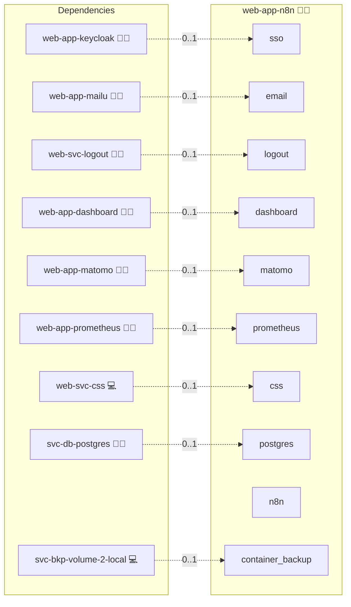

# n8n

## Description

[n8n](https://n8n.io/) is an open-source workflow automation platform. Connect services, transform data, and build integrations using a visual low-code editor or custom JavaScript/Python nodes.

## Overview

This role deploys n8n Community Edition using the upstream `docker.n8n.io/n8nio/n8n` image backed by a PostgreSQL database (consumed from the central `svc-db-postgres` via `sys-stk-full`). Authentication is handled by an **oauth2-proxy** sidecar (Keycloak OIDC) in V1, or left to n8n's own user-management UI in V2. n8n Community Edition does not support LDAP — it is gated behind n8n's Enterprise license (`ldap.controller.ee.js` is not registered in CE) — so no LDAP variant is offered. Credentials stored inside n8n are encrypted at rest with a stable `N8N_ENCRYPTION_KEY`.

## Cosmos

The diagram places n8n in the Infinito.Nexus cosmos: the components it deploys (capabilities), the central services it consumes (dependencies), and its outward reach (federation and bridged external networks).



Solid `1:1` edges are fixed relationships; dashed `0..1` edges are conditional (enabled only in matching deployments). Node markers show the role's deploy modes (💻 host, 🐳 compose, 🐝 swarm); ❌ marks a service that is explicitly turned off, and ⚙️ an Ansible role dependency declared in `meta/main.yml`.

## Features

- **Visual workflow editor:** Drag-and-drop canvas with 400+ built-in integrations.
- **Webhook triggers:** Expose workflow endpoints for external systems to call.
- **SSO via oauth2-proxy with auto-provisioning:** V1 gates all access through the shared Keycloak OIDC client (oauth2-proxy edge). openresty forwards the authenticated identity to n8n as a trusted `Remote-Email` header (`templates/proxy.conf.j2`); an `EXTERNAL_HOOK_FILES` script (`files/hooks.js`, adapted from [PavelSozonov/n8n-community-sso](https://github.com/PavelSozonov/n8n-community-sso)) reads that header, auto-provisions a local n8n user on first sign-in, and issues n8n's own session cookie — so every Keycloak user lands directly in the workflow editor, with no second, n8n-local login step.
- **Encrypted credential storage:** `N8N_ENCRYPTION_KEY` protects all saved credentials at rest; the key is stable across re-deploys.
- **Postgres backend:** Workflow definitions, execution history, and user data persist in the central `svc-db-postgres`.

## Quick Setup

### Development

Clone, set up the workstation, and deploy n8n onto the local stack:

```bash
git clone https://github.com/infinito-nexus/core.git
cd core
make onboard
make compose-deploy mode=reinstall apps=web-app-n8n full_cycle=false
```

### Production

Run the published image to provision the inventory and deploy n8n to a managed server (the mounted volume persists the inventory):

```bash
APP=web-app-n8n
HOST=<your-server>
TLS_MODE=self_signed
SSH_PUBLIC_KEY="<your-ssh-public-key>"

docker run --rm -it \
  -v "$PWD/inventories:/etc/infinito.nexus/inventories" \
  -e APP="$APP" -e HOST="$HOST" -e TLS_MODE="$TLS_MODE" -e SSH_PUBLIC_KEY="$SSH_PUBLIC_KEY" \
  ghcr.io/infinito-nexus/core/debian bash -c '
    INVENTORY=/etc/infinito.nexus/inventories/production
    infinito administration inventory provision "$INVENTORY" \
      --inventory-file "$INVENTORY/devices.yml" \
      --host "$HOST" \
      --include "$APP" \
      --vars "{\"TLS_MODE\": \"$TLS_MODE\", \"users\": {\"administrator\": {\"authorized_keys\": [\"$SSH_PUBLIC_KEY\"]}}}" &&
    infinito administration deploy dedicated "$INVENTORY/devices.yml" \
      --password-file "$INVENTORY/.password" \
      --diff -vv'
```

## Variant Matrix

| | V1 (sso) | V2 (no auth) |
|---|---|---|
| oauth2-proxy SSO | ✓ | ✗ |
| Shared postgres | ✓ | ✗ |

## First-Run Setup

The deployment bootstrap (`tasks/02_bootstrap.yml`) automatically creates the owner account on first run using the platform-generated `owner_password` credential. No manual wizard step is required.

**V1 (SSO):** The oauth2-proxy edge gate redirects all requests to Keycloak. `files/hooks.js` reads the trusted `Remote-Email` header openresty sets once the gate passes and auto-provisions/logs in the matching n8n user (role `global:member`, or the pre-existing owner for `users.administrator.email`), so every Keycloak user — administrator and regular users alike — lands directly on n8n's own workflow surface with no second, n8n-local login step.

**V2 (no auth):** n8n presents its native login UI. The administrator logs in with the email configured in `users.administrator.email` and the password stored in the platform credential `credentials.owner_password`. Retrieve it with:

```
ansible-vault view group_vars/web-app-n8n.yml
```

## Developer Notes

Variant matrix: [variants.yml](./meta/variants.yml). Service flags and image pin: [services.yml](./meta/services.yml). Credentials declared in [schema.yml](./meta/schema.yml).

## Further Resources

- [n8n Official Website](https://n8n.io/)
- [n8n Docker Documentation](https://docs.n8n.io/hosting/installation/docker/)
- [n8n GitHub](https://github.com/n8n-io/n8n)

## Credits

Implemented by **[Prageeth Panicker](https://github.com/pragepani)**.
Part of the [Infinito.Nexus Project](https://s.infinito.nexus/code) and maintained by [Kevin Veen-Birkenbach](https://www.veen.world).
Licensed under the [Infinito.Nexus Community License (Non-Commercial)](https://s.infinito.nexus/license).
