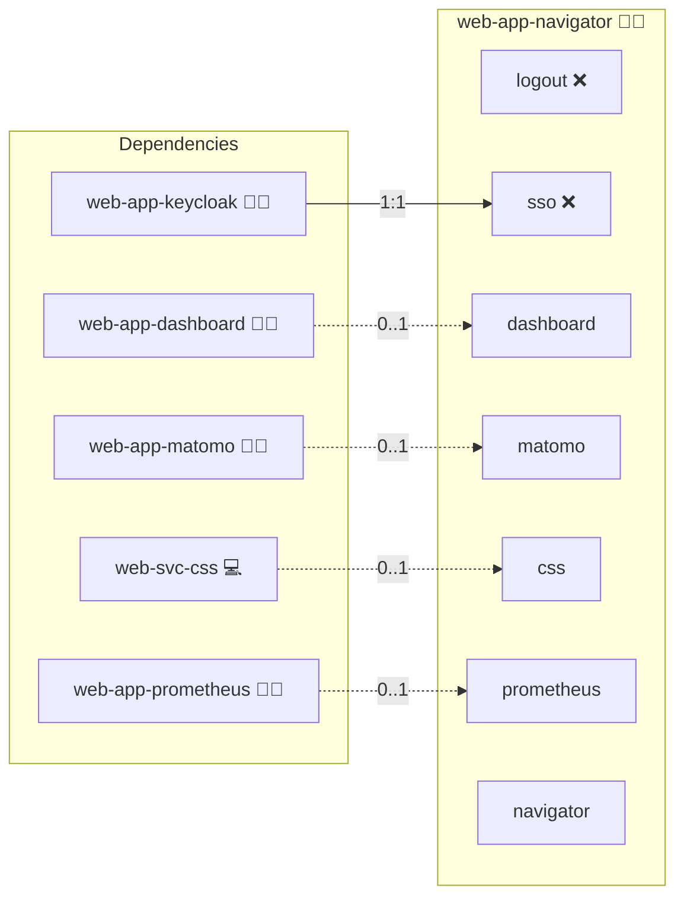

# Presentation

## Description

This **Infinito.Nexus Presentation** is a tool designed for showcasing the Infinito.Nexus platform to various audiences, including **Administrators**, **Developers**, **End-Users**, **Businesses**, and **Investors**. The presentation leverages **Reveal.js** to create an interactive, engaging, and fully containerized experience that can be easily deployed with Docker.

This role automates the process of setting up and running the Infinito.Nexus presentation in a Docker container, ensuring a reproducible and isolated environment for displaying the content.

## Overview

The **Infinito.Nexus Presentation** role automates the setup of an environment using Docker, providing a seamless process for pulling your source repository, building the presentation, and serving the slides through a lightweight HTTP server. It uses **[Reveal.js](https://revealjs.com/)** for building and serving the presentation slides and can be deployed with **Kevin's Package Manager**.

## Cosmos

The diagram places Presentation in the Infinito.Nexus cosmos: the components it deploys (capabilities), the central services it consumes (dependencies), and its outward reach (federation and bridged external networks).



Solid `1:1` edges are fixed relationships; dashed `0..1` edges are conditional (enabled only in matching deployments). Node markers show the role's deploy modes (💻 host, 🐳 compose, 🐝 swarm); ❌ marks a service that is explicitly turned off, and ⚙️ an Ansible role dependency declared in `meta/main.yml`.

## Features

- **Fully Automated Setup:** The role handles all tasks, including pulling the source repository, building the Docker image, and serving the presentation through a web server.
- **Dockerized Environment:** The entire process is contained within Docker, ensuring consistent builds and easy deployment.
- **Interactive Slides:** The presentation is built with **Reveal.js**, allowing for interactive slides with advanced features like fragments, transitions, and more.
- **Customizable:** Easily configurable to point to your own source code or documentation.

## Quick Setup

### Development

Clone, set up the workstation, and deploy Presentation onto the local stack:

```bash
git clone https://github.com/infinito-nexus/core.git
cd core
make onboard
make compose-deploy mode=reinstall apps=web-app-navigator full_cycle=false
```

### Production

Run the published image to provision the inventory and deploy Presentation to a managed server (the mounted volume persists the inventory):

```bash
APP=web-app-navigator
HOST=<your-server>
TLS_MODE=self_signed
SSH_PUBLIC_KEY="<your-ssh-public-key>"

docker run --rm -it \
  -v "$PWD/inventories:/etc/infinito.nexus/inventories" \
  -e APP="$APP" -e HOST="$HOST" -e TLS_MODE="$TLS_MODE" -e SSH_PUBLIC_KEY="$SSH_PUBLIC_KEY" \
  ghcr.io/infinito-nexus/core/debian bash -c '
    INVENTORY=/etc/infinito.nexus/inventories/production
    infinito administration inventory provision "$INVENTORY" \
      --inventory-file "$INVENTORY/devices.yml" \
      --host "$HOST" \
      --include "$APP" \
      --vars "{\"TLS_MODE\": \"$TLS_MODE\", \"users\": {\"administrator\": {\"authorized_keys\": [\"$SSH_PUBLIC_KEY\"]}}}" &&
    infinito administration deploy dedicated "$INVENTORY/devices.yml" \
      --password-file "$INVENTORY/.password" \
      --diff -vv'
```

## Further Resources

- [Infinito.Nexus Presentation](https://s.infinito.nexus/code-presentation)
- [Reveal.js](https://revealjs.com/)
- [infinito.nexus](https://infinito.nexus)

## Credits

Implemented by **[Kevin Veen-Birkenbach](https://www.veen.world)**.
Part of the [Infinito.Nexus Project](https://s.infinito.nexus/code) and maintained by [Kevin Veen-Birkenbach](https://www.veen.world).
Licensed under the [Infinito.Nexus Community License (Non-Commercial)](https://s.infinito.nexus/license).
