# Nextcloud

## Description

Elevate your collaboration with Nextcloud, a vibrant self-hosted cloud solution designed for dynamic file sharing, seamless communication, and effortless teamwork. Nextcloud offers a full suite of integrated tools (including LDAP and OIDC authentication, Redis caching, and automated plugin management via OCC) to empower a secure, extensible, and production-ready cloud environment.

## Overview

This role provisions a complete Nextcloud deployment using Docker Compose. It automates the setup of the Nextcloud application along with its underlying MariaDB database and configures the system for secure public access via an NGINX reverse proxy. The deployment includes automated configuration merging into `config.php`, health check routines, and integrated support for backup and recovery operations.

## Cosmos

The diagram places Nextcloud in the Infinito.Nexus cosmos: the components it deploys (capabilities), the central services it consumes (dependencies), and its outward reach (federation and bridged external networks).

```mermaid
flowchart LR
    subgraph deps [Dependencies]
        dep_svc_bkp_volume_2_local["svc-bkp-volume-2-local 💻"]
        dep_svc_db_mariadb["svc-db-mariadb 🐳🐝"]
        dep_svc_db_openldap["svc-db-openldap 🐳🐝"]
        dep_svc_db_redis["svc-db-redis 🐳🐝"]
        dep_web_app_bigbluebutton["web-app-bigbluebutton 🐳🐝"]
        dep_web_app_dashboard["web-app-dashboard 🐳🐝"]
        dep_web_app_discourse["web-app-discourse 🐳🐝"]
        dep_web_app_flowise["web-app-flowise 🐳🐝"]
        dep_web_app_gitlab["web-app-gitlab 🐳🐝"]
        dep_web_app_keycloak["web-app-keycloak 🐳🐝"]
        dep_web_app_mailu["web-app-mailu 🐳🐝"]
        dep_web_app_mastodon["web-app-mastodon 🐳🐝"]
        dep_web_app_matomo["web-app-matomo 🐳🐝"]
        dep_web_app_matrix["web-app-matrix 🐳🐝"]
        dep_web_app_mattermost["web-app-mattermost 🐳🐝"]
        dep_web_app_openproject["web-app-openproject 🐳🐝"]
        dep_web_app_openwebui["web-app-openwebui 🐳🐝"]
        dep_web_app_peertube["web-app-peertube 🐳🐝"]
        dep_web_app_prometheus["web-app-prometheus 🐳🐝"]
        dep_web_app_seaweedfs["web-app-seaweedfs 🐳🐝"]
        dep_web_app_xwiki["web-app-xwiki 🐳🐝"]
        dep_web_app_zammad["web-app-zammad 🐳🐝"]
        dep_web_svc_collabora["web-svc-collabora 🐳🐝"]
        dep_web_svc_coturn["web-svc-coturn 🐳🐝"]
        dep_web_svc_css["web-svc-css 💻"]
        dep_web_svc_logout["web-svc-logout 🐳🐝"]
        dep_web_svc_onlyoffice["web-svc-onlyoffice 🐳🐝"]
    end
    subgraph role [web-app-nextcloud 🐳🐝]
        svc_sso["sso"]
        svc_coturn["coturn"]
        svc_logout["logout"]
        svc_ldap["ldap"]
        svc_dashboard["dashboard"]
        svc_matomo["matomo"]
        svc_email["email"]
        svc_redis["redis"]
        svc_mariadb["mariadb"]
        svc_nextcloud["nextcloud"]
        svc_proxy["proxy"]
        svc_cron["cron"]
        svc_talk["talk"]
        svc_whiteboard["whiteboard"]
        svc_onlyoffice["onlyoffice"]
        svc_collabora["collabora"]
        svc_bigbluebutton["bigbluebutton"]
        svc_xwiki["xwiki"]
        svc_minio["minio ❌"]
        svc_seaweedfs["seaweedfs"]
        svc_talk_recording["talk_recording"]
        svc_css["css"]
        svc_hcaptcha["hcaptcha"]
        svc_prometheus["prometheus"]
        svc_openproject["openproject"]
        svc_gitlab["gitlab"]
        svc_discourse["discourse"]
        svc_mattermost["mattermost"]
        svc_matrix["matrix"]
        svc_zammad["zammad"]
        svc_openwebui["openwebui"]
        svc_flowise["flowise"]
        svc_mastodon["mastodon"]
        svc_peertube["peertube"]
        svc_moodle["moodle ❌"]
        svc_suitecrm["suitecrm ❌"]
        svc_container_backup["container_backup"]
    end
    dep_svc_bkp_volume_2_local -. "0..1" .-> svc_container_backup
    dep_svc_db_mariadb -. "0..1" .-> svc_mariadb
    dep_svc_db_openldap -. "0..1" .-> svc_ldap
    dep_svc_db_redis -. "0..1" .-> svc_redis
    dep_web_app_bigbluebutton -. "0..1" .-> svc_bigbluebutton
    dep_web_app_dashboard -. "0..1" .-> svc_dashboard
    dep_web_app_discourse -. "0..1" .-> svc_discourse
    dep_web_app_flowise -. "0..1" .-> svc_flowise
    dep_web_app_gitlab -. "0..1" .-> svc_gitlab
    dep_web_app_keycloak -. "0..1" .-> svc_sso
    dep_web_app_mailu -. "0..1" .-> svc_email
    dep_web_app_mastodon -. "0..1" .-> svc_mastodon
    dep_web_app_matomo -. "0..1" .-> svc_matomo
    dep_web_app_matrix -. "0..1" .-> svc_matrix
    dep_web_app_mattermost -. "0..1" .-> svc_mattermost
    dep_web_app_openproject -. "0..1" .-> svc_openproject
    dep_web_app_openwebui -. "0..1" .-> svc_openwebui
    dep_web_app_peertube -. "0..1" .-> svc_peertube
    dep_web_app_prometheus -. "0..1" .-> svc_prometheus
    dep_web_app_seaweedfs -. "0..1" .-> svc_seaweedfs
    dep_web_app_xwiki -. "0..1" .-> svc_xwiki
    dep_web_app_zammad -. "0..1" .-> svc_zammad
    dep_web_svc_collabora -. "0..1" .-> svc_collabora
    dep_web_svc_coturn -. "0..1" .-> svc_coturn
    dep_web_svc_coturn -. "0..1" .-> svc_talk
    dep_web_svc_css -. "0..1" .-> svc_css
    dep_web_svc_logout -. "0..1" .-> svc_logout
    dep_web_svc_onlyoffice -. "0..1" .-> svc_onlyoffice
```



Solid `1:1` edges are fixed relationships; dashed `0..1` edges are conditional (enabled only in matching deployments). Node markers show the role's deploy modes (💻 host, 🐳 compose, 🐝 swarm); ❌ marks a service that is explicitly turned off, and ⚙️ an Ansible role dependency declared in `meta/main.yml`.

## Features

- **Fully Dockerized Deployment:** Simplifies installation using Docker Compose for the Nextcloud application and its MariaDB backend.
- **Secure Access:** Integrates with an NGINX reverse proxy for encrypted, high-performance access.
- **Robust Authentication:** Supports LDAP and OIDC for secure identity and access management.
- **Automated Configuration Management:** Uses additive configuration files to dynamically merge system settings into `config.php`.
- **Integrated Backup & Recovery:** Provides built-in support for backup and restoration operations to safeguard your data.
- **Extensible Plugin Framework:** Easily manage and configure hundreds of Nextcloud plugins using the OCC command line tool.

## Quick Setup

### Development

Clone, set up the workstation, and deploy Nextcloud onto the local stack:

```bash
git clone https://github.com/infinito-nexus/core.git
cd core
make onboard
make compose-deploy mode=reinstall apps=web-app-nextcloud full_cycle=false
```

### Production

Run the published image to provision the inventory and deploy Nextcloud to a managed server (the mounted volume persists the inventory):

```bash
APP=web-app-nextcloud
HOST=<your-server>
TLS_MODE=self_signed
SSH_PUBLIC_KEY="<your-ssh-public-key>"

docker run --rm -it \
  -v "$PWD/inventories:/etc/infinito.nexus/inventories" \
  -e APP="$APP" -e HOST="$HOST" -e TLS_MODE="$TLS_MODE" -e SSH_PUBLIC_KEY="$SSH_PUBLIC_KEY" \
  ghcr.io/infinito-nexus/core/debian bash -c '
    INVENTORY=/etc/infinito.nexus/inventories/production
    infinito administration inventory provision "$INVENTORY" \
      --inventory-file "$INVENTORY/devices.yml" \
      --host "$HOST" \
      --include "$APP" \
      --vars "{\"TLS_MODE\": \"$TLS_MODE\", \"users\": {\"administrator\": {\"authorized_keys\": [\"$SSH_PUBLIC_KEY\"]}}}" &&
    infinito administration deploy dedicated "$INVENTORY/devices.yml" \
      --password-file "$INVENTORY/.password" \
      --diff -vv'
```

## Addons

The config-bearing Nextcloud apps are declared in [`meta/addons/`](./meta/addons/) under the unified addon contract (requirement 026).
Each declaration carries its full `occ config:app:set` payload under `config:`.
The enable-only appstore apps stay under `nextcloud.plugins` in [`meta/services.yml`](./meta/services.yml).

| Addon | Mechanism | Default state | Bridges |
|-------|-----------|---------------|---------|
| `sociallogin` | `plugin` | enabled when the SSO OIDC plugin selector picks it | `sso` → `web-app-keycloak` |
| `user_ldap` | `plugin` | enabled with the `ldap` service | `ldap` → `svc-db-openldap` |
| `bbb` | `plugin` | enabled with the `bigbluebutton` partner | `bigbluebutton` → `web-app-bigbluebutton` |
| `onlyoffice` | `plugin` | enabled with the `onlyoffice` partner | `onlyoffice` → `web-svc-onlyoffice` |
| `richdocuments` | `plugin` | enabled with the `collabora` partner | `collabora` → `web-svc-collabora` |
| `spreed` | `plugin` | enabled with the `talk` service | `talk`, `coturn` |
| `whiteboard` | `plugin` | `required` (always installed) | none (self-hosted backend) |
| `xwiki` | `plugin` | enabled with the `xwiki` partner | `xwiki` → `web-app-xwiki` |

The SSO (`sociallogin`) and LDAP (`user_ldap`) login surfaces are covered by the OIDC/LDAP Playwright specs (requirements 017/018).

## Documentation

A detailed documentation for the use and administration of Nextcloud on Infinito.Nexus you will find [here](docs/README.md).

## Further Resources

- [Nextcloud Official Website](https://nextcloud.com/)
- [Nextcloud Docker Documentation](https://github.com/nextcloud/docker)
- [Nextcloud Admin Manual](https://docs.nextcloud.com/server/latest/admin_manual/)
- [LDAP Integration Guide](https://docs.nextcloud.com/server/latest/admin_manual/configuration_user/user_auth_ldap.html)
- [OIDC Login Plugin (pulsejet)](https://github.com/pulsejet/nextcloud-oidc-login)
- [Sociallogin Plugin (Official)](https://apps.nextcloud.com/apps/sociallogin)

## Credits

Implemented by **[Kevin Veen-Birkenbach](https://www.veen.world)**.
Part of the [Infinito.Nexus Project](https://s.infinito.nexus/code) and maintained by [Kevin Veen-Birkenbach](https://www.veen.world).
Licensed under the [Infinito.Nexus Community License (Non-Commercial)](https://s.infinito.nexus/license).
