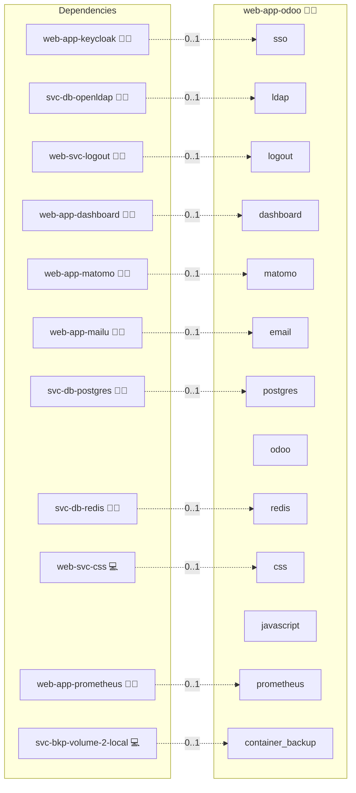

# Odoo ERP

## Description

Deploy and manage [Odoo](https://www.odoo.com/), a comprehensive open-source enterprise resource planning (ERP) solution within the Infinito.Nexus ecosystem. Odoo provides a fully integrated suite of business applications including CRM, sales, inventory, accounting, HR, marketing, and website tools.

## Overview

This role automates the deployment of Odoo in a containerized Docker environment with PostgreSQL database integration, OIDC/LDAP authentication support, and full Infinito.Nexus stack integration including reverse proxy, CSP configuration, and centralized identity management.

## Cosmos

The diagram places Odoo ERP in the Infinito.Nexus cosmos: the components it deploys (capabilities), the central services it consumes (dependencies), and its outward reach (federation and bridged external networks).



Solid `1:1` edges are fixed relationships; dashed `0..1` edges are conditional (enabled only in matching deployments). Node markers show the role's deploy modes (💻 host, 🐳 compose, 🐝 swarm); ❌ marks a service that is explicitly turned off, and ⚙️ an Ansible role dependency declared in `meta/main.yml`.

## Purpose

The purpose of this role is to provide a hands-off, production-ready Odoo ERP deployment that integrates seamlessly with the Infinito.Nexus platform. Organizations can leverage Odoo's comprehensive business management capabilities while benefiting from centralized authentication, backup, monitoring, and security features.

## Features

- **CRM & Sales Management:**
  Track leads, opportunities, and customer relationships. Manage sales pipelines, quotations, and orders with full visibility into sales performance.

- **Accounting & Finance:**
  Handle invoicing, payments, bank reconciliation, and financial reporting. Supports multi-currency and multi-company operations.

- **Inventory & Warehouse:**
  Manage stock levels, transfers, and warehouse operations. Supports barcode scanning, batch picking, and advanced routing.

- **Website & E-Commerce:**
  Build and manage professional websites with integrated e-commerce capabilities, forms, and online payment processing.

- **Project Management:**
  Plan and track projects with Gantt charts, Kanban boards, and time tracking. Integrate with sales and invoicing for complete project billing.

- **Human Resources:**
  Manage employees, recruitment, expenses, leaves, and appraisals. Optional HR modules provide comprehensive workforce management.

- **Marketing & Automation:**
  Create email campaigns, marketing automation workflows, and social media management integrated with CRM data.

- **OIDC Authentication:**
  Single sign-on via Keycloak integration for seamless identity management across the Infinito.Nexus ecosystem.

- **LDAP Authentication:**
  Enterprise directory integration via OpenLDAP for organizations using traditional directory services.

- **WebSocket Support:**
  Real-time notifications and live chat capabilities through WebSocket connections.

## Quick Setup

### Development

Clone, set up the workstation, and deploy Odoo ERP onto the local stack:

```bash
git clone https://github.com/infinito-nexus/core.git
cd core
make onboard
make compose-deploy mode=reinstall apps=web-app-odoo full_cycle=false
```

### Production

Run the published image to provision the inventory and deploy Odoo ERP to a managed server (the mounted volume persists the inventory):

```bash
APP=web-app-odoo
HOST=<your-server>
TLS_MODE=self_signed
SSH_PUBLIC_KEY="<your-ssh-public-key>"

docker run --rm -it \
  -v "$PWD/inventories:/etc/infinito.nexus/inventories" \
  -e APP="$APP" -e HOST="$HOST" -e TLS_MODE="$TLS_MODE" -e SSH_PUBLIC_KEY="$SSH_PUBLIC_KEY" \
  ghcr.io/infinito-nexus/core/debian bash -c '
    INVENTORY=/etc/infinito.nexus/inventories/production
    infinito administration inventory provision "$INVENTORY" \
      --inventory-file "$INVENTORY/devices.yml" \
      --host "$HOST" \
      --include "$APP" \
      --vars "{\"TLS_MODE\": \"$TLS_MODE\", \"users\": {\"administrator\": {\"authorized_keys\": [\"$SSH_PUBLIC_KEY\"]}}}" &&
    infinito administration deploy dedicated "$INVENTORY/devices.yml" \
      --password-file "$INVENTORY/.password" \
      --diff -vv'
```

## Modules

Odoo's functionality is delivered through a modular architecture. The following core modules are installed by default:

| Module | Description |
|--------|-------------|
| **crm** | Customer Relationship Management - track leads, opportunities, and customer interactions |
| **contacts** | Centralized contact management for customers, vendors, and partners |
| **sale_management** | Sales pipeline, quotations, orders, and invoicing workflows |
| **account** | Full accounting suite including invoicing, payments, and financial reporting |
| **website** | Website builder with drag-and-drop editor and SEO tools |
| **project** | Project management with Kanban boards, Gantt charts, and time tracking |
| **stock** | Inventory and warehouse management with barcode support |

Additional modules can be enabled by declaring them as `group: optional` addons in [`meta/addons/`](meta/addons/).

## Addons

Odoo modules are declared as addons in [`meta/addons/`](meta/addons/) per the unified addon contract (requirement 026). The install path reads them from `applications.web-app-odoo.addons`.

| Addon | Mechanism | Default state | Bridges |
|-------|-----------|---------------|---------|
| crm | module | enabled (required) | none |
| contacts | module | enabled (required) | none |
| sale_management | module | enabled (required) | none |
| account | module | enabled (required) | none |
| website | module | enabled (required) | none |
| project | module | enabled (required) | none |
| stock | module | enabled (required) | none |

All core modules carry `required: true` and `group: core`, so they are always installed. The `optional` group is empty today.

## Deployment

Deploy Odoo using the standard Infinito.Nexus deployment command:

```bash
make compose-deploy mode=reinstall apps=web-app-odoo
```

For subsequent updates:

```bash
make compose-deploy mode=update apps=web-app-odoo
```

## Access

After deployment, Odoo is accessible at:

- **URL:** `odoo.erp.{DOMAIN}` (HTTPS)
- **Admin Login:** Uses configured administrator credentials
- **SSO Login:** "Login with SSO" button (when OIDC is enabled)

## Developer Notes

- The Odoo configuration file is templated to `/etc/odoo/odoo.conf`
- Custom addons can be placed in `files/addons/` and will be mounted at `/mnt/custom-addons`
- Database operations use the master password for security
- WebSocket connections are routed through port 8072

### HTTPS OAuth Redirect Fix

The role includes a custom `auth_oauth_https` addon that fixes OAuth redirect URIs when running behind a reverse proxy with TLS termination. The standard `auth_oauth` module may incorrectly generate HTTP redirect URIs. This addon overrides the behavior to use the `web.base.url` system parameter, ensuring HTTPS is always used.

### Inspecting the Container

```bash
make compose-exec
# Then inside the container:
odoo shell -d <database_name>
```

### Log Access

```bash
docker logs odoo -f
```

## Credits

Implemented by **[Evangelos Tsakoudis](https://github.com/evangelostsak)**.
Part of the [Infinito.Nexus Project](https://s.infinito.nexus/code) and maintained by [Kevin Veen-Birkenbach](https://www.veen.world).
Licensed under the [Infinito.Nexus Community License (Non-Commercial)](https://s.infinito.nexus/license).
