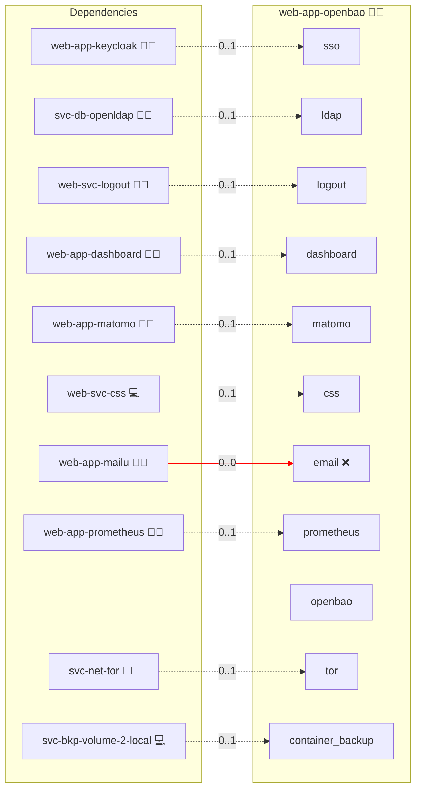

# OpenBao

## Description

[OpenBao](https://openbao.org/) is an identity-based secrets and encryption manager governed by the Linux Foundation. It stores application credentials, API keys, service and database credentials, automation and agent identities, short-lived tokens and encryption keys behind a policy engine, and can act as an internal certificate authority.

## Overview

This role deploys OpenBao as an Infinito.Nexus application at `openbao.<domain>`, behind the platform's HTTPS reverse proxy. Humans sign in through Keycloak with OIDC and receive exactly the privileges their RBAC group grants; machines authenticate separately through AppRole. State lives in OpenBao's own raft store on a persistent volume, and a static seal auto-unseals the node on every restart so no operator has to intervene after a redeploy.

## Cosmos

The diagram places OpenBao in the Infinito.Nexus cosmos: the components it deploys (capabilities), the central services it consumes (dependencies), and its outward reach (federation and bridged external networks).



Solid `1:1` edges are fixed relationships; dashed `0..1` edges are conditional (enabled only in matching deployments); red `0..0` edges are turned off in this role. Node markers show the role's deploy modes (💻 host, 🐳 compose, 🐝 swarm); ❌ marks a service that is explicitly turned off, and ⚙️ an Ansible role dependency declared in `meta/main.yml`.

## Features

- **Keycloak OIDC login:** The `jwt`/`oidc` auth method is configured against the platform Keycloak, so users sign in with their existing Infinito.Nexus identity. Logout integrates with `web-svc-logout`.
- **LDAP fallback:** When `svc-db-openldap` is deployed, the `ldap` auth method is enabled as a second login path, mapping the same role groups to the same policies. OIDC remains the default.
- **Group-mapped RBAC:** The Keycloak `groups` claim binds to OpenBao external identity groups carrying the `administrator`, `operator` and `reader` policies. Authenticating on its own grants only `default`.
- **Automatic unsealing:** A `static` seal reads a 32-byte key from the encrypted inventory, so the node unseals itself on every container restart.
- **Machine identity:** AppRole is configured independently of human login, so services and automation use their own identities and short-lived tokens instead of a shared administrator token.
- **Optional internal PKI:** A service flag mounts the `pki` engine with an internal root CA and an issuing role.
- **Monitoring:** Prometheus scrapes `/v1/sys/metrics` on the role-local network. A sealed node is detected from `/v1/sys/health`, which answers 503 while sealed and 200 once unsealed.
- **Automated provisioning:** Configured by Ansible without manual steps; no Keycloak client or OpenBao path has to be created by hand.

## Quick Setup

### Development

Clone, set up the workstation, and deploy OpenBao onto the local stack:

```bash
git clone https://github.com/infinito-nexus/core.git
cd core
make onboard
make compose-deploy mode=reinstall apps=web-app-openbao full_cycle=false
```

### Production

Run the published image to provision the inventory and deploy OpenBao to a managed server (the mounted volume persists the inventory):

```bash
APP=web-app-openbao
HOST=<your-server>
TLS_MODE=self_signed
SSH_PUBLIC_KEY="<your-ssh-public-key>"

docker run --rm -it \
  -v "$PWD/inventories:/etc/infinito.nexus/inventories" \
  -e APP="$APP" -e HOST="$HOST" -e TLS_MODE="$TLS_MODE" -e SSH_PUBLIC_KEY="$SSH_PUBLIC_KEY" \
  ghcr.io/infinito-nexus/core/debian bash -c '
    INVENTORY=/etc/infinito.nexus/inventories/production
    infinito administration inventory provision "$INVENTORY" \
      --inventory-file "$INVENTORY/devices.yml" \
      --host "$HOST" \
      --include "$APP" \
      --vars "{\"TLS_MODE\": \"$TLS_MODE\", \"users\": {\"administrator\": {\"authorized_keys\": [\"$SSH_PUBLIC_KEY\"]}}}" &&
    infinito administration deploy dedicated "$INVENTORY/devices.yml" \
      --password-file "$INVENTORY/.password" \
      --diff -vv'
```

## Developer Notes

- **The seal key is the whole ballgame.** The `static` seal encrypts the raft root key with a 32-byte key generated into the ansible-vault-encrypted inventory as `secrets.credentials.seal_key` and injected as `env://OPENBAO_SEAL_KEY`. A backup of the raft volume is **undecryptable without that key**, and the key is *not* covered by `svc-bkp-secrets-2-local` (whose sources are `DIR_SECRETS`, the root CA and the ACME material). The inventory is its authoritative home — back the inventory up accordingly. Upstream considers a static seal appropriate only where an existing source of trust already holds the key; here that source is the encrypted inventory, at the same trust level as every other platform credential.
- **Recovery keys are generated and then deliberately discarded.** Initialising with an auto-seal yields *recovery* keys rather than unseal shares. They cannot decrypt the root key — only the seal key can — so they are not disaster-recovery material for the data; they only authorise `operator generate-root` and `operator rekey`. Persisting them would mean writing OpenBao-generated secrets back into the inventory, which is exactly what the AppRole bootstrap exists to avoid, so the play does not keep them. **The consequence is explicit: the Ansible AppRole is the only administrative path into this instance.** If its RoleID/SecretID are changed out-of-band inside OpenBao, there is no way back in and the instance must be rebuilt from the volume backup plus the seal key. Re-running the role does not repair that, because reconciliation itself authenticates with the AppRole.
- **Bootstrap leaves no stored root token.** The first deploy runs `bao operator init`, holds the root token in memory only, enables AppRole, pins both the RoleID and the SecretID to inventory-generated values via `auth/approle/role/<role>/role-id` and `.../custom-secret-id`, then revokes the root token. Every later deploy logs in with those inventory credentials, so nothing OpenBao generates is ever written back into the inventory. Tokens reach the CLI through stdin and the container token helper, never through process arguments, and the helper file is removed at the end of the run.
- **Policies live outside the config directory.** OpenBao parses every file in `-config` as server configuration, so the RBAC policy `.hcl` files are mounted at `/openbao/policies/` instead of `/openbao/config/`.
- **Storage path is `/openbao/file`, not `/openbao/data`.** The image runs as the non-root `openbao` user and pre-chowns only `/openbao/{config,logs,file}`. A fresh named volume inherits ownership from the image path, so raft can write there; a volume at `/openbao/data` would land root-owned and fail.
- **`command:` is just `server`.** The image entrypoint appends `-config=/openbao/config` itself; passing an explicit `-config` duplicates the flag.
- **CLI OIDC login is out of scope.** The `redirect_uris` lookup registers `https://<domain>/*` per SSO consumer, which covers the UI and API callbacks but not the CLI's `http://localhost:8250/oidc/callback`. Use AppRole for non-interactive access.
- **Visiting `/ui/vault/logout` does not end the session.** Measured against a live instance: after that navigation the UI returns to `/ui/vault/secrets` still authenticated, because the Ember app restores its token from browser storage. Use the UI's own logout control, or clear site data, when you actually need the session gone.
- **Do not alert on `vault_core_unsealed`.** OpenBao keeps Vault's `vault_*` metric namespace, and on a healthy unsealed node this gauge is emitted as `vault_core_unsealed{cluster=""} 0` — an alert on `== 0` fires permanently. Use `/v1/sys/health` (503 while sealed) as the seal signal; `vault_core_active{cluster="…"} == 1` corroborates from the metrics side.
- **Swarm:** single replica, `placement: manager`, `nfs: false` on the raft volume and `service_update_order = stop-first` — raft's BoltDB store is mmap + `fsync` based, so it must stay node-local and must never have two tasks writing the same directory.
- **The RBAC tiers are proven by moving `biber` through the groups, not by dedicated accounts.** `files/playwright/test-rbac-groups.js` signs the administrator into LAM, adds `biber` to `cn=web-app-openbao-<role>,ou=roles` through LAM's Multi edit tool, logs `biber` into OpenBao over LDAP and asserts both the policy set and the capability that tier grants, then removes him again and asserts the revoke. One account covers all three tiers, and the grant and the revoke are observed rather than assumed — a permanently-assigned member can only ever show a steady state. LAM's *group list* cannot be used for this: it renders `posixGroup` entries, while the RBAC role groups are `groupOfNames` under `ou=roles`. LAM applies the change asynchronously, so the spec polls the resulting policy set instead of LAM's own progress wording.
- **Redeploying locally after the inventory regenerates leaves stale state that looks like a role bug.** The development inventory regenerates credentials per deploy while docker volumes survive, so anything that stores a credential *inside* its volume desynchronises: the raft store stays `initialized: true, sealed: true` when `seal_key` no longer matches, the Ansible AppRole reports `invalid role or secret ID` when it was pinned at an earlier bootstrap, and a surviving `mariadb_data` fails its healthcheck with `Access denied for user 'root'@'127.0.0.1'`. None of these are defects; CI never sees them because every run starts clean. Run `make compose-entity-purge apps=web-app-openbao` (or the affected entity) before redeploying locally.
- **A role-declared account cannot be logged in as unless it sets a password.** The tiers were first covered by two role-local accounts, `baooperator` and `baoreader`, which deployed and joined their RBAC groups correctly but returned 403 on every LDAP bind: a user declared without an explicit `password` inherits the `strong_password` fallback expression, which is re-evaluated on every render (`secrets.choice`, nothing persisted), so the value `svc-db-openldap` writes with `ldap_passwd` and the value `playwright.env.j2` renders can be different strings. Both accounts are gone now — the tiers are covered by moving `biber` through the groups instead — but the trap applies to any future role-declared account something has to authenticate as. Until [`feature/ai-agent-employees`](https://github.com/kevinveenbirkenbach/infinito-nexus-core/tree/refs/heads/feature/ai-agent-employees) lands (`f4398e1c5` pins a password per declared user at inventory creation), such an account needs an explicit `password:`, as `user-administrator` and `web-app-semaphore` do.
- **Alert rules ship with the role.** `templates/prometheus/alert_rules.yml.j2` is discovered by the `alert_rule_roles` lookup and concatenated into the Prometheus rule file, so the seal alert lives next to the thing it watches. The fragment must start at the `groups:` item level (two-space-indented `- name:` entries).

### Backup and restore

Backups run through `svc-bkp-volume-2-local` with `backup.no_stop_required: false`, so the container is quiesced for a consistent copy of the raft volume. To restore:

1. Restore the `openbao_data` volume from the backup generation.
2. Confirm the inventory still holds the original `seal_key` — a different key makes the restored store unreadable.
3. Redeploy the role. The static seal unseals the restored store automatically; verify with `/v1/sys/seal-status` (`sealed: false`) and read back a known secret.

## Credits

Implemented by **Evangelos Tsakoudis**.
Part of the [Infinito.Nexus Project](https://s.infinito.nexus/code) and maintained by [Kevin Veen-Birkenbach](https://www.veen.world).
Licensed under the [Infinito.Nexus Community License (Non-Commercial)](https://s.infinito.nexus/license).
