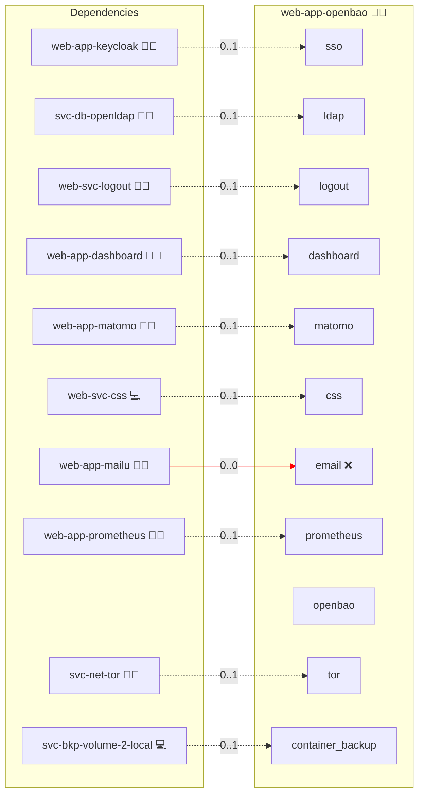

# OpenBao

## Description

[OpenBao](https://openbao.org/) is an identity-based secrets and encryption manager governed by the Linux Foundation. It stores application credentials, API keys, service and database credentials, automation and agent identities, short-lived tokens and encryption keys behind a policy engine, and can act as an internal certificate authority.

## Overview

This role deploys OpenBao as an Infinito.Nexus application at `openbao.<domain>`, behind the platform's HTTPS reverse proxy. Humans sign in through Keycloak with OIDC and receive exactly the privileges their RBAC group grants; machines authenticate separately through AppRole. State lives in OpenBao's own raft store on a persistent volume, and a static seal auto-unseals the node on every restart so no operator has to intervene after a redeploy.

## Cosmos

The diagram places OpenBao in the Infinito.Nexus cosmos: the components it deploys (capabilities), the central services it consumes (dependencies), and its outward reach (federation and bridged external networks).



Solid `1:1` edges are fixed relationships; dashed `0..1` edges are conditional (enabled only in matching deployments); red `0..0` edges are turned off in this role. Node markers show the role's deploy modes (💻 host, 🐳 compose, 🐝 swarm); ❌ marks a service that is explicitly turned off, and ⚙️ an Ansible role dependency declared in `meta/main.yml`.

## Features

- **Keycloak OIDC login:** The `jwt`/`oidc` auth method is configured against the platform Keycloak, so users sign in with their existing Infinito.Nexus identity. Logout integrates with `web-svc-logout`.
- **LDAP fallback:** When `svc-db-openldap` is deployed, the `ldap` auth method is enabled as a second login path, mapping the same role groups to the same policies. OIDC remains the default.
- **Group-mapped RBAC:** The Keycloak `groups` claim binds to OpenBao external identity groups carrying the `administrator`, `operator` and `reader` policies. Authenticating on its own grants only `default`.
- **Automatic unsealing:** A `static` seal reads a 32-byte key from the encrypted inventory, so the node unseals itself on every container restart.
- **Machine identity:** AppRole is configured independently of human login, so services and automation use their own identities and short-lived tokens instead of a shared administrator token.
- **Optional internal PKI:** A service flag mounts the `pki` engine with an internal root CA and an issuing role.
- **Monitoring:** Prometheus scrapes `/v1/sys/metrics` on the role-local network. A sealed node is detected from `/v1/sys/health`, which answers 503 while sealed and 200 once unsealed.
- **Automated provisioning:** Configured by Ansible without manual steps; no Keycloak client or OpenBao path has to be created by hand.

## Quick Setup

### Development

Clone, set up the workstation, and deploy OpenBao onto the local stack:

```bash
git clone https://github.com/infinito-nexus/core.git
cd core
make onboard
make compose-deploy mode=reinstall apps=web-app-openbao full_cycle=false
```

### Production

Run the published image to provision the inventory and deploy OpenBao to a managed server (the mounted volume persists the inventory):

```bash
APP=web-app-openbao
HOST=<your-server>
DOMAIN=<your-domain>
TLS_MODE=self_signed
SSH_PUBLIC_KEY="<your-ssh-public-key>"

docker run --rm -it \
  -v "$PWD/inventories:/etc/infinito.nexus/inventories" \
  -e APP="$APP" -e HOST="$HOST" -e DOMAIN="$DOMAIN" -e TLS_MODE="$TLS_MODE" -e SSH_PUBLIC_KEY="$SSH_PUBLIC_KEY" \
  ghcr.io/infinito-nexus/core/debian bash -c '
    INVENTORY=/etc/infinito.nexus/inventories/production
    infinito administration inventory provision "$INVENTORY" \
      --inventory-file "$INVENTORY/devices.yml" \
      --host "$HOST" \
      --include "$APP" \
      --vars "{\"TLS_MODE\": \"$TLS_MODE\", \"DOMAIN_PRIMARY\": \"$DOMAIN\", \"users\": {\"administrator\": {\"authorized_keys\": [\"$SSH_PUBLIC_KEY\"]}}}" &&
    infinito administration deploy dedicated "$INVENTORY/devices.yml" \
      --password-file "$INVENTORY/.password" \
      --diff -vv'
```

## Developer Notes

- **The seal key is the whole ballgame.** The `static` seal wraps the raft root key with `secrets.credentials.seal_key`, injected as `env://OPENBAO_SEAL_KEY`. A backup of the raft volume is **undecryptable without it**, and `svc-bkp-secrets-2-local` does not cover it — the encrypted inventory is its only home, so back the inventory up accordingly. It is pinned `rotatable: false`: the static seal carries one generation of slack, and spending that every deploy makes any skipped generation unrecoverable. Rotate it deliberately by changing the inventory value; `openbao.hcl.j2` then emits the `previous_key`/`previous_key_id` pair, the node unseals with the old key and rewraps to the new one.
- **The recovery key is the way back in.** `bao operator init` issues it once and nothing reissues it, which is what makes it useful — it is the only authority here that does not rotate. It is persisted through `sys-token-store` (`DIR_SECRETS`, backed up, and it survives both `MODE_RESET` and a replaced manager, each of which takes `.applied.json` with it). When neither the inventory AppRole nor the recorded one is accepted, `tasks/utils/recover.yml` mints a root token from it and re-pins the AppRole. It cannot decrypt the store — only the seal key can — so it is not a substitute for backing up the inventory.
- **Every deploy rotates the AppRole.** The `role_id`/`secret_id` a run is handed are not the ones the running instance holds. `tasks/01_init.yml` tries the inventory pair, falls back to the pair recorded in `.applied.json`, then `tasks/06_rotate.yml` re-pins to this run's values and destroys the old SecretID. The record is written last, so a run that dies partway leaves the previous generation intact. `custom-secret-id` is **not** idempotent — re-writing a held SecretID answers `500` — so the swap is gated on the value having changed.
- **Bootstrap leaves no stored root token.** The first deploy holds it in memory, pins both AppRole halves to inventory values, then revokes it. Tokens reach the CLI through stdin and the container token helper, never through process arguments, and the helper file is removed at the end of the run.
- **Paths that look wrong and are not.** Policies mount at `/openbao/policies/`, because OpenBao parses *every* file under `-config` as server configuration. Storage is `/openbao/file`, not `/openbao/data`: the image pre-chowns only `/openbao/{config,logs,file}` for the non-root `openbao` user, so a volume elsewhere lands root-owned and raft cannot write. `command:` is just `server` — the entrypoint appends `-config` itself, and passing it duplicates the flag.
- **Do not alert on `vault_core_unsealed`.** OpenBao keeps Vault's metric namespace, and a healthy unsealed node emits `vault_core_unsealed{cluster=""} 0`, so an alert on `== 0` fires permanently. Use `/v1/sys/health` (503 while sealed); `vault_core_active{cluster="…"} == 1` corroborates.
- **Alert rules ship with the role.** `templates/prometheus/alert_rules.yml.j2` is discovered by the `alert_rule_roles` lookup, which returns only roles that are actually scraped, so the fragment carries no activation guard of its own. It must start at the `groups:` item level.
- **Swarm:** single replica, `placement: manager`, `nfs: false` on the raft volume, `service_update_order = stop-first`. Raft's BoltDB store is mmap + `fsync` based, so it must stay node-local and must never have two tasks writing one directory.
- **CLI OIDC login is out of scope.** `redirect_uris` registers `https://<domain>/*`, covering UI and API callbacks but not the CLI's `http://localhost:8250/oidc/callback`. Use AppRole for non-interactive access.
- **Test notes.** The RBAC tiers are proven by moving `biber` through the groups with LAM's Multi edit tool and asserting both the grant and the revoke, rather than by dedicated accounts. `/ui/vault/logout` does not end a session — the Ember app restores its token from browser storage — so use the UI's own logout control when the session must actually be gone.

### Backup and restore

Backups run through `svc-bkp-volume-2-local` with `backup.no_stop_required: false`, so the container is quiesced for a consistent copy of the raft volume. To restore:

1. Restore the `openbao_data` volume from the backup generation.
2. Confirm the inventory still holds the original `seal_key` — a different key makes the restored store unreadable.
3. Redeploy the role. The static seal unseals the restored store automatically; verify with `/v1/sys/seal-status` (`sealed: false`) and read back a known secret.

## Credits

Implemented by **[Evangelos Tsakoudis](https://github.com/evangelostsak)**.
Part of the [Infinito.Nexus Project](https://s.infinito.nexus/code) and maintained by [Kevin Veen-Birkenbach](https://www.veen.world).
Licensed under the [Infinito.Nexus Community License (Non-Commercial)](https://s.infinito.nexus/license).
