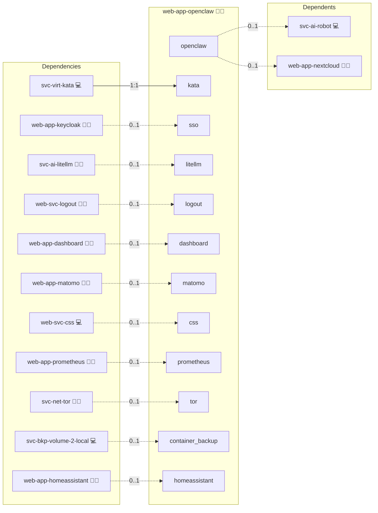

# OpenClaw

## Description

[OpenClaw](https://openclaw.ai/) is an open-source personal AI agent that runs on hardware you control. It ships a gateway process with a browser Control UI next to its CLI and TUI, keeps persistent memory and a workspace on disk, and performs browser and filesystem tasks inside its own sandbox.

## Overview

This role deploys OpenClaw as a gateway container behind the reverse proxy on its own canonical domain. Its compose service is pinned to the isolating runtime that the Kata & gVisor role selects for the host, its gateway configuration file is rendered from the role, and its state directory is kept in a persistent volume. Access is fronted by an OAuth2 proxy with Keycloak sign-in when Keycloak is part of the deployment.

## Cosmos

The diagram places OpenClaw in the Infinito.Nexus cosmos: the components it deploys (capabilities), the central services it consumes (dependencies), and its outward reach (federation and bridged external networks).



Solid `1:1` edges are fixed relationships; dashed `0..1` edges are conditional (enabled only in matching deployments); red `0..0` edges are turned off in this role. Node markers show the role's deploy modes (💻 host, 🐳 compose, 🐝 swarm); ❌ marks a service that is explicitly turned off, and ⚙️ an Ansible role dependency declared in `meta/main.yml`.

## Features

- **Agent gateway:** The container runs the OpenClaw gateway bound to the LAN interface on port 18789, with an HTTP health check against `/healthz`.
- **Isolating runtime:** The compose service is pinned to Kata Containers where `/dev/kvm` and the Kata shim are available, and to gVisor otherwise.
- **Single sign-on:** When Keycloak is deployed, an OAuth2 proxy sits in front of the gateway and admits only members of the administrator group of this application.
- **Gateway token:** A generated gateway token guards the Control UI and the API, and the Control UI accepts the canonical domain as its only allowed origin.
- **Model gateway key:** With the LiteLLM Gateway deployed, that gateway provisions a per-consumer virtual key aliased to this application.
- **MCP client contract:** With Home Assistant deployed, the role declares the MCP client side of the platform contract as an internal streamable-HTTP client with a read-only tool policy. The MCP server list itself lives in `openclaw.json`, not in the container environment.
- **Persistent state:** Memory and workspace live in a volume mounted at `/home/node/.openclaw`, with the rendered `openclaw.json` mounted into it, and are included in the container volume backup when that service is deployed.
- **Compose and Swarm:** The role deploys in both modes and renders the gateway configuration file for the local host and the swarm peers.

## Quick Setup

### Development

Clone, set up the workstation, and deploy OpenClaw onto the local stack:

```bash
git clone https://github.com/infinito-nexus/core.git
cd core
make onboard
make compose-deploy mode=reinstall apps=web-app-openclaw full_cycle=false
```

### Production

Run the published image to provision the inventory and deploy OpenClaw to a managed server (the mounted volume persists the inventory):

```bash
APP=web-app-openclaw
HOST=<your-server>
TLS_MODE=self_signed
SSH_PUBLIC_KEY="<your-ssh-public-key>"

docker run --rm -it \
  -v "$PWD/inventories:/etc/infinito.nexus/inventories" \
  -e APP="$APP" -e HOST="$HOST" -e TLS_MODE="$TLS_MODE" -e SSH_PUBLIC_KEY="$SSH_PUBLIC_KEY" \
  ghcr.io/infinito-nexus/core/debian bash -c '
    INVENTORY=/etc/infinito.nexus/inventories/production
    infinito administration inventory provision "$INVENTORY" \
      --inventory-file "$INVENTORY/devices.yml" \
      --host "$HOST" \
      --include "$APP" \
      --vars "{\"TLS_MODE\": \"$TLS_MODE\", \"users\": {\"administrator\": {\"authorized_keys\": [\"$SSH_PUBLIC_KEY\"]}}}" &&
    infinito administration deploy dedicated "$INVENTORY/devices.yml" \
      --password-file "$INVENTORY/.password" \
      --diff -vv'
```

## MCP Client

OpenClaw consumes MCP. Every deployed shared MCP server role is discovered
through `MCP_DISCOVERED_SERVERS` and written into the agent configuration.

### Configuration

| Property | Value |
| --- | --- |
| Direction | `client` |
| Transport | Streamable HTTP |
| Config file | `openclaw.json` |
| Auth | `Authorization` header per server, from the discovery data |

Servers whose auth scheme cannot be presented as a header are dropped before
rendering, so no entry carries a credential the server would reject.

### Verification

OpenClaw exposes no administrator-visible list of configured MCP servers, so the
configured set is proven at deploy time instead:
[`tasks/utils/mcp_assert.yml`](./tasks/utils/mcp_assert.yml) probes the agent's `mcp`
surface and fails the deploy on a non-zero return code or a `failed to start
server` line. The Playwright spec covers the complementary case, that the
gateway holding the MCP credentials refuses an unauthenticated caller.

### Default state

Off. `mcp.enabled` is false unless an MCP server role is part of the
deployment.

### How to disable

Remove the MCP server roles, or pin `mcp.enabled: false` for this role.
The rendered config then contains no MCP server entry.

## Credits

Implemented by **[Kevin Veen-Birkenbach](https://www.veen.world)**.
Part of the [Infinito.Nexus Project](https://s.infinito.nexus/code) and maintained by [Kevin Veen-Birkenbach](https://www.veen.world).
Licensed under the [Infinito.Nexus Community License (Non-Commercial)](https://s.infinito.nexus/license).
