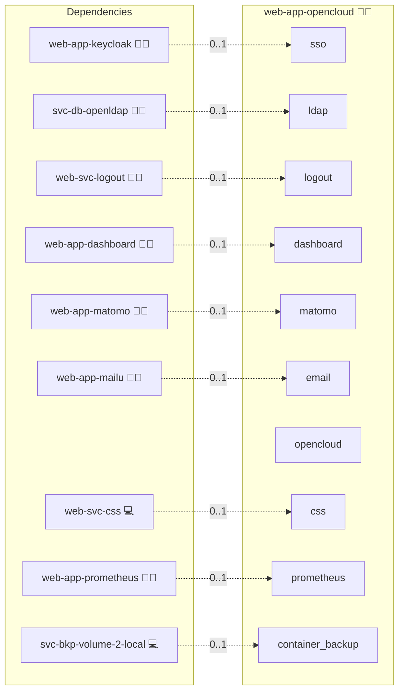

# OpenCloud

## Description

[OpenCloud](https://opencloud.eu/) is a sovereign self-hosted file sync, share, and collaboration platform maintained by the Heinlein Group. It is a fork of the OpenCloud Infinite Scale codebase and is published as the `opencloudeu/opencloud` container image.

## Overview

This role deploys OpenCloud using Docker Compose in single-binary mode and exposes it under `open.cloud.{{ DOMAIN_PRIMARY }}` through the central reverse proxy. It wires the deployment to the shared Keycloak realm via OIDC, sources users and groups from the central `svc-db-openldap` directory, and runs side by side with `web-app-nextcloud` so both file platforms can coexist on the same host. For identity wiring details see [IAM.md](docs/IAM.md) and [LDAP.md](docs/LDAP.md).

## Cosmos

The diagram places OpenCloud in the Infinito.Nexus cosmos: the components it deploys (capabilities), the central services it consumes (dependencies), and its outward reach (federation and bridged external networks).



Solid `1:1` edges are fixed relationships; dashed `0..1` edges are conditional (enabled only in matching deployments). Node markers show the role's deploy modes (💻 host, 🐳 compose, 🐝 swarm); ❌ marks a service that is explicitly turned off, and ⚙️ an Ansible role dependency declared in `meta/main.yml`.

## Features

- **Sovereign File Sync and Share:** Self-host file sync, shares, and collaborative spaces under your own domain.
- **Single Sign-On:** Users authenticate once via Keycloak and reuse the session across the platform.
- **Central User Directory:** Users and groups are read from a shared OpenLDAP backend, so accounts stay consistent across apps.
- **Auto-Provisioning:** New OIDC users are created on first login with username equal to the LDAP `uid`, and group claims drive role assignment.
- **OpenTalk Cross-Launch:** Start a video meeting in OpenTalk from a file context without re-authenticating when `web-app-opentalk` is deployed alongside.
- **Coexists with Nextcloud:** Runs in parallel with `web-app-nextcloud` on a distinct canonical hostname.

## Quick Setup

### Development

Clone, set up the workstation, and deploy OpenCloud onto the local stack:

```bash
git clone https://github.com/infinito-nexus/core.git
cd core
make onboard
make compose-deploy mode=reinstall apps=web-app-opencloud full_cycle=false
```

### Production

Run the published image to provision the inventory and deploy OpenCloud to a managed server (the mounted volume persists the inventory):

```bash
APP=web-app-opencloud
HOST=<your-server>
TLS_MODE=self_signed
SSH_PUBLIC_KEY="<your-ssh-public-key>"

docker run --rm -it \
  -v "$PWD/inventories:/etc/infinito.nexus/inventories" \
  -e APP="$APP" -e HOST="$HOST" -e TLS_MODE="$TLS_MODE" -e SSH_PUBLIC_KEY="$SSH_PUBLIC_KEY" \
  ghcr.io/infinito-nexus/core/debian bash -c '
    INVENTORY=/etc/infinito.nexus/inventories/production
    infinito administration inventory provision "$INVENTORY" \
      --inventory-file "$INVENTORY/devices.yml" \
      --host "$HOST" \
      --include "$APP" \
      --vars "{\"TLS_MODE\": \"$TLS_MODE\", \"users\": {\"administrator\": {\"authorized_keys\": [\"$SSH_PUBLIC_KEY\"]}}}" &&
    infinito administration deploy dedicated "$INVENTORY/devices.yml" \
      --password-file "$INVENTORY/.password" \
      --diff -vv'
```

## Developer Notes

See [IAM.md](docs/IAM.md) for OIDC discovery and verification commands, and [LDAP.md](docs/LDAP.md) for the directory binding and schema mapping. Open follow-up items are tracked in [TODO.md](TODO.md).

## Further Resources

- [opencloud.eu](https://opencloud.eu/)
- [OpenCloud documentation](https://docs.opencloud.eu/)
- [opencloudeu/opencloud on Docker Hub](https://hub.docker.com/r/opencloudeu/opencloud)

## Credits

Implemented by **[Kevin Veen-Birkenbach](https://www.veen.world)**.
Part of the [Infinito.Nexus Project](https://s.infinito.nexus/code) and maintained by [Kevin Veen-Birkenbach](https://www.veen.world).
Licensed under the [Infinito.Nexus Community License (Non-Commercial)](https://s.infinito.nexus/license).
