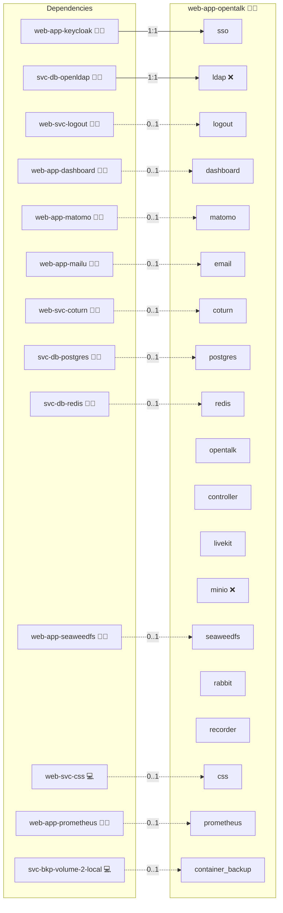

# OpenTalk

## Description

[OpenTalk](https://opentalk.eu/) is a sovereign open-source video conferencing platform developed by the Heinlein Group. It combines a Rust controller, a LiveKit-based WebRTC media server, and a React web frontend.

## Overview

This role deploys the OpenTalk stack using Docker Compose and exposes the web frontend at `open.talk.{{ DOMAIN_PRIMARY }}` through the central reverse proxy. It runs the Rust controller, the LiveKit WebRTC media server, the React web frontend, a dedicated Redis, a dedicated MinIO bucket for controller assets, a RabbitMQ broker, and the OpenTalk recorder for meeting MP4 archives. The deployment integrates with the shared Keycloak realm via OIDC and reuses `svc-db-postgres` and `web-svc-coturn` for relational data and STUN/TURN. For identity wiring details see [IAM.md](docs/IAM.md) and [LDAP.md](docs/LDAP.md).

## Cosmos

The diagram places OpenTalk in the Infinito.Nexus cosmos: the components it deploys (capabilities), the central services it consumes (dependencies), and its outward reach (federation and bridged external networks).



Solid `1:1` edges are fixed relationships; dashed `0..1` edges are conditional (enabled only in matching deployments). Node markers show the role's deploy modes (💻 host, 🐳 compose, 🐝 swarm); ❌ marks a service that is explicitly turned off, and ⚙️ an Ansible role dependency declared in `meta/main.yml`.

## Features

- **Sovereign Video Conferencing:** Self-host meetings under your own domain without external SaaS dependency.
- **WebRTC Media via LiveKit:** Real-time audio, video, and screen sharing through a high-performance SFU.
- **Single Sign-On:** Frontend and controller share one Keycloak client and realm.
- **Federated User Lookup:** Invitee search resolves through the Keycloak admin Web API, so any user federated from OpenLDAP into Keycloak becomes findable inside OpenTalk.
- **OpenCloud File Integration:** Pick files from OpenCloud in a meeting without re-authenticating when `web-app-opencloud` is deployed alongside.
- **Meeting Recordings:** A dedicated recorder consumes recording jobs from the RabbitMQ queue and stores MP4 archives in MinIO.
- **Shared Infrastructure:** Reuses `svc-db-postgres` for relational data and `web-svc-coturn` for STUN and TURN.

## Quick Setup

### Development

Clone, set up the workstation, and deploy OpenTalk onto the local stack:

```bash
git clone https://github.com/infinito-nexus/core.git
cd core
make onboard
make compose-deploy mode=reinstall apps=web-app-opentalk full_cycle=false
```

### Production

Run the published image to provision the inventory and deploy OpenTalk to a managed server (the mounted volume persists the inventory):

```bash
APP=web-app-opentalk
HOST=<your-server>
TLS_MODE=self_signed
SSH_PUBLIC_KEY="<your-ssh-public-key>"

docker run --rm -it \
  -v "$PWD/inventories:/etc/infinito.nexus/inventories" \
  -e APP="$APP" -e HOST="$HOST" -e TLS_MODE="$TLS_MODE" -e SSH_PUBLIC_KEY="$SSH_PUBLIC_KEY" \
  ghcr.io/infinito-nexus/core/debian bash -c '
    INVENTORY=/etc/infinito.nexus/inventories/production
    infinito administration inventory provision "$INVENTORY" \
      --inventory-file "$INVENTORY/devices.yml" \
      --host "$HOST" \
      --include "$APP" \
      --vars "{\"TLS_MODE\": \"$TLS_MODE\", \"users\": {\"administrator\": {\"authorized_keys\": [\"$SSH_PUBLIC_KEY\"]}}}" &&
    infinito administration deploy dedicated "$INVENTORY/devices.yml" \
      --password-file "$INVENTORY/.password" \
      --diff -vv'
```

## Developer Notes

See [IAM.md](docs/IAM.md) for the OIDC and Keycloak admin Web API setup, and [LDAP.md](docs/LDAP.md) for the LDAP federation chain. Pending follow-up work is tracked in [TODO.md](TODO.md).

## Further Resources

- [opentalk.eu](https://opentalk.eu/)
- [OpenTalk documentation](https://docs.opentalk.eu/)
- [OpenTalk setup template](https://gitlab.opencode.de/opentalk/ot-setup)

## Credits

Implemented by **[Kevin Veen-Birkenbach](https://www.veen.world)**.
Part of the [Infinito.Nexus Project](https://s.infinito.nexus/code) and maintained by [Kevin Veen-Birkenbach](https://www.veen.world).
Licensed under the [Infinito.Nexus Community License (Non-Commercial)](https://s.infinito.nexus/license).
