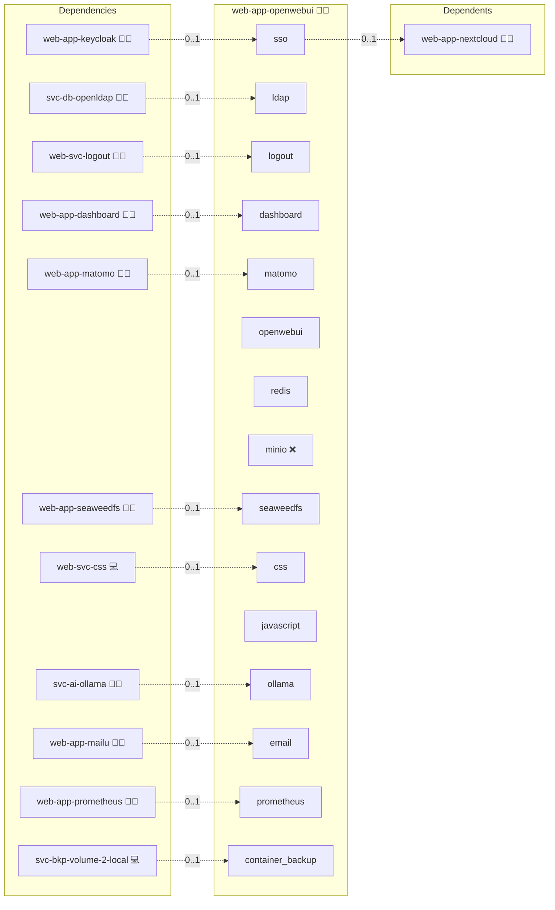

# Open WebUI

## Description

**Open WebUI** provides a clean, fast chat interface for working with local AI models (e.g., via Ollama). It delivers a ChatGPT-like experience on your own infrastructure to keep prompts and data private.

## Overview

End users access a web page, pick a model, and start chatting. Conversations remain on your servers. Admins can enable strict offline behavior so no external network calls occur. The UI can also point at OpenAI-compatible endpoints if needed.

## Cosmos

The diagram places Open WebUI in the Infinito.Nexus cosmos: the components it deploys (capabilities), the central services it consumes (dependencies), and its outward reach (federation and bridged external networks).



Solid `1:1` edges are fixed relationships; dashed `0..1` edges are conditional (enabled only in matching deployments). Node markers show the role's deploy modes (💻 host, 🐳 compose, 🐝 swarm); ❌ marks a service that is explicitly turned off, and ⚙️ an Ansible role dependency declared in `meta/main.yml`.

## Features

* Familiar multi-chat interface with quick model switching
* Supports local backends (Ollama) and OpenAI-compatible APIs
* Optional **offline mode** for air-gapped environments
* File/paste input for summaries and extraction (model dependent)
* Suitable for teams: predictable, private, reproducible

## Quick Setup

### Development

Clone, set up the workstation, and deploy Open WebUI onto the local stack:

```bash
git clone https://github.com/infinito-nexus/core.git
cd core
make onboard
make compose-deploy mode=reinstall apps=web-app-openwebui full_cycle=false
```

### Production

Run the published image to provision the inventory and deploy Open WebUI to a managed server (the mounted volume persists the inventory):

```bash
APP=web-app-openwebui
HOST=<your-server>
TLS_MODE=self_signed
SSH_PUBLIC_KEY="<your-ssh-public-key>"

docker run --rm -it \
  -v "$PWD/inventories:/etc/infinito.nexus/inventories" \
  -e APP="$APP" -e HOST="$HOST" -e TLS_MODE="$TLS_MODE" -e SSH_PUBLIC_KEY="$SSH_PUBLIC_KEY" \
  ghcr.io/infinito-nexus/core/debian bash -c '
    INVENTORY=/etc/infinito.nexus/inventories/production
    infinito administration inventory provision "$INVENTORY" \
      --inventory-file "$INVENTORY/devices.yml" \
      --host "$HOST" \
      --include "$APP" \
      --vars "{\"TLS_MODE\": \"$TLS_MODE\", \"users\": {\"administrator\": {\"authorized_keys\": [\"$SSH_PUBLIC_KEY\"]}}}" &&
    infinito administration deploy dedicated "$INVENTORY/devices.yml" \
      --password-file "$INVENTORY/.password" \
      --diff -vv'
```

## Further Resources

* Open WebUI: [openwebui.com](https://openwebui.com)
* Ollama: [ollama.com](https://ollama.com)

## Credits

Implemented by **[Kevin Veen-Birkenbach](https://www.veen.world)**.
Part of the [Infinito.Nexus Project](https://s.infinito.nexus/code) and maintained by [Kevin Veen-Birkenbach](https://www.veen.world).
Licensed under the [Infinito.Nexus Community License (Non-Commercial)](https://s.infinito.nexus/license).
