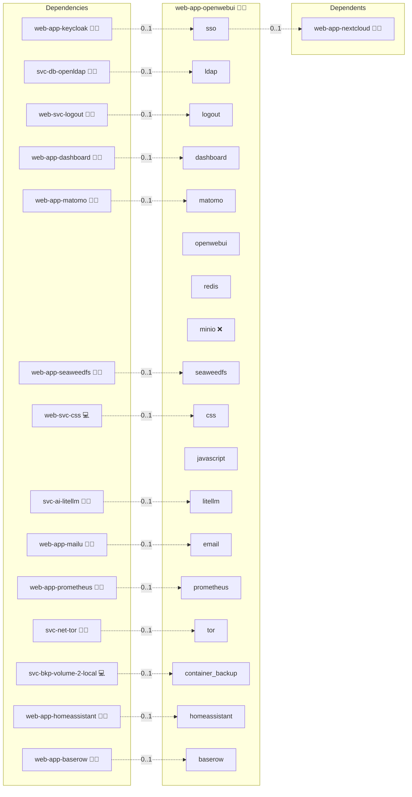

# Open WebUI

## Description

**Open WebUI** provides a clean, fast chat interface for working with local AI models (e.g., via Ollama). It delivers a ChatGPT-like experience on your own infrastructure to keep prompts and data private.

## Overview

End users access a web page, pick a model, and start chatting. Conversations remain on your servers. Admins can enable strict offline behavior so no external network calls occur. The UI can also point at OpenAI-compatible endpoints if needed.

## Cosmos

The diagram places Open WebUI in the Infinito.Nexus cosmos: the components it deploys (capabilities), the central services it consumes (dependencies), and its outward reach (federation and bridged external networks).


```mermaid
flowchart LR
    subgraph deps [Dependencies]
        dep_svc_ai_litellm["svc-ai-litellm 🐳🐝"]
        dep_svc_bkp_volume_2_local["svc-bkp-volume-2-local 💻"]
        dep_svc_db_openldap["svc-db-openldap 🐳🐝"]
        dep_svc_net_tor["svc-net-tor 🐳🐝"]
        dep_web_app_baserow["web-app-baserow 🐳🐝"]
        dep_web_app_dashboard["web-app-dashboard 🐳🐝"]
        dep_web_app_homeassistant["web-app-homeassistant 🐳🐝"]
        dep_web_app_keycloak["web-app-keycloak 🐳🐝"]
        dep_web_app_mailu["web-app-mailu 🐳🐝"]
        dep_web_app_matomo["web-app-matomo 🐳🐝"]
        dep_web_app_prometheus["web-app-prometheus 🐳🐝"]
        dep_web_app_seaweedfs["web-app-seaweedfs 🐳🐝"]
        dep_web_svc_css["web-svc-css 💻"]
        dep_web_svc_logout["web-svc-logout 🐳🐝"]
    end
    subgraph role [web-app-openwebui 🐳🐝]
        svc_sso["sso"]
        svc_ldap["ldap"]
        svc_logout["logout"]
        svc_dashboard["dashboard"]
        svc_matomo["matomo"]
        svc_openwebui["openwebui"]
        svc_redis["redis"]
        svc_minio["minio ❌"]
        svc_seaweedfs["seaweedfs"]
        svc_css["css"]
        svc_javascript["javascript"]
        svc_litellm["litellm"]
        svc_email["email"]
        svc_prometheus["prometheus"]
        svc_tor["tor"]
        svc_container_backup["container_backup"]
        svc_homeassistant["homeassistant"]
        svc_baserow["baserow"]
    end
    subgraph dependents [Dependents]
        dpt_web_app_nextcloud["web-app-nextcloud 🐳🐝"]
    end
    dep_svc_ai_litellm -. "0..1" .-> svc_litellm
    dep_svc_bkp_volume_2_local -. "0..1" .-> svc_container_backup
    dep_svc_db_openldap -. "0..1" .-> svc_ldap
    dep_svc_net_tor -. "0..1" .-> svc_tor
    dep_web_app_baserow -. "0..1" .-> svc_baserow
    dep_web_app_dashboard -. "0..1" .-> svc_dashboard
    dep_web_app_homeassistant -. "0..1" .-> svc_homeassistant
    dep_web_app_keycloak -. "0..1" .-> svc_sso
    dep_web_app_mailu -. "0..1" .-> svc_email
    dep_web_app_matomo -. "0..1" .-> svc_matomo
    dep_web_app_prometheus -. "0..1" .-> svc_prometheus
    dep_web_app_seaweedfs -. "0..1" .-> svc_seaweedfs
    dep_web_svc_css -. "0..1" .-> svc_css
    dep_web_svc_logout -. "0..1" .-> svc_logout
    svc_sso -. "0..1" .-> dpt_web_app_nextcloud
```

Solid `1:1` edges are fixed relationships; dashed `0..1` edges are conditional (enabled only in matching deployments); red `0..0` edges are turned off in this role. Node markers show the role's deploy modes (💻 host, 🐳 compose, 🐝 swarm); ❌ marks a service that is explicitly turned off, and ⚙️ an Ansible role dependency declared in `meta/main.yml`.

## Features

* Familiar multi-chat interface with quick model switching
* Supports local backends (Ollama) and OpenAI-compatible APIs
* Optional **offline mode** for air-gapped environments
* File/paste input for summaries and extraction (model dependent)
* Suitable for teams: predictable, private, reproducible

## Quick Setup

### Development

Clone, set up the workstation, and deploy Open WebUI onto the local stack:

```bash
git clone https://github.com/infinito-nexus/core.git
cd core
make onboard
make compose-deploy mode=reinstall apps=web-app-openwebui full_cycle=false
```

### Production

Run the published image to provision the inventory and deploy Open WebUI to a managed server (the mounted volume persists the inventory):

```bash
APP=web-app-openwebui
HOST=<your-server>
TLS_MODE=self_signed
SSH_PUBLIC_KEY="<your-ssh-public-key>"

docker run --rm -it \
  -v "$PWD/inventories:/etc/infinito.nexus/inventories" \
  -e APP="$APP" -e HOST="$HOST" -e TLS_MODE="$TLS_MODE" -e SSH_PUBLIC_KEY="$SSH_PUBLIC_KEY" \
  ghcr.io/infinito-nexus/core/debian bash -c '
    INVENTORY=/etc/infinito.nexus/inventories/production
    infinito administration inventory provision "$INVENTORY" \
      --inventory-file "$INVENTORY/devices.yml" \
      --host "$HOST" \
      --include "$APP" \
      --vars "{\"TLS_MODE\": \"$TLS_MODE\", \"users\": {\"administrator\": {\"authorized_keys\": [\"$SSH_PUBLIC_KEY\"]}}}" &&
    infinito administration deploy dedicated "$INVENTORY/devices.yml" \
      --password-file "$INVENTORY/.password" \
      --diff -vv'
```

## Further Resources

* Open WebUI: [openwebui.com](https://openwebui.com)
* Ollama: [ollama.com](https://ollama.com)

## MCP Client

Open WebUI consumes MCP through its native tool-server support. Every deployed
shared MCP server role is rendered into `TOOL_SERVER_CONNECTIONS` as a
`type: mcp` entry.

### Configuration

| Property | Value |
| --- | --- |
| Direction | `client` |
| Transport | Streamable HTTP |
| Env key | `TOOL_SERVER_CONNECTIONS` |
| Auth | `auth_type: bearer` with the token from the discovery data |
| Access | `config.access_grants: []`, administrator-only rather than public |

Open WebUI's `ToolServerConnection` accepts bearer, session, system_oauth and
oauth_2.1. A server whose scheme it cannot present is skipped rather than
registered with an unusable credential, so a basic-auth server such as Jenkins
does not appear here.

### Verification

The token each entry carries is the one the deployment issued, not the signed-in
caller's own, so reaching an MCP tool server is a grant separate from signing
in. The env renders `config.access_grants: []`, which `has_connection_access`
reads as administrator-only, and
[`tasks/utils/mcp.yml`](./tasks/utils/mcp.yml) then narrows each entry to the serving
role's `mcp` RBAC group.

That second step exists because a group grant addresses an Open WebUI group id
and `insert_new_group` assigns it as a fresh UUID, so the id cannot be known
while the env is rendered. The task signs in as the native administrator,
resolves or creates the group whose name matches the OIDC claim value, and
writes the grant through `POST /api/v1/configs/tool_servers`. It refuses to act
when two groups share a name rather than guessing between them.

`BYPASS_ADMIN_ACCESS_CONTROL=false` keeps the grant meaningful for
administrators too; upstream defaults it to true, which would let every
administrator past any grant. `ENABLE_OAUTH_GROUP_MANAGEMENT` syncs the
platform's groups on login, so membership follows Keycloak.

`ENABLE_OAUTH_ROLE_MANAGEMENT` maps the application's administrator group onto
the Open WebUI admin role, and it also makes `OAUTH_ALLOWED_ROLES` a sign-in
gate. The env sets `OAUTH_ALLOWED_ROLES=*` so every platform role passes that
gate; narrow it only to a list that matches the `/roles/<app>/<role>` paths
Keycloak emits.

Entries render **disabled**, and the task enables each one in the same write
that carries its grant. An empty `access_grants` is not "nobody": Open WebUI
reads it as every administrator, which is wider than the `mcp` group. Since
`ENABLE_PERSISTENT_CONFIG=false` makes the env authoritative again on every
start, an enabled-but-ungranted entry would hand access to all administrators
before the first provisioning run and after any bare container restart. A
disabled entry is not served at all, so the fallback is no access rather than
too much.

### Operational limits

Three properties follow from how Open WebUI works and none of them is closed by
this role.

**Only the first start serves nothing.** The env is authoritative again on every
start, so what `TOOL_SERVER_CONNECTIONS` carries is the state the container comes
back with. Before any group exists that is a disabled entry, which is the safe
direction: no access rather than every administrator. Once the provisioning task
has created the group, its id lives in the token store, `vars/main.yml` reads it
back on the next deploy, and the filter renders the entry enabled with its exact
group grant. From then on a bare container restart restores a served, correctly
scoped connection without a deploy.

**Group revocation is not reliable, in both directions.** Open WebUI removes a
user from a synced group only while the groups claim is non-empty, so a user who
loses their last role keeps stale membership until a later login carries a
non-empty claim. Conversely, a non-empty claim removes the user from *every*
local group the claim does not name, including groups an administrator created by
hand. Reconciling either from the deploy would mean a second writer for group
membership, competing with the login-time sync and able to evict accounts the
platform's own user list does not know about, so both are left to an external
reconciler or an upstream fix.

**The deploy can create a role-internal administrator.** On an instance with no
users at all there is no OIDC administrator to borrow an API key from, so
[`tasks/utils/mcp.yml`](./tasks/utils/mcp.yml) creates the `openwebui-api-bot` declared
in [`meta/users.yml`](./meta/users.yml), whose password the platform generates
with every other user's. It is deliberately not an OIDC identity: Open WebUI ships
`OAUTH_MERGE_ACCOUNTS_BY_EMAIL` disabled and refuses an OIDC login whose email a
local account already holds, so seeding a person's address would lock them out of
their own login. On an instance that already has an administrator no account is
created.

**The `mcp` role is granted per platform, not per application.** A user's
`roles:` list carries role names only, and
[`build_realm_rbac_groups`](../web-app-keycloak/filter_plugins/build_realm_rbac_groups.py)
matches them without an application context, so `roles: [mcp]` makes that user a
member of *every* deployed `/roles/<app>/mcp` group. Entitling somebody to drive
Baserow but not GitLab is therefore not expressible declaratively today; it needs
the Keycloak membership to be set directly on the single group. The tool-server
side honours whatever membership arrives, so the limit is the platform's user
model, not this wiring, and the Playwright coverage reflects it: it proves "all
groups sees all servers" and "no group sees none", not the selective case.

The role ships a Playwright spec that signs in as the administrator, reads
`/api/v1/configs/tool_servers`, and asserts that every discovered server appears
with a bearer and a non-empty key.

### Default state

Off. `mcp.enabled` is false unless an MCP server role is part of the
deployment.

### How to disable

Remove the MCP server roles, or pin `mcp.enabled: false` for this role.
`TOOL_SERVER_CONNECTIONS` then renders empty.

## Credits

Implemented by **[Kevin Veen-Birkenbach](https://www.veen.world)**.
Part of the [Infinito.Nexus Project](https://s.infinito.nexus/code) and maintained by [Kevin Veen-Birkenbach](https://www.veen.world).
Licensed under the [Infinito.Nexus Community License (Non-Commercial)](https://s.infinito.nexus/license).
