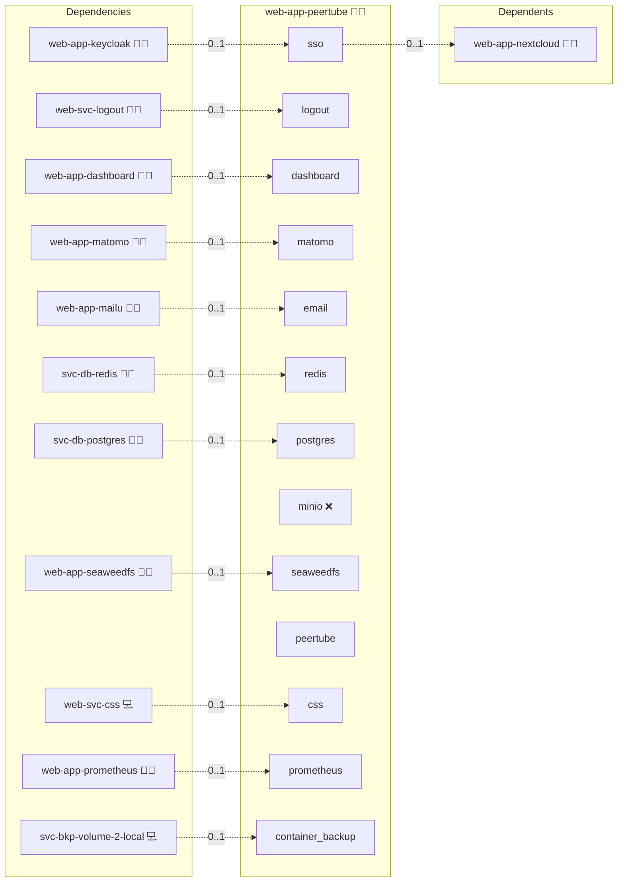

# PeerTube

## Description

PeerTube is a decentralized, open-source video hosting platform that empowers creators to share videos without relying on centralized services. It leverages federated architecture and peer-to-peer technologies to provide scalable, secure, and community-driven video streaming.

## Overview

This Docker Compose deployment sets up PeerTube with integrated support for essential services such as a PostgreSQL database, Redis cache, and an NGINX reverse proxy for secure HTTPS termination and domain routing. The configuration supports advanced security settings, modular service scaling, and automated environment injection.

## Cosmos

The diagram places PeerTube in the Infinito.Nexus cosmos: the components it deploys (capabilities), the central services it consumes (dependencies), and its outward reach (federation and bridged external networks).



Solid `1:1` edges are fixed relationships; dashed `0..1` edges are conditional (enabled only in matching deployments). Node markers show the role's deploy modes (💻 host, 🐳 compose, 🐝 swarm); ❌ marks a service that is explicitly turned off, and ⚙️ an Ansible role dependency declared in `meta/main.yml`.

## Features

- **Decentralized Video Hosting:**
  Distribute video hosting across multiple instances to enhance resilience and avoid single-point control.

- **Scalability and Performance:**
  Efficiently manage video transcoding, live streaming, and storage through containerized microservices.

- **Customizable Configuration:**
  Tailor settings such as storage, email delivery, and administrative parameters using environment variables and configuration files.

- **Secure and Private:**
  Built-in support for TLS, secure SMTP integration, and strict administrative controls to ensure data protection.

- **Federated Communication:**
  Designed to operate within a federated network, enabling seamless sharing and interconnection with other PeerTube instances.

## Quick Setup

### Development

Clone, set up the workstation, and deploy PeerTube onto the local stack:

```bash
git clone https://github.com/infinito-nexus/core.git
cd core
make onboard
make compose-deploy mode=reinstall apps=web-app-peertube full_cycle=false
```

### Production

Run the published image to provision the inventory and deploy PeerTube to a managed server (the mounted volume persists the inventory):

```bash
APP=web-app-peertube
HOST=<your-server>
TLS_MODE=self_signed
SSH_PUBLIC_KEY="<your-ssh-public-key>"

docker run --rm -it \
  -v "$PWD/inventories:/etc/infinito.nexus/inventories" \
  -e APP="$APP" -e HOST="$HOST" -e TLS_MODE="$TLS_MODE" -e SSH_PUBLIC_KEY="$SSH_PUBLIC_KEY" \
  ghcr.io/infinito-nexus/core/debian bash -c '
    INVENTORY=/etc/infinito.nexus/inventories/production
    infinito administration inventory provision "$INVENTORY" \
      --inventory-file "$INVENTORY/devices.yml" \
      --host "$HOST" \
      --include "$APP" \
      --vars "{\"TLS_MODE\": \"$TLS_MODE\", \"users\": {\"administrator\": {\"authorized_keys\": [\"$SSH_PUBLIC_KEY\"]}}}" &&
    infinito administration deploy dedicated "$INVENTORY/devices.yml" \
      --password-file "$INVENTORY/.password" \
      --diff -vv'
```

## Developer Notes

See [Upgrade.md](./Upgrade.md) for guidance on upgrading your PeerTube deployment.

## Further Resources

- [PeerTube Official Documentation](https://docs.joinpeertube.org/install-docker)
- [PeerTube GitHub Issues](https://github.com/Chocobozzz/PeerTube/issues/3091)

## Credits

Implemented by **[Kevin Veen-Birkenbach](https://www.veen.world)**.
Part of the [Infinito.Nexus Project](https://s.infinito.nexus/code) and maintained by [Kevin Veen-Birkenbach](https://www.veen.world).
Licensed under the [Infinito.Nexus Community License (Non-Commercial)](https://s.infinito.nexus/license).
