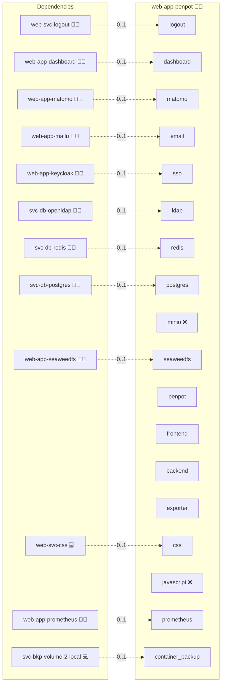

# Penpot

## Description

Deploys [Penpot](https://penpot.app/), the open-source design and prototyping
platform (a self-hostable Figma alternative) for UI/UX design, real-time
collaboration, asset libraries, version history, and developer handoff — fully
integrated into the Infinito.Nexus ecosystem.

## Overview

The role brings up Penpot's containerized stack behind the standard
Infinito.Nexus reverse proxy and wires it into central identity, backup, and
dashboard infrastructure. It follows the per-role meta layout
([layout.md](../../docs/contributing/design/role/services/layout.md)) and is
modeled on [`web-app-openproject`](../web-app-openproject/) and
[`web-app-baserow`](../web-app-baserow/).

### Containers

| Service    | Image                  | Purpose                                                        |
|------------|------------------------|----------------------------------------------------------------|
| `frontend` | `penpotapp/frontend`   | Nginx + SPA; public HTTP surface, proxies to backend/exporter. |
| `backend`  | `penpotapp/backend`    | API, auth (OIDC/LDAP), persistence, asset storage.             |
| `exporter` | `penpotapp/exporter`   | Headless renderer for SVG/PDF/image export and dev handoff.    |
| `redis`    | `svc-db-redis` (role-local sidecar, service name `redis`) | Cache / pub-sub for real-time collaboration. |
| `postgres` | shared `svc-db-postgres` | Relational store.                                            |

The **exporter** is mandatory: it backs the export (SVG/PDF) and developer
handoff features.

## Cosmos

The diagram places Penpot in the Infinito.Nexus cosmos: the components it deploys (capabilities), the central services it consumes (dependencies), and its outward reach (federation and bridged external networks).



Solid `1:1` edges are fixed relationships; dashed `0..1` edges are conditional (enabled only in matching deployments). Node markers show the role's deploy modes (💻 host, 🐳 compose, 🐝 swarm); ❌ marks a service that is explicitly turned off, and ⚙️ an Ansible role dependency declared in `meta/main.yml`.

## Features

- Design creation and editing, team collaboration with comments and live cursors.
- Shared asset libraries and components, version history.
- Export (SVG, PDF, images) and developer handoff (CSS/code) via the exporter.
- Real-time collaboration over WebSockets through the proxy.

## Quick Setup

### Development

Clone, set up the workstation, and deploy Penpot onto the local stack:

```bash
git clone https://github.com/infinito-nexus/core.git
cd core
make onboard
make compose-deploy mode=reinstall apps=web-app-penpot full_cycle=false
```

### Production

Run the published image to provision the inventory and deploy Penpot to a managed server (the mounted volume persists the inventory):

```bash
APP=web-app-penpot
HOST=<your-server>
TLS_MODE=self_signed
SSH_PUBLIC_KEY="<your-ssh-public-key>"

docker run --rm -it \
  -v "$PWD/inventories:/etc/infinito.nexus/inventories" \
  -e APP="$APP" -e HOST="$HOST" -e TLS_MODE="$TLS_MODE" -e SSH_PUBLIC_KEY="$SSH_PUBLIC_KEY" \
  ghcr.io/infinito-nexus/core/debian bash -c '
    INVENTORY=/etc/infinito.nexus/inventories/production
    infinito administration inventory provision "$INVENTORY" \
      --inventory-file "$INVENTORY/devices.yml" \
      --host "$HOST" \
      --include "$APP" \
      --vars "{\"TLS_MODE\": \"$TLS_MODE\", \"users\": {\"administrator\": {\"authorized_keys\": [\"$SSH_PUBLIC_KEY\"]}}}" &&
    infinito administration deploy dedicated "$INVENTORY/devices.yml" \
      --password-file "$INVENTORY/.password" \
      --diff -vv'
```

## Identity

Login methods are toggled through `PENPOT_FLAGS` and configured by Ansible:

- **OIDC** via [`web-app-keycloak`](../web-app-keycloak/) — enabled when the
  `sso` service is active (`flavor: oidc`, native in-app "OpenID" login). Adds
  `enable-login-with-oidc`.
- **LDAP** via [`svc-db-openldap`](../svc-db-openldap/) — enabled when the
  `ldap` service is active. Adds `enable-login-with-ldap`.
- **Native** local email/password login is *off* once OIDC is the login path
  (forces SSO), *on* otherwise — derived from the `sso` service flag. `PENPOT_FLAGS`
  renders `enable-login-with-password` / `disable-login-with-password` accordingly
  (no JS injection needed — Penpot disables the password form natively). When
  native login is on, the role bootstraps a local password for the `administrator`
  profile via the backend PREPL (`enable-prepl-server`) in `tasks/main.yml` —
  `create-profile` for a fresh profile, `update-profile` to set the password when
  a federated login already created it; the bootstrap is skipped under OIDC.

**Self-registration** is *on* when OIDC is enabled and *off* otherwise — also
derived from the `sso` service flag. Penpot routes first-time OIDC logins through
the registration path (a disabled flag makes the callback fail with
`?error=registration-disabled` for not-yet-provisioned users), so registration
must stay on wherever OIDC is. Native admin is bootstrapped and LDAP
self-provisions without it. `PENPOT_FLAGS` renders `enable-registration` /
`disable-registration` accordingly.

## Storage & scalability

- Assets are stored on the filesystem backend (`PENPOT_ASSETS_STORAGE_BACKEND=assets-fs`)
  on the backup-ready named volume `penpot_assets`, mounted into both `frontend`
  and `backend` at `/opt/data/assets`.
- The PostgreSQL database is backed up by the central backup roles; the asset
  volume is backup-ready by convention.
- **S3-compatible object storage (future):** Penpot supports an `assets-s3`
  backend (`PENPOT_STORAGE_ASSETS_FS_*` → `PENPOT_STORAGE_ASSETS_S3_*`). It is
  intentionally **not** implemented here; switching the backend and adding the
  S3 credentials to `meta/schema.yml` is the documented upgrade path.

## Ports & networking

- Canonical domain: `penpot.design.{{ DOMAIN_PRIMARY }}`.
- Local proxy bind: `services.penpot.ports.local.http` (`8041`).
- Role network: `192.168.105.192/28`.

## Autonomous-implementation notes

Resolved by best judgement during the autonomous build (per the requirement's
Procedure); revisit at PR review:

- **Image tag** pinned to `2.5.4` for all three containers (single upstream tag).
- **Exporter `PENPOT_PUBLIC_URI`** is shared from the single role env file (the
  external HTTPS base URL). Penpot upstream also supports an internal
  `http://frontend:8080` value; the shared-env contract renders one file for all
  containers, which the upstream image tolerates.
- **CSP** allows `unsafe-inline`/`unsafe-eval` for `script-src-elem` and
  `blob:` workers/images, required by Penpot's SPA and worker-based renderer.
- **OIDC JVM CA trust (self-signed TLS only):** when `TLS_MODE == self_signed`,
  the backend command (in `templates/compose.yml.j2`) imports the internal CA
  into a writable `cacerts` copy and points the JVM at it via `JAVA_TOOL_OPTIONS`.
  The shared `with-ca-trust.sh` entrypoint covers the OS/NSS/env trust stores but
  not the JVM truststore, so without this Penpot's server-side OIDC
  token/userinfo calls to Keycloak fail with `PKIX path building failed`. The
  override is gated behind self-signed mode (it is a no-op in production, where
  real CA-signed certs are already trusted) and the CA path is hardcoded because
  the framework's CA-override re-serialises the command.
- **`disable-onboarding`** is in `PENPOT_FLAGS` so users land directly on the
  dashboard (sovereign install; also keeps the project/asset flows testable).

## Testing

The Playwright suite is split per login surface **and persona** (the runner
globs every `*.js` under `files/playwright/`):

- `_shared.js` — env + login helpers (`penpotOidcLogin`, `penpotLdapLogin`,
  `penpotNativeLogin`, `penpotRegister`).
- `test-login-native.js` — administrator native (local password) login;
  skipped when `sso` is enabled (native login is disabled under OIDC).
- `test-login-oidc-admin.js` — OIDC via Keycloak, administrator.
- `test-login-oidc-biber.js` — OIDC via Keycloak, `biber` (non-admin RBAC).
- `test-login-ldap-admin.js` — OpenLDAP bind, administrator.
- `test-login-ldap-biber.js` — OpenLDAP bind, `biber` (non-admin RBAC).
- `playwright.spec.js` — orchestrator: TLS baseline, project creation, image
  asset upload, and the `guest`/`biber`/`administrator` personas. The `biber` /
  `administrator` personas are declared blocked via `PERSONA_*_BLOCKED`
  (mirroring `web-app-taiga`): Penpot's in-app "OpenID" entry and SPA user-menu
  logout aren't driveable by the generic persona helper, so both users' real
  auth is exercised by the dedicated login companions above.

Login/project/asset scenarios gate on the relevant service via
`skipUnlessServiceEnabled`, so a deploy reports them `skipped` (not `failed`)
when that service is disabled. Validated live against a Penpot + Keycloak +
OpenLDAP deploy.

## Further Resources

- [Penpot Official Website](https://penpot.app/)
- [Penpot Configuration Guide](https://help.penpot.app/technical-guide/configuration/)
- [Penpot Docker Guide](https://github.com/penpot/penpot/tree/main/docker)

## Credits

Implemented by **[Evangelos Tsakoudis](https://github.com/evangelostsak)**.
Part of the [Infinito.Nexus Project](https://s.infinito.nexus/code) and maintained by [Kevin Veen-Birkenbach](https://www.veen.world).
Licensed under the [Infinito.Nexus Community License (Non-Commercial)](https://s.infinito.nexus/license).
