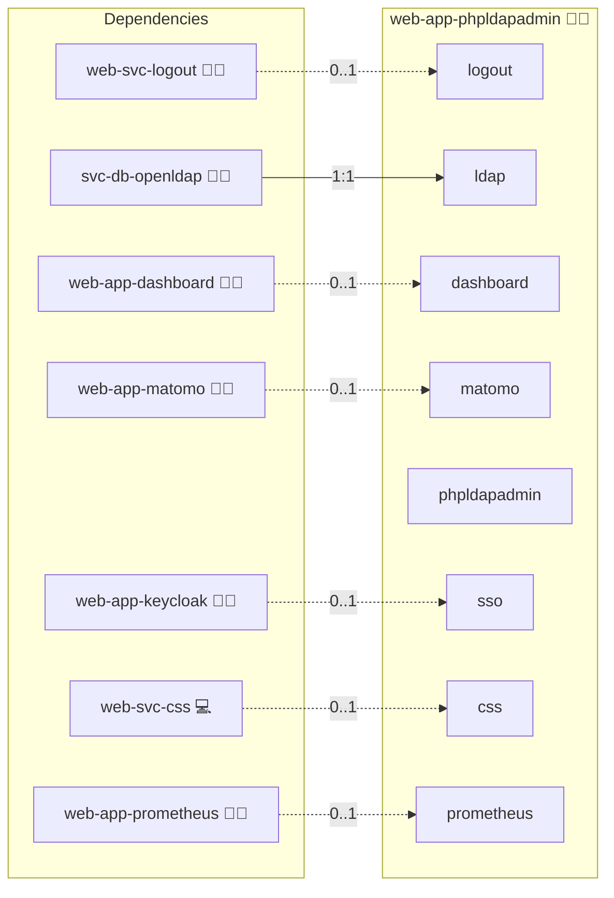

# phpldapadmin

## Description

phpLDAPadmin is a web‑based LDAP client that provides an intuitive interface for managing LDAP directories. This containerized deployment leverages Docker Compose and Ansible automation to offer a secure, configurable environment for administering and exploring your LDAP configurations.

## Overview

This deployment simplifies LDAP management by presenting a modern web interface that lets you search, modify, and manage directory entries easily. It supports integration with external LDAP servers and works seamlessly behind a reverse proxy, allowing administrators to focus on core directory tasks rather than deployment intricacies.

## Cosmos

The diagram places phpldapadmin in the Infinito.Nexus cosmos: the components it deploys (capabilities), the central services it consumes (dependencies), and its outward reach (federation and bridged external networks).



Solid `1:1` edges are fixed relationships; dashed `0..1` edges are conditional (enabled only in matching deployments). Node markers show the role's deploy modes (💻 host, 🐳 compose, 🐝 swarm); ❌ marks a service that is explicitly turned off, and ⚙️ an Ansible role dependency declared in `meta/main.yml`.

## Features

- **Web‑Based LDAP Management:**  
  Enjoy an intuitive and responsive interface to browse and administer your LDAP directories.

- **Secure Reverse Proxy Setup:**  
  Easily configure your access through a reverse proxy to ensure secure, controlled entry to your LDAP management tool.

- **Docker Compose Integration:**  
  Benefit from a streamlined, containerized deployment process that simplifies updates and environment configuration.

- **Flexible Environment Configuration:**  
  Customize your installation using environment variables and templated configuration files to match your infrastructure needs.

## Quick Setup

### Development

Clone, set up the workstation, and deploy phpldapadmin onto the local stack:

```bash
git clone https://github.com/infinito-nexus/core.git
cd core
make onboard
make compose-deploy mode=reinstall apps=web-app-phpldapadmin full_cycle=false
```

### Production

Run the published image to provision the inventory and deploy phpldapadmin to a managed server (the mounted volume persists the inventory):

```bash
APP=web-app-phpldapadmin
HOST=<your-server>
TLS_MODE=self_signed
SSH_PUBLIC_KEY="<your-ssh-public-key>"

docker run --rm -it \
  -v "$PWD/inventories:/etc/infinito.nexus/inventories" \
  -e APP="$APP" -e HOST="$HOST" -e TLS_MODE="$TLS_MODE" -e SSH_PUBLIC_KEY="$SSH_PUBLIC_KEY" \
  ghcr.io/infinito-nexus/core/debian bash -c '
    INVENTORY=/etc/infinito.nexus/inventories/production
    infinito administration inventory provision "$INVENTORY" \
      --inventory-file "$INVENTORY/devices.yml" \
      --host "$HOST" \
      --include "$APP" \
      --vars "{\"TLS_MODE\": \"$TLS_MODE\", \"users\": {\"administrator\": {\"authorized_keys\": [\"$SSH_PUBLIC_KEY\"]}}}" &&
    infinito administration deploy dedicated "$INVENTORY/devices.yml" \
      --password-file "$INVENTORY/.password" \
      --diff -vv'
```

## Other Resources

- [phpLDAPadmin Docker Container Documentation](https://github.com/leenooks/phpLDAPadmin/wiki/Docker-Container)
- [Official phpldapadmin Homepage](https://github.com/leenooks/phpLDAPadmin)

## Credits

Implemented by **[Kevin Veen-Birkenbach](https://www.veen.world)**.
Part of the [Infinito.Nexus Project](https://s.infinito.nexus/code) and maintained by [Kevin Veen-Birkenbach](https://www.veen.world).
Licensed under the [Infinito.Nexus Community License (Non-Commercial)](https://s.infinito.nexus/license).
