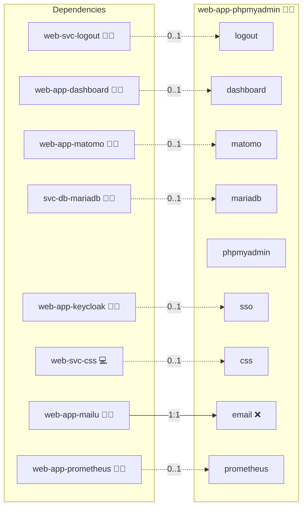

# PhpMyAdmin

## Description

This Ansible role deploys [PhpMyAdmin](https://www.phpmyadmin.net/) in a secure Docker environment, complete with optional OAuth2 proxy support. It enables seamless management of MariaDB/MySQL databases via a web-app-based interface.

## Overview

The role configures and deploys a containerized PhpMyAdmin instance using Docker Compose. It optionally integrates with a central database and uses dynamic Ansible variables to support flexible deployments in both production and homelab environments.

## Cosmos

The diagram places PhpMyAdmin in the Infinito.Nexus cosmos: the components it deploys (capabilities), the central services it consumes (dependencies), and its outward reach (federation and bridged external networks).



Solid `1:1` edges are fixed relationships; dashed `0..1` edges are conditional (enabled only in matching deployments). Node markers show the role's deploy modes (💻 host, 🐳 compose, 🐝 swarm); ❌ marks a service that is explicitly turned off, and ⚙️ an Ansible role dependency declared in `meta/main.yml`.

## Purpose

The purpose of this role is to provide a reliable, configurable, and secure PhpMyAdmin deployment out-of-the-box. It minimizes the need for manual setup, and integrates smoothly with other Infinito.Nexus infrastructure roles.

## Features

- **Docker Compose Integration:** Deploy PhpMyAdmin via a templated Compose setup.
- **OAuth2 Proxy Support:** Secure your admin interface with modern authentication.
- **Central DB Integration:** Connects to shared MariaDB instances for multi-role environments.
- **Custom Configuration:** Leverage Ansible variables to fine-tune your deployment.
- **Healthchecks & Networking:** Includes Docker healthchecks and network setup logic.

## Quick Setup

### Development

Clone, set up the workstation, and deploy PhpMyAdmin onto the local stack:

```bash
git clone https://github.com/infinito-nexus/core.git
cd core
make onboard
make compose-deploy mode=reinstall apps=web-app-phpmyadmin full_cycle=false
```

### Production

Run the published image to provision the inventory and deploy PhpMyAdmin to a managed server (the mounted volume persists the inventory):

```bash
APP=web-app-phpmyadmin
HOST=<your-server>
TLS_MODE=self_signed
SSH_PUBLIC_KEY="<your-ssh-public-key>"

docker run --rm -it \
  -v "$PWD/inventories:/etc/infinito.nexus/inventories" \
  -e APP="$APP" -e HOST="$HOST" -e TLS_MODE="$TLS_MODE" -e SSH_PUBLIC_KEY="$SSH_PUBLIC_KEY" \
  ghcr.io/infinito-nexus/core/debian bash -c '
    INVENTORY=/etc/infinito.nexus/inventories/production
    infinito administration inventory provision "$INVENTORY" \
      --inventory-file "$INVENTORY/devices.yml" \
      --host "$HOST" \
      --include "$APP" \
      --vars "{\"TLS_MODE\": \"$TLS_MODE\", \"users\": {\"administrator\": {\"authorized_keys\": [\"$SSH_PUBLIC_KEY\"]}}}" &&
    infinito administration deploy dedicated "$INVENTORY/devices.yml" \
      --password-file "$INVENTORY/.password" \
      --diff -vv'
```

## Credits

Implemented by **[Kevin Veen-Birkenbach](https://www.veen.world)**.
Part of the [Infinito.Nexus Project](https://s.infinito.nexus/code) and maintained by [Kevin Veen-Birkenbach](https://www.veen.world).
Licensed under the [Infinito.Nexus Community License (Non-Commercial)](https://s.infinito.nexus/license).
