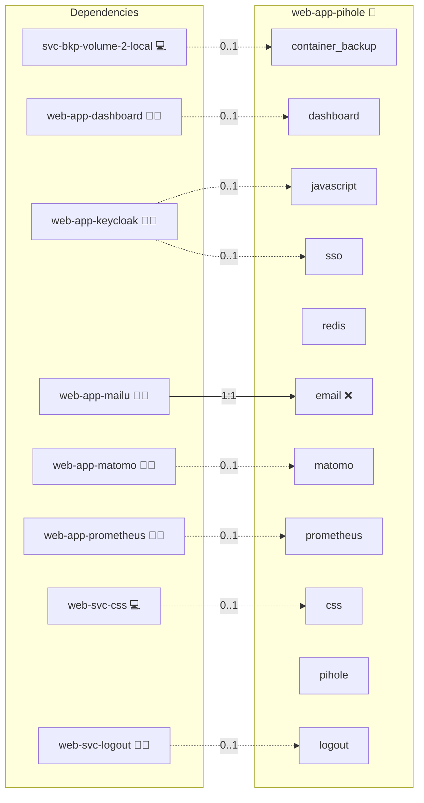

# web-app-pihole

Deploys [Pi-hole](https://pi-hole.net/) — a network-wide ad blocker — as a Docker-based service within the Infinito.Nexus platform.

## Description

Deploys [Pi-hole](https://pi-hole.net/) — a network-wide DNS sinkhole for ad and tracker blocking — with OAuth2/Keycloak SSO protection as part of the Infinito.Nexus stack.

## Overview

This role deploys Pi-hole as a containerized service within the Infinito.Nexus platform. Access is protected by OAuth2/Keycloak SSO, with RBAC enforced via OpenLDAP group membership.

## Cosmos

The diagram places web-app-pihole in the Infinito.Nexus cosmos: the components it deploys (capabilities), the central services it consumes (dependencies), and its outward reach (federation and bridged external networks).



Solid `1:1` edges are fixed relationships; dashed `0..1` edges are conditional (enabled only in matching deployments). Node markers show the role's deploy modes (💻 host, 🐳 compose, 🐝 swarm); ❌ marks a service that is explicitly turned off, and ⚙️ an Ansible role dependency declared in `meta/main.yml`.

## Features

- **OAuth2/SSO protection** via Keycloak and oauth2-proxy
- **RBAC** — only users in the `web-app-pihole-administrator` group can access the dashboard
- **OpenLDAP integration** for group synchronization
- **Logout button** injected into the Pi-hole admin navbar via JavaScript
- **Auto-redirect** from Pi-hole root 403 page to `/admin/`
- **Redis** session storage for oauth2-proxy
- **Prometheus** metrics support

## Quick Setup

### Development

Clone, set up the workstation, and deploy web-app-pihole onto the local stack:

```bash
git clone https://github.com/infinito-nexus/core.git
cd core
make onboard
make compose-deploy mode=reinstall apps=web-app-pihole full_cycle=false
```

### Production

Run the published image to provision the inventory and deploy web-app-pihole to a managed server (the mounted volume persists the inventory):

```bash
APP=web-app-pihole
HOST=<your-server>
TLS_MODE=self_signed
SSH_PUBLIC_KEY="<your-ssh-public-key>"

docker run --rm -it \
  -v "$PWD/inventories:/etc/infinito.nexus/inventories" \
  -e APP="$APP" -e HOST="$HOST" -e TLS_MODE="$TLS_MODE" -e SSH_PUBLIC_KEY="$SSH_PUBLIC_KEY" \
  ghcr.io/infinito-nexus/core/debian bash -c '
    INVENTORY=/etc/infinito.nexus/inventories/production
    infinito administration inventory provision "$INVENTORY" \
      --inventory-file "$INVENTORY/devices.yml" \
      --host "$HOST" \
      --include "$APP" \
      --vars "{\"TLS_MODE\": \"$TLS_MODE\", \"users\": {\"administrator\": {\"authorized_keys\": [\"$SSH_PUBLIC_KEY\"]}}}" &&
    infinito administration deploy dedicated "$INVENTORY/devices.yml" \
      --password-file "$INVENTORY/.password" \
      --diff -vv'
```

## Access

After deployment, Pi-hole is available at:
`https://pihole.<DOMAIN_PRIMARY>/admin/`

Access is protected by SSO. Users must be members of the `web-app-pihole-administrator` group in Keycloak/LDAP.

## Dependencies

- `web-app-keycloak` — for SSO/OIDC authentication
- `svc-db-openldap` — for LDAP group synchronization

## Configuration

| Variable | Description | Default |
|---|---|---|
| `pihole.upstream_dns` | Upstream DNS servers | `{{ NETWORK_PUBLIC_DNS_RESOLVERS }}` |

## Variants

| Variant | Description |
|---|---|
| 0 | Default deploy with OAuth2/Keycloak protection |

## E2E Tests

Four Playwright scenarios are tested:

1. Pi-hole is protected — unauthenticated access redirects to Keycloak
2. Admin can log in via SSO and access the dashboard
3. Biber (non-admin) is denied access
4. Admin can log out via the logout button

## Credits

Implemented by **[Prageeth Panicker](https://github.com/pragepani)**.
Part of the [Infinito.Nexus Project](https://s.infinito.nexus/code) and maintained by [Kevin Veen-Birkenbach](https://www.veen.world).
Licensed under the [Infinito.Nexus Community License (Non-Commercial)](https://s.infinito.nexus/license).
