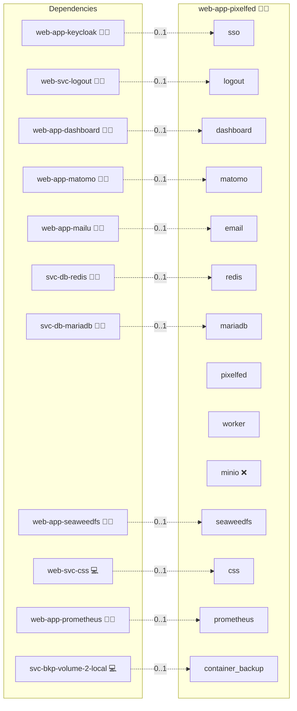

# Pixelfed

## Description

Pixelfed is a decentralized image-sharing platform that champions creativity and privacy. It offers a secure, community-driven alternative to centralized social networks by enabling federated communication and seamless content sharing through a modern web interface.

## Overview

This Docker Compose deployment automates the installation and operation of a Pixelfed instance.

## Cosmos

The diagram places Pixelfed in the Infinito.Nexus cosmos: the components it deploys (capabilities), the central services it consumes (dependencies), and its outward reach (federation and bridged external networks).



Solid `1:1` edges are fixed relationships; dashed `0..1` edges are conditional (enabled only in matching deployments). Node markers show the role's deploy modes (💻 host, 🐳 compose, 🐝 swarm); ❌ marks a service that is explicitly turned off, and ⚙️ an Ansible role dependency declared in `meta/main.yml`.

## Features

* **Decentralized Content Sharing:** Empower users to share photos and visual content across an interoperable, federated network with enhanced privacy controls.
* **Modern, Responsive Web Interface:** Access an intuitive and adaptive UI for effortless browsing, administration, and content management.
* **Robust Scalability & Performance:** Leverage integrated Redis caching and a reliable database (MariaDB or PostgreSQL) for smooth scaling and high performance.
* **Flexible Configuration:** Customize cache sizes, domain settings, and authentication options via environment variables and templated configuration files.
* **Maintenance & Administration Tools:** Built-in CLI and web-app-based tools to clear caches, manage the database, and monitor application health.
* **Single Sign-On (SSO) / OpenID Connect (OIDC):** Seamless integration with external identity providers for centralized authentication.

## Quick Setup

### Development

Clone, set up the workstation, and deploy Pixelfed onto the local stack:

```bash
git clone https://github.com/infinito-nexus/core.git
cd core
make onboard
make compose-deploy mode=reinstall apps=web-app-pixelfed full_cycle=false
```

### Production

Run the published image to provision the inventory and deploy Pixelfed to a managed server (the mounted volume persists the inventory):

```bash
APP=web-app-pixelfed
HOST=<your-server>
TLS_MODE=self_signed
SSH_PUBLIC_KEY="<your-ssh-public-key>"

docker run --rm -it \
  -v "$PWD/inventories:/etc/infinito.nexus/inventories" \
  -e APP="$APP" -e HOST="$HOST" -e TLS_MODE="$TLS_MODE" -e SSH_PUBLIC_KEY="$SSH_PUBLIC_KEY" \
  ghcr.io/infinito-nexus/core/debian bash -c '
    INVENTORY=/etc/infinito.nexus/inventories/production
    infinito administration inventory provision "$INVENTORY" \
      --inventory-file "$INVENTORY/devices.yml" \
      --host "$HOST" \
      --include "$APP" \
      --vars "{\"TLS_MODE\": \"$TLS_MODE\", \"users\": {\"administrator\": {\"authorized_keys\": [\"$SSH_PUBLIC_KEY\"]}}}" &&
    infinito administration deploy dedicated "$INVENTORY/devices.yml" \
      --password-file "$INVENTORY/.password" \
      --diff -vv'
```

## Other Resources

* [Official Pixelfed website](https://pixelfed.org/)
* [Pixelfed GitHub repository](https://github.com/pixelfed/pixelfed)

## Credits

Implemented by **[Kevin Veen-Birkenbach](https://www.veen.world)**.
Part of the [Infinito.Nexus Project](https://s.infinito.nexus/code) and maintained by [Kevin Veen-Birkenbach](https://www.veen.world).
Licensed under the [Infinito.Nexus Community License (Non-Commercial)](https://s.infinito.nexus/license).
