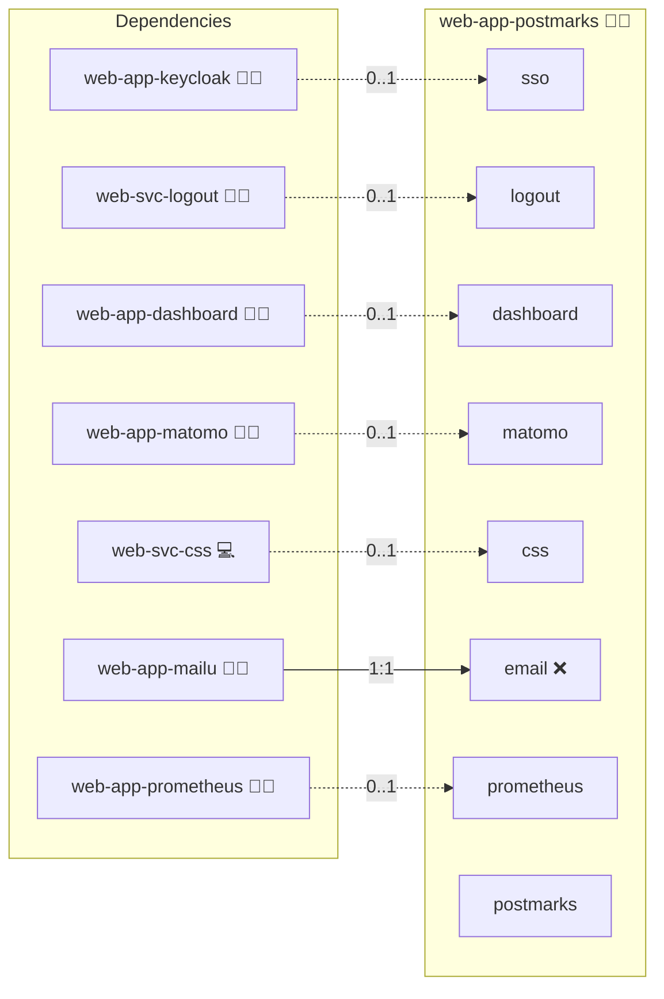

# Postmarks

## Description

Run **Postmarks**, a single-user [ActivityPub](https://www.w3.org/TR/activitypub/) bookmarking website for the Fediverse, via Docker Compose. The owner curates a public collection of bookmarks that federates to followers on Mastodon and other ActivityPub servers. Upstream project: [ckolderup/postmarks](https://github.com/ckolderup/postmarks).

## Overview

This role builds Postmarks from source into a custom image, wires it to the standard reverse proxy, and persists its SQLite data. Postmarks is single-user: there are no accounts, only "the owner". The upstream login is a single shared-secret password form that flips one session boolean (`req.session.loggedIn`).

## Cosmos

The diagram places Postmarks in the Infinito.Nexus cosmos: the components it deploys (capabilities), the central services it consumes (dependencies), and its outward reach (federation and bridged external networks).



Solid `1:1` edges are fixed relationships; dashed `0..1` edges are conditional (enabled only in matching deployments). Node markers show the role's deploy modes (💻 host, 🐳 compose, 🐝 swarm); ❌ marks a service that is explicitly turned off, and ⚙️ an Ansible role dependency declared in `meta/main.yml`.

## Features

- **Containerized build:** Clones the pinned upstream ref and runs `node server.js` behind the front proxy.
- **Single-owner model:** One privileged identity, gated by `req.session.loggedIn`.
- **Trusted-header SSO bridge:** Establishes the owner session from the oauth2-proxy identity (see below).
- **Minimal footprint:** Small Node.js/Express service that fits neatly into larger stacks.

## Quick Setup

### Development

Clone, set up the workstation, and deploy Postmarks onto the local stack:

```bash
git clone https://github.com/infinito-nexus/core.git
cd core
make onboard
make compose-deploy mode=reinstall apps=web-app-postmarks full_cycle=false
```

### Production

Run the published image to provision the inventory and deploy Postmarks to a managed server (the mounted volume persists the inventory):

```bash
APP=web-app-postmarks
HOST=<your-server>
TLS_MODE=self_signed
SSH_PUBLIC_KEY="<your-ssh-public-key>"

docker run --rm -it \
  -v "$PWD/inventories:/etc/infinito.nexus/inventories" \
  -e APP="$APP" -e HOST="$HOST" -e TLS_MODE="$TLS_MODE" -e SSH_PUBLIC_KEY="$SSH_PUBLIC_KEY" \
  ghcr.io/infinito-nexus/core/debian bash -c '
    INVENTORY=/etc/infinito.nexus/inventories/production
    infinito administration inventory provision "$INVENTORY" \
      --inventory-file "$INVENTORY/devices.yml" \
      --host "$HOST" \
      --include "$APP" \
      --vars "{\"TLS_MODE\": \"$TLS_MODE\", \"users\": {\"administrator\": {\"authorized_keys\": [\"$SSH_PUBLIC_KEY\"]}}}" &&
    infinito administration deploy dedicated "$INVENTORY/devices.yml" \
      --password-file "$INVENTORY/.password" \
      --diff -vv'
```

## Single sign-on

Postmarks has no native OIDC/SAML/LDAP/REMOTE_USER login — the only auth path is the `ADMIN_KEY` password form. Under the `oauth2` SSO flavor this role adds a **trusted-header SSO bridge**:

- A sidecar `web-app-keycloak` oauth2-proxy authenticates the visitor against Keycloak (OIDC, or LDAP federated through Keycloak) and nginx overwrites the `X-Forwarded-*` identity headers on every proxied request.
- A small Express middleware (`files/sso/header_auth.js`, mounted into `server.js` at build time by `files/sso/patch_server.js`) reads only those nginx-overwritten `X-Forwarded-*` headers and flips `req.session.loggedIn = true`, so the existing `isAuthenticated` gate on `/admin` opens for the proxied owner.
- The bridge activates only when `PROXY_HEADER_SSO` is truthy (derived from `lookup('sso', application_id, 'is_proxy_gated')`); otherwise the middleware is a transparent pass-through and the native password form still guards `/admin`.
- An optional `PROXY_HEADER_SSO_ADMIN_GROUP` check against `X-Forwarded-Groups` restricts the owner session to members of the application's administrator RBAC group.

Security: the identity headers are trusted unconditionally, which is only safe because the app port is bound to `127.0.0.1` and every request traverses the oauth2-proxy that overwrites `X-Forwarded-*`. The `X-Auth-Request-*` / `Remote-User` variants are deliberately ignored so an already-authenticated client cannot inject a different identity. Logout must go through `web-svc-logout` / the oauth2-proxy sign-out, not Postmarks' own logout link, because the proxy header re-establishes the session on the next request.

RBAC is not feasible beyond the group gate: Postmarks has no in-app authorisation tier beyond "owner or not" and no per-user identity, so `X-Forwarded-Email`/`X-Forwarded-Preferred-Username` cannot scope anything inside the app. This RBAC exception is documented per [lifecycle.md](../../docs/contributing/design/role/services/lifecycle.md).

## Further Resources

- [Postmarks (GitHub)](https://github.com/ckolderup/postmarks)
- [ActivityPub (W3C Recommendation)](https://www.w3.org/TR/activitypub/)

## Credits

Implemented by **[Kevin Veen-Birkenbach](https://www.veen.world)**.
Part of the [Infinito.Nexus Project](https://s.infinito.nexus/code) and maintained by [Kevin Veen-Birkenbach](https://www.veen.world).
Licensed under the [Infinito.Nexus Community License (Non-Commercial)](https://s.infinito.nexus/license).
