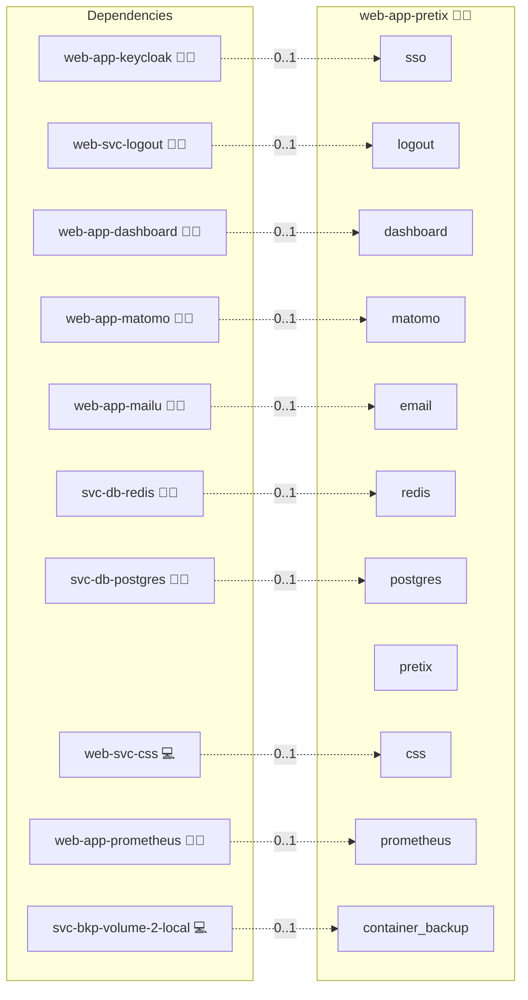

# Pretix

## Description

Simplify event management with **Pretix**, an open-source ticketing system for conferences, workshops, and cultural events. Pretix empowers organizers with flexible ticket sales, attendee management, and secure payment integrations, all under your control.

## Overview

This role deploys Pretix using Docker, automating the installation, configuration, and management of your Pretix server. It integrates with an external PostgreSQL database, Redis for caching and sessions, and an NGINX reverse proxy. The role supports advanced features such as global CSS injection, Matomo analytics, OIDC authentication, and centralized logout, making it a powerful and customizable solution within the Infinito.Nexus ecosystem.

## Cosmos

The diagram places Pretix in the Infinito.Nexus cosmos: the components it deploys (capabilities), the central services it consumes (dependencies), and its outward reach (federation and bridged external networks).



Solid `1:1` edges are fixed relationships; dashed `0..1` edges are conditional (enabled only in matching deployments). Node markers show the role's deploy modes (💻 host, 🐳 compose, 🐝 swarm); ❌ marks a service that is explicitly turned off, and ⚙️ an Ansible role dependency declared in `meta/main.yml`.

## Features

- **Pretix Installation:** Deploys Pretix in a dedicated Docker container.  
- **External PostgreSQL Database:** Configures Pretix to use a centralized PostgreSQL service.  
- **Redis Integration:** Adds Redis support for caching and session handling.  
- **NGINX Reverse Proxy Integration:** Provides secure access and HTTPS termination.  
- **OIDC Authentication:** Seamless integration with identity providers such as Keycloak.  
- **Centralized Logout:** Unified logout across applications in the ecosystem.  
- **Matomo Analytics & Global CSS:** Built-in support for analytics and unified styling.  

## Quick Setup

### Development

Clone, set up the workstation, and deploy Pretix onto the local stack:

```bash
git clone https://github.com/infinito-nexus/core.git
cd core
make onboard
make compose-deploy mode=reinstall apps=web-app-pretix full_cycle=false
```

### Production

Run the published image to provision the inventory and deploy Pretix to a managed server (the mounted volume persists the inventory):

```bash
APP=web-app-pretix
HOST=<your-server>
TLS_MODE=self_signed
SSH_PUBLIC_KEY="<your-ssh-public-key>"

docker run --rm -it \
  -v "$PWD/inventories:/etc/infinito.nexus/inventories" \
  -e APP="$APP" -e HOST="$HOST" -e TLS_MODE="$TLS_MODE" -e SSH_PUBLIC_KEY="$SSH_PUBLIC_KEY" \
  ghcr.io/infinito-nexus/core/debian bash -c '
    INVENTORY=/etc/infinito.nexus/inventories/production
    infinito administration inventory provision "$INVENTORY" \
      --inventory-file "$INVENTORY/devices.yml" \
      --host "$HOST" \
      --include "$APP" \
      --vars "{\"TLS_MODE\": \"$TLS_MODE\", \"users\": {\"administrator\": {\"authorized_keys\": [\"$SSH_PUBLIC_KEY\"]}}}" &&
    infinito administration deploy dedicated "$INVENTORY/devices.yml" \
      --password-file "$INVENTORY/.password" \
      --diff -vv'
```

## Addons

Role-level extensions are declared in [`meta/addons/`](meta/addons/) following the unified addon contract (requirement 026).

| Addon | Mechanism | Default state | Bridges |
|---|---|---|---|
| `pretix-oidc` | plugin | enabled when `sso` is wired (`services.sso.enabled`) | `sso` |

The `oidc` plugin (`pretix-oidc`, pinned to `2.3.1`) is pip-installed at image build time and delivers Keycloak/OIDC login. It auto-enables whenever the SSO partner role (`web-app-keycloak`) is co-deployed and stays off otherwise.

## Further Resources

- [Pretix Official Website](https://pretix.eu/)  
- [Pretix Documentation](https://docs.pretix.eu/en/latest/)  
- [Pretix GitHub Repository](https://github.com/pretix/pretix)  

## Credits

Implemented by **[Kevin Veen-Birkenbach](https://www.veen.world)**.
Part of the [Infinito.Nexus Project](https://s.infinito.nexus/code) and maintained by [Kevin Veen-Birkenbach](https://www.veen.world).
Licensed under the [Infinito.Nexus Community License (Non-Commercial)](https://s.infinito.nexus/license).
