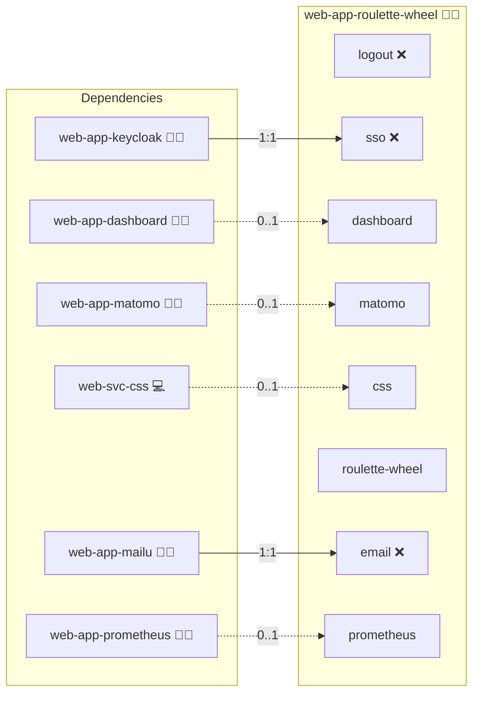

# Roulette Wheel

## Description

[Roulette Wheel](https://github.com/p-wojt/roulette-wheel) is a Node.js-based front-end application that simulates a roulette wheel in the browser.

## Overview

This role deploys and configures the Roulette Wheel application using Docker Compose. It pulls the latest source code from a Git repository, builds a Docker image from a configurable Node.js base, and starts the application on a user-defined local HTTP port.

## Cosmos

The diagram places Roulette Wheel in the Infinito.Nexus cosmos: the components it deploys (capabilities), the central services it consumes (dependencies), and its outward reach (federation and bridged external networks).



Solid `1:1` edges are fixed relationships; dashed `0..1` edges are conditional (enabled only in matching deployments). Node markers show the role's deploy modes (💻 host, 🐳 compose, 🐝 swarm); ❌ marks a service that is explicitly turned off, and ⚙️ an Ansible role dependency declared in `meta/main.yml`.

## Features

- **Dockerized Deployment:** Packages the application in a Docker container for consistent and isolated runtime.
- **Automated Builds:** Uses an automated Docker build process with a dedicated `Dockerfile`.
- **Configurable Ports:** Exposes the application through a customizable host port.
- **Git Integration:** Ensures that the application source code is up-to-date by pulling from the specified Git repository.

## Quick Setup

### Development

Clone, set up the workstation, and deploy Roulette Wheel onto the local stack:

```bash
git clone https://github.com/infinito-nexus/core.git
cd core
make onboard
make compose-deploy mode=reinstall apps=web-app-roulette-wheel full_cycle=false
```

### Production

Run the published image to provision the inventory and deploy Roulette Wheel to a managed server (the mounted volume persists the inventory):

```bash
APP=web-app-roulette-wheel
HOST=<your-server>
TLS_MODE=self_signed
SSH_PUBLIC_KEY="<your-ssh-public-key>"

docker run --rm -it \
  -v "$PWD/inventories:/etc/infinito.nexus/inventories" \
  -e APP="$APP" -e HOST="$HOST" -e TLS_MODE="$TLS_MODE" -e SSH_PUBLIC_KEY="$SSH_PUBLIC_KEY" \
  ghcr.io/infinito-nexus/core/debian bash -c '
    INVENTORY=/etc/infinito.nexus/inventories/production
    infinito administration inventory provision "$INVENTORY" \
      --inventory-file "$INVENTORY/devices.yml" \
      --host "$HOST" \
      --include "$APP" \
      --vars "{\"TLS_MODE\": \"$TLS_MODE\", \"users\": {\"administrator\": {\"authorized_keys\": [\"$SSH_PUBLIC_KEY\"]}}}" &&
    infinito administration deploy dedicated "$INVENTORY/devices.yml" \
      --password-file "$INVENTORY/.password" \
      --diff -vv'
```

## Further Resources

- [Roulette Wheel on GitHub](https://github.com/p-wojt/roulette-wheel)
- [Stack Overflow: Invalid Host Header with Webpack Dev Server](https://stackoverflow.com/questions/43619644/i-am-getting-an-invalid-host-header-message-when-connecting-to-webpack-dev-ser)

## Credits

Implemented by **[Kevin Veen-Birkenbach](https://www.veen.world)**.
Part of the [Infinito.Nexus Project](https://s.infinito.nexus/code) and maintained by [Kevin Veen-Birkenbach](https://www.veen.world).
Licensed under the [Infinito.Nexus Community License (Non-Commercial)](https://s.infinito.nexus/license).
