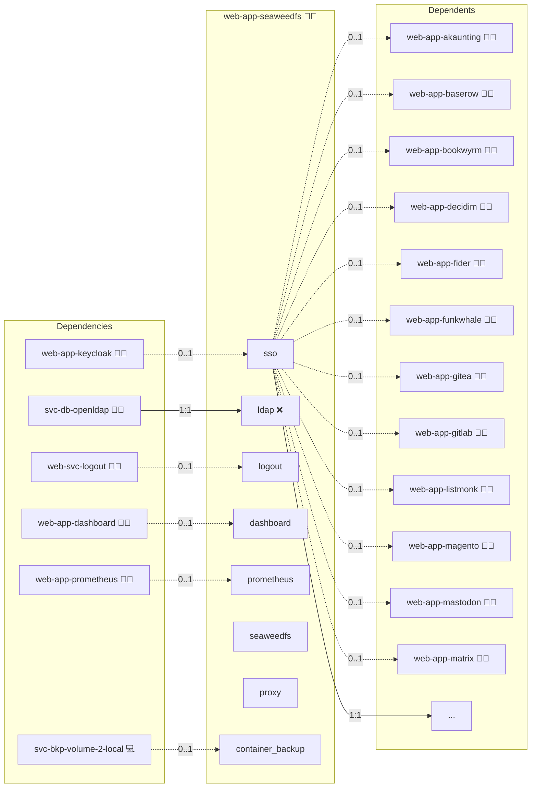

# SeaweedFS

## Description

[SeaweedFS](https://github.com/seaweedfs/seaweedfs) is a fast distributed storage system for blobs, objects, and files.
It exposes an S3-compatible API, so applications store and retrieve objects with standard S3 SDKs and CLIs.

## Overview

This role deploys SeaweedFS as the central provider of the project-wide object-store service (engine `seaweedfs`).
Web-app roles consume it like a database: they enable a `seaweedfs` service in their `meta/services.yml` and resolve host, port, bucket, and credentials through the `objstore` lookup.
A single server container runs master, volume, filer, and the S3 gateway in one process, accompanied by an nginx sidecar that routes the admin UIs.
The role serves three canonical domains:

- `api.seaweedfs.s3.*` is the public S3 endpoint and is reachable without SSO gating.
- `filer.seaweedfs.s3.*` serves the filer web UI behind an admin-only oauth2-proxy.
- `master.seaweedfs.s3.*` serves the master web UI behind the same admin-only oauth2-proxy.

Per-consumer S3 identities are rendered into `s3.json`: each consuming role receives an access key and bucket-scoped `Read`, `Write`, `List`, and `Tagging` actions, and consumers marked `public` additionally receive anonymous read on their bucket.
Consumer buckets are created through `weed shell` when a consumer role requests provisioning.

In embedded mode (`shared: false`) a consumer's compose stack receives a storage-only SeaweedFS container without UI or published ports.
The embedded S3 listener performs no authentication, so it MUST stay confined to the consumer's isolated compose network.

## Cosmos

The diagram places SeaweedFS in the Infinito.Nexus cosmos: the components it deploys (capabilities), the central services it consumes (dependencies), and its outward reach (federation and bridged external networks).



Solid `1:1` edges are fixed relationships; dashed `0..1` edges are conditional (enabled only in matching deployments). Node markers show the role's deploy modes (💻 host, 🐳 compose, 🐝 swarm); ❌ marks a service that is explicitly turned off, and ⚙️ an Ansible role dependency declared in `meta/main.yml`.

## Features

- **S3-compatible API:** Standard S3 SDKs and CLIs work against the gateway for uploads, media, attachments, and exports.
- **Central object-store service:** One shared instance serves all consuming web-app roles, mirroring the shared database pattern.
- **Per-consumer isolation:** Every consumer receives its own identity and bucket with bucket-scoped actions only.
- **Admin-gated UIs:** The filer and master web interfaces are reachable only for members of the administrator group via oauth2-proxy.
- **Embedded mode:** Roles that opt out of the shared instance run a private storage-only container inside their own compose network.

## Quick Setup

### Development

Clone, set up the workstation, and deploy SeaweedFS onto the local stack:

```bash
git clone https://github.com/infinito-nexus/core.git
cd core
make onboard
make compose-deploy mode=reinstall apps=web-app-seaweedfs full_cycle=false
```

### Production

Run the published image to provision the inventory and deploy SeaweedFS to a managed server (the mounted volume persists the inventory):

```bash
APP=web-app-seaweedfs
HOST=<your-server>
TLS_MODE=self_signed
SSH_PUBLIC_KEY="<your-ssh-public-key>"

docker run --rm -it \
  -v "$PWD/inventories:/etc/infinito.nexus/inventories" \
  -e APP="$APP" -e HOST="$HOST" -e TLS_MODE="$TLS_MODE" -e SSH_PUBLIC_KEY="$SSH_PUBLIC_KEY" \
  ghcr.io/infinito-nexus/core/debian bash -c '
    INVENTORY=/etc/infinito.nexus/inventories/production
    infinito administration inventory provision "$INVENTORY" \
      --inventory-file "$INVENTORY/devices.yml" \
      --host "$HOST" \
      --include "$APP" \
      --vars "{\"TLS_MODE\": \"$TLS_MODE\", \"users\": {\"administrator\": {\"authorized_keys\": [\"$SSH_PUBLIC_KEY\"]}}}" &&
    infinito administration deploy dedicated "$INVENTORY/devices.yml" \
      --password-file "$INVENTORY/.password" \
      --diff -vv'
```

## Further Resources

- [SeaweedFS on GitHub](https://github.com/seaweedfs/seaweedfs)
- [SeaweedFS Wiki](https://github.com/seaweedfs/seaweedfs/wiki)
- [Amazon S3 API](https://aws.amazon.com/s3/)

## Credits

Implemented by **[Kevin Veen-Birkenbach](https://www.veen.world)**.
Part of the [Infinito.Nexus Project](https://s.infinito.nexus/code) and maintained by [Kevin Veen-Birkenbach](https://www.veen.world).
Licensed under the [Infinito.Nexus Community License (Non-Commercial)](https://s.infinito.nexus/license).
